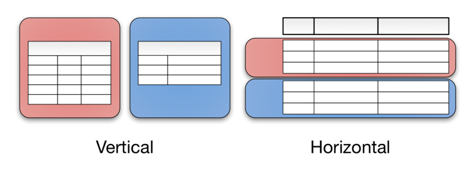

Horizontal partitioning involves putting different rows into different tables. Perhaps customers with ZIP codes less than 50000 are stored in CustomersEast, while customers with ZIP codes greater than or equal to 50000 are stored in CustomersWest. The two partition tables are then CustomersEast and CustomersWest, while a view with a union might be created over both of them to provide a complete view of all customers.

Vertical partitioning involves creating tables with fewer columns and using additional tables to store the remaining columns. Normalization also involves this splitting of columns across tables, but vertical partitioning goes beyond that and partitions columns even when already normalized.

Взято из https://en.wikipedia.org/wiki/Partition_(database)

#database #partitioning