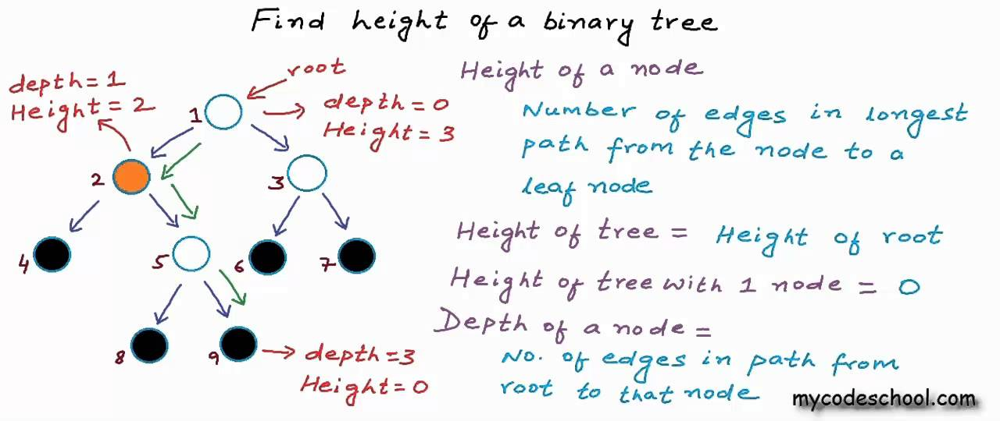

# Binary tree

A binary tree is a rooted tree that is also an ordered tree (a.k.a. plane tree) in which every node has at most two children. 

The height of a binary tree is the height of the root node in the whole binary tree. 

Complete tree -  is a binary tree in which every level, except possibly the last, is completely filled, and all nodes in the last level are as far left as possible.

A balanced binary tree is a binary tree structure in which the left and right subtrees of every node differ in height by no more than 1.

A perfect binary tree is a binary tree in which all interior nodes have two children and all leaves have the same depth or same level.

#algorithm #tree #data-structure
#draft