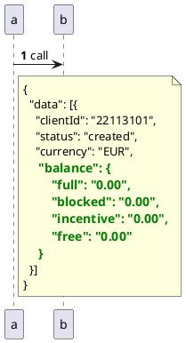

# Color part of note in uml

```plantuml
@startuml

!function $my_code($fgcolor)
!return "<color:"+$fgcolor+"><size:14><b>"
!endfunction

autonumber

a -> b: call
note right a
{
  "data": [{
    "clientId": "22113101",
    "status": "created",
    "currency": "EUR",
    $my_code(green) "balance": {
    $my_code(green)     "full": "0.00",
    $my_code(green)     "blocked": "0.00",
    $my_code(green)     "incentive": "0.00",
    $my_code(green)     "free": "0.00"
    $my_code(green) }
  }]
}
end note

@enduml
```

#plantuml #uml #schema
#draft