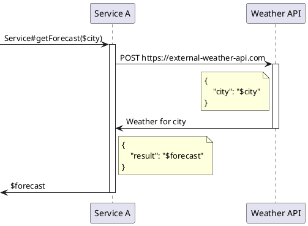

# Ordering Chaos: Arranging HTTP Request Testing in Spring

I have authored an article about the approach to writing tests in Spring. This approach is utilized in all the services where I mentor. You might find it intriguing to discover the motivation behind it.

#

In this article, I would like to describe an approach to writing tests with a clear division into separate stages, each performing its specific role. This facilitates the creation of tests that are easier to read, understand, and maintain.

The discussion will focus on using the Arrange-Act-Assert methodology for integration testing in the Spring Framework with mocking of HTTP requests to external resources encountered during the execution of the tested code within the system behavior. The tests under consideration are written using the Spock Framework in the Groovy language. MockRestServiceServer will be used as the mocking mechanism. There will also be a few words about WireMock.

## Problem Description
When studying how to write integration tests for Spring, I often referred to materials on the topic. Examples for MockRestServiceServer mostly described an approach with the declaration of expectations as follows:
- expected URI
- number of requests to the expected URI
- expectations for the structure and content of the request body
- response to the request

The code looked something like this:
```java
@Test
public void testWeatherRequest() {
    mockServer.expect(once(), requestTo("https://external-weather-api.com/forecast"))         
            .andExpect(method(HttpMethod.POST))
            .andExpect(jsonPath("$.field1", equalTo("value1")))
            .andExpect(jsonPath("$.field2", equalTo("value2")))
            .andExpect(jsonPath("$.field3", equalTo("value3")))
            .andRespond(withSuccess('{"result": "42"}', MediaType.APPLICATION_JSON));
    weatherService.getForecast("London")
    mockServer.verify()
    assert ..
    assert ..
}
```

When applying this approach, I encountered a number of difficulties:
1. Ambiguity in determining the reasons for AssertionError by the log text - the log text is the same for different scenarios:
- the HTTP call code is missing/not executed according to business logic;
- the HTTP call code is executed with an error;
- the HTTP call code is executed correctly, but there is an error in the mock description.
2. Difficulty in determining the scope of the tested states due to their dispersion throughout the test code. Formally, the result verification is carried out at the end of the test (mockServer.verify()), but the verification assertions regarding the composition and structure of the request are described at the beginning of the test (as part of creating the mock). At the same time, verification assertions not related to the mock were presented at the end of the test.

Important clarification: using RequestMatcher for the purpose of isolating mocks within many requests seems like the right solution.

## Proposed Solution

Clear division of test code into separate stages, according to the Arrange-Act-Assert pattern.

### Arrange-Act-Assert

Arrange-Act-Assert is a widely used pattern in writing tests, especially in unit testing. Let's take a closer look at each of these steps:

Arrange (Preparation): At this stage, you set up the test environment. This includes initializing objects, creating mocks, setting up necessary data, etc. The goal of this step is to prepare everything needed for the execution of the action being tested.

Act (Execution): Here you perform the action you want to test. This could be a method call or a series of actions leading to a certain state or result to be tested.

Assert (Result Verification): At the final stage, you check the results of the action. This includes assertions about the state of objects, returned values, changes in the database, messages sent, etc. The goal of this step is to ensure that the tested action has produced the expected result.

## Demonstration Scenarios

The business logic of the service for which the tests will be provided can be described as follows:

```gherkin
given: The weather service provides information that the weather in city A equals B
when: We request weather data from the service for city A
then: We receive B
```

Sequence Diagram



## Example Implementation for MockRestServiceServer Before Proposed Changes

Tests for the above scenario will be described using MockRestServiceServer.

### Difficulty in Determining the Scope of Tested States Due to Their Dispersion Throughout the Test Code

```groovy
def "Forecast for provided city London is 42"() {
    setup:          // (1)
    mockServer.expect(once(), requestTo("https://external-weather-api.com/forecast")) // (2)
            .andExpect(method(HttpMethod.POST))
            .andExpect(jsonPath('$.city', Matchers.equalTo("London")))                // (3)
            .andRespond(withSuccess('{"result": "42"}', MediaType.APPLICATION_JSON)); // (4)
    when:          // (5)
    def forecast = weatherService.getForecast("London")
    then:          // (6)
    forecast == "42"     // (7)
    mockServer.verify()  // (8)
}
```

1. Setup stage: describing the mock.
2. Indicating that exactly one call is expected to https://external-weather-api.com.
3. Specifying expected request parameters.
4. Describing the response to return.
5. Execution stage, where the main call to get the weather for the specified city occurs.
6. Verification stage. Here, mockServer.verify() is also called to check the request (see item 3).
7. Verification assertion regarding the returned value.
8. Calling to verify the mock's state.

Here we can observe the problem described earlier as "Difficulty in determining the scope of tested states due to their dispersion throughout the test code" - some of the verification assertions are in the then block, some in the setup block.

### Ambiguity in Determining the Causes of AssertionError

To demonstrate the problem, let's model different error scenarios in the code. Below are the situations and corresponding error logs.

1. Scenario: passed an unknown city name: `def forecast = weatherService.getForecast("Unknown")`

```log
java.lang.AssertionError: No further requests expected: HTTP POST https://external-weather-api.com
0 request(s) executed.

	at org.springframework.test.web.client.AbstractRequestExpectationManager.createUnexpectedRequestError(AbstractRequestExpectationManager.java:193)
```

2. Scenario: incorrect URI declaration for the mock, for example `mockServer.expect(once(), requestTo("https://foo.com"))`
   
```log
java.lang.AssertionError: No further requests expected: HTTP POST https://external-weather-api.com
0 request(s) executed.

	at org.springframework.test.web.client.AbstractRequestExpectationManager.createUnexpectedRequestError(AbstractRequestExpectationManager.java:193)
```

3. Scenario: no HTTP calls in the code
```log
java.lang.AssertionError: Further request(s) expected leaving 1 unsatisfied expectation(s).
0 request(s) executed.
```

The main observation: all errors are similar, and the stack trace is more or less the same.

## Example Implementation for MockRestServiceServer with Proposed Changes

### Ease of Determining the Scope of Tested States Due to Their Dispersion Throughout the Test Code

```groovy
def "Forecast for provided city London is 42"() {
    setup:          // (1)
    def requestCaptor = new RequestCaptor()
    mockServer.expect(manyTimes(), requestTo("https://external-weather-api.com"))          // (2)
            .andExpect(method(HttpMethod.POST))
            .andExpect(requestCaptor)                                                      // (3)
            .andRespond(withSuccess('{"result": "42"}', MediaType.APPLICATION_JSON));      // (4)
    when:          // (5)
    def forecast = weatherService.getForecast("London")
    then:          // (6)
    forecast == "42"
    requestCaptor.times == 1              // (7)
    requestCaptor.entity.city == "London" // (8)
}
```

3 - Data capture object, code described here - https://github.com/avvero/spring-sandbox/blob/main/src/test/java/pw/avvero/spring/sandbox/weather/RequestCaptor.java
7 - Verification assertion regarding the number of calls to the URI
8 - Verification assertion regarding the composition of the request to the URI

In this implementation, we can see that all the verification assertions are in the then block.

The above scenario (or the author's laziness) does not allow showing the convenience of checking headers, but such a possibility also exists in the expected form:
```groovy
forecast == "42"
requestCaptor.times == 1           
requestCaptor.body.city == "London" 
requestCaptor.headers.get("Content-Type") == ["application/json"]
```

### Unambiguity in Identifying the Causes of AssertionError

To demonstrate the problem, let's attempt to model different error scenarios in the code. Below are the situations and corresponding error logs.

1. Scenario: An unknown city name was provided `def forecast = weatherService.getForecast("Unknown")`
   
```log
requestCaptor.entity.city == "London"
|             |      |    |
|             |      |    false
|             |      |    5 differences (28% similarity)
|             |      |    (Unk)n(-)o(w)n
|             |      |    (Lo-)n(d)o(-)n
|             |      Unknown
|             [city:Unknown]
<pw.avvero.spring.sandbox.weather.RequestCaptor@6f77917c times=1 bodyString={"city":"Unknown"} entity=[city:Unknown] headers=[Accept:[application/json, application/*+json], Content-Type:[application/json], Content-Length:[18]]>
```

2. Scenario: Incorrect URI declaration for the mock, for example `mockServer.expect(once(), requestTo("https://foo.com"))`

```log
java.lang.AssertionError: No further requests expected: HTTP POST https://external-weather-api.com
0 request(s) executed.
```

3. Scenario: No HTTP calls in the code
   
```log
Condition not satisfied:

requestCaptor.times == 1
|             |     |
|             0     false
<pw.avvero.spring.sandbox.weather.RequestCaptor@474a63d9 times=0 bodyString=null entity=null headers=[:]>
```

## Using WireMock

WireMock provides the ability to describe verifiable expressions in the Assert block.

```groovy
def "Forecast for provided city London is 42"() {
    setup:          // (1)
    wireMockServer.stubFor(post(urlEqualTo("/forecast"))                              // (2)
            .willReturn(aResponse()                                                   // (4)
                    .withBody('{"result": "42"}')
                    .withStatus(200)
                    .withHeader("Content-Type", "application/json")))
    when:          // (5)
    def forecast = weatherService.getForecast("London")
    then:          // (6)
    forecast == "42"
    wireMockServer.verify(postRequestedFor(urlEqualTo("/forecast"))
            .withRequestBody(matchingJsonPath('$.city', equalTo("London"))))          // (7)
}
```

The above approach can also be used here, by describing the WiredRequestCaptor class - https://github.com/avvero/spring-sandbox/blob/main/src/test/java/pw/avvero/spring/sandbox/weather/WiredRequestCaptor.java

```groovy
def "Forecast for provided city London is 42"() {
    setup:
    StubMapping forecastMapping = wireMockServer.stubFor(post(urlEqualTo("/forecast"))
            .willReturn(aResponse()
                    .withBody('{"result": "42"}')
                    .withStatus(200)
                    .withHeader("Content-Type", "application/json")))
    def requestCaptor = new WiredRequestCaptor(wireMockServer, forecastMapping)
    when:
    def forecast = weatherService.getForecast("London")
    then:
    forecast == "42"
    requestCaptor.times == 1
    requestCaptor.body.city == "London"
}
```

This allows us to simplify expressions and enhance the idiomaticity of the code, making the tests more readable and easier to maintain.

## Conclusion

Throughout this article, I have dissected the stages of testing HTTP requests in Spring, using the Arrange-Act-Assert methodology and mocking tools such as MockRestServiceServer and WireMock. The primary goal was to demonstrate how clearly dividing the test into separate stages significantly enhances readability, understanding, and maintainability.

I highlighted the problems associated with the ambiguity of error determination and the difficulty of defining the scope of tested states, and presented ways to solve them through a more structured approach to test writing. This approach is particularly important in complex integration tests, where every aspect is critical to ensuring accuracy and reliability of the system.

Furthermore, I showed how the use of tools like RequestCaptor and WiredRequestCaptor simplifies the test-writing process and improves their idiomaticity and readability, thereby facilitating easier support and modification.

In conclusion, I want to emphasize that the choice of testing approach and corresponding tools should be based on specific tasks and the context of development. The approach to testing HTTP requests in Spring presented in this article is intended to assist developers facing similar challenges.

Link to the project repository with demonstration tests - https://github.com/avvero/spring-sandbox/tree/main/src/test/groovy/pw/avvero/spring/sandbox/weather.

Thank you for your attention to the article, and good luck in your pursuit of writing effective and reliable tests!

#article #java #spring #tdd #spock
#draft