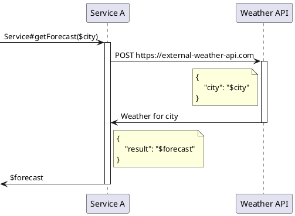

# Разносим по полочкам этапы тестирования http запросов в Spring

В данной статье я бы хотел описать подход к написанию тестов с четким разделением на отдельные этапы, каждый из которых выполняет свою специфическую роль. Это способствует написанию тестов, которые легче читать, понимать и поддерживать.

Речь пойдет об использовании методологии Arrange-Act-Assert применительно к интеграционным тестам на Spring Framework с использованием мокирования (mock) HTTP-запросов к внешним ресурсам, к которым идет обращение по ходу выполнения тестируемого кода в рамках поведения системы. Предлагаемые к рассмотрению тесты написаны с использованием Spock Framework на языке Groovy (см. недавнюю статью по этой теме: [Тестируем Spring Boot приложения через Spock Framework](https://habr.com/ru/articles/775346/)). В качестве механизма мокирования будет использоваться MockRestServiceServer. Будет пару слов и о [WireMock](https://wiremock.org/).

## Описание проблемы

Когда я изучал вопрос написания интеграционных тестов для Spring, я часто обращался к материалам по теме. Примеры для MockRestServiceServer в своей массе описывали подход с декларацией ожиданий в таком составе:
- ожидаемый URI
- количество запросов к ожидаемому URI
- ожидания к структуре и составу тела запроса
- ответ на запрос

В коде это выглядело приблизительно так:
```java
@Test
public void testWeatherRequest() {
    mockServer.expect(once(), requestTo("https://external-weather-api.com/forecast"))         
            .andExpect(method(HttpMethod.POST))
            .andExpect(jsonPath("$.field1", equalTo("value1")))
            .andExpect(jsonPath("$.field2", equalTo("value2")))
            .andExpect(jsonPath("$.field3", equalTo("value3")))
            .andRespond(withSuccess('{"result": "42"}', MediaType.APPLICATION_JSON));
    weatherService.getForecast("London")
    mockServer.verify()
    assert ..
    assert ..
}
```

При применении данного подхода я столкнулся с рядом сложностей:
1. Неоднозначность в определении по тексту лога причин ошибок типа AssertionError - текст лога одинаков для разных сценариев:
- код вызова HTTP отсутствует/не выполняется по бизнес-логике;
- код вызова HTTP выполняется с ошибкой;
- код вызова HTTP выполняется корректно, но есть ошибка в описании мока.
2. Сложность определения объема тестируемых состояний из-за их рассредоточенности по коду теста. Формально проверка результата осуществляется в конце теста (mockServer.verify()), но проверочные утверждения (assertions) относительно состава и структуры запроса описываются в начале теста (в рамках создания мока). В то же время, проверочные утверждения, не связанные с моком, были представлены в конце теста.

Важное уточнение: использование RequestMatcher для целей изоляции моков в рамках многих запросов выглядит правильным решением.

## Предлагаемое решение

Четкое разделение кода в тесте на отдельные этапы, согласно шаблону Arrange-Act-Assert.

### Arrange-Act-Assert

Arrange-Act-Assert является широко используемым шаблоном в написании тестов, особенно в модульном тестировании. Давайте подробнее рассмотрим каждый из этих шагов:

Arrange (Подготовка): На этом этапе вы настраиваете тестовую среду. Это включает в себя инициализацию объектов, создание моков, настройку необходимых данных и т.д. Цель этого шага - подготовить все необходимое для выполнения тестируемого действия.

Act (Выполнение): Здесь вы выполняете действие, которое хотите протестировать. Это может быть вызов метода или выполнение серии действий, которые приводят к определенному состоянию или результату, подлежащему тестированию.

Assert (Проверка результата): На последнем этапе вы проверяете результаты действия. Это включает в себя утверждения (assertions) относительно состояния объектов, возвращаемых значений, изменений в базе данных, отправленных сообщений и т.д. Цель этого шага - убедиться, что тестируемое действие дало ожидаемый результат.

## Демонстрационный сценарии

Бизнес-логику сервиса, для которого будут предоставлены тесты, можно описать так:

```gherkin
given: Сервис погоды предоставляет информацию о том, что в городе A погода равна B
when: Запрашиваем у сервиса погоды данные по городу A
then: Получаем B
```

Диаграмма последовательности



## Пример реализации для MockRestServiceServer до использования предлагаемых изменений

Тесты для предложенного выше сценария будут описаны с использованием MockRestServiceServer.

### Сложность определения объема тестируемых состояний из-за их рассредоточенности по коду теста

```groovy
def "Forecast for provided city London is 42"() {
    setup:          // (1)
    mockServer.expect(once(), requestTo("https://external-weather-api.com/forecast")) // (2)
            .andExpect(method(HttpMethod.POST))
            .andExpect(jsonPath('$.city', Matchers.equalTo("London")))                // (3)
            .andRespond(withSuccess('{"result": "42"}', MediaType.APPLICATION_JSON)); // (4)
    when:          // (5)
    def forecast = weatherService.getForecast("London")
    then:          // (6)
    forecast == "42"     // (7)
    mockServer.verify()  // (8)
}
```

1. Этап настройки: описываем мок.
2. Указываем, что ожидается ровно один вызов к https://external-weather-api.com.
3. Указываем ожидаемые параметры запроса.
4. Описание ответа, который нужно вернуть.
5. Этап выполнения, где происходит основной вызов получения погоды для указанного города.
6. Этап проверки результатов. Здесь также делается вызов mockServer.verify() для проверки запроса (см. пункт 3).
7. Проверочное утверждение относительно возвращаемого значения.
8. Вызов проверки состояния мока.

Здесь можно наблюдать проблему, описанную выше как "Сложность определения объема тестируемых состояний из-за их рассредоточенности по коду теста" - часть проверяемых утверждений находится в блоке then, часть в блоке setup.

### Неоднозначность в определении причин ошибок типа AssertionError

Для демонстрации проблемы попытаемся смоделировать различные варианты ошибок в коде. Ниже будут приведены ситуации и логи соответствующей ошибки.

1. Сценарий: передали неизвестное название города: `def forecast = weatherService.getForecast("Unknown")`

```log
java.lang.AssertionError: No further requests expected: HTTP POST https://external-weather-api.com
0 request(s) executed.

	at org.springframework.test.web.client.AbstractRequestExpectationManager.createUnexpectedRequestError(AbstractRequestExpectationManager.java:193)
```

2. Сценарий: неправильная декларация URI для мока, например `mockServer.expect(once(), requestTo("https://foo.com"))`
   
```log
java.lang.AssertionError: No further requests expected: HTTP POST https://external-weather-api.com
0 request(s) executed.

	at org.springframework.test.web.client.AbstractRequestExpectationManager.createUnexpectedRequestError(AbstractRequestExpectationManager.java:193)
```

3. Сценарий: в коде отсутствуют вызовы к HTTP
```log
java.lang.AssertionError: Further request(s) expected leaving 1 unsatisfied expectation(s).
0 request(s) executed.
```

Основное наблюдение: все ошибки схожи между собой, stack-trace также плюс-минус одинаковый.

## Пример реализации для MockRestServiceServer с использованием предлагаемых изменений

### Простота определения объема тестируемых состояний ввиду их рассредоточенности по коду теста

```groovy
    def "Forecast for provided city London is 42"() {
        setup:          // (1)
        def requestCaptor = new RequestCaptor()
        mockServer.expect(manyTimes(), requestTo("https://external-weather-api.com"))          // (2)
                .andExpect(method(HttpMethod.POST))
                .andExpect(requestCaptor)                                                      // (3)
                .andRespond(withSuccess('{"result": "42"}', MediaType.APPLICATION_JSON));      // (4)
        when:          // (5)
        def forecast = weatherService.getForecast("London")
        then:          // (6)
        forecast == "42"
        requestCaptor.times == 1              // (7)
        requestCaptor.entity.city == "London" // (8)
    }
```

3 - объект захвата данных по запросу, код описан тут  - https://github.com/avvero/spring-sandbox/blob/main/src/test/java/pw/avvero/spring/sandbox/weather/RequestCaptor.java
7 - проверочное утверждение относительно количества обращений к URI
8 - проверочное утверждение относительно состава запроса к URI

В данной реализации мы можем видеть, что все проверяемые утверждения находятся в блоке then.

Предложенный выше сценарий (или лень автора) не позволяет показать удобство проверки заголовков, но такая возможность так же присутствует в ожидаемом виде:
```groovy
forecast == "42"
requestCaptor.times == 1           
requestCaptor.body.city == "London" 
requestCaptor.headers.get("Content-Type") == ["application/json"]
```

### Однозначность в определении причин ошибок типа AssertionError

Для демонстрации проблемы попытаемся смоделировать различные варианты ошибок в коде. Ниже будут приведены ситуации и логи соответствующей ошибки.

1. Сценарий: передали неизвестное название города `def forecast = weatherService.getForecast("Unknown")`
   
```log
requestCaptor.entity.city == "London"
|             |      |    |
|             |      |    false
|             |      |    5 differences (28% similarity)
|             |      |    (Unk)n(-)o(w)n
|             |      |    (Lo-)n(d)o(-)n
|             |      Unknown
|             [city:Unknown]
<pw.avvero.spring.sandbox.weather.RequestCaptor@6f77917c times=1 bodyString={"city":"Unknown"} entity=[city:Unknown] headers=[Accept:[application/json, application/*+json], Content-Type:[application/json], Content-Length:[18]]>
```

2. Сценарий: неправильная декларация URI для мока, например `mockServer.expect(once(), requestTo("https://foo.com"))`

```log
java.lang.AssertionError: No further requests expected: HTTP POST https://external-weather-api.com
0 request(s) executed.
```

3. Сценарий: в коде отсутствуют вызовы к HTTP
   
```log
Condition not satisfied:

requestCaptor.times == 1
|             |     |
|             0     false
<pw.avvero.spring.sandbox.weather.RequestCaptor@474a63d9 times=0 bodyString=null entity=null headers=[:]>
```

## Использование WireMock

WireMock предоставляет возможность описывать проверяемые выражения в блоке Assert.

```groovy
def "Forecast for provided city London is 42"() {
    setup:          // (1)
    wireMockServer.stubFor(post(urlEqualTo("/forecast"))                              // (2)
            .willReturn(aResponse()                                                   // (4)
                    .withBody('{"result": "42"}')
                    .withStatus(200)
                    .withHeader("Content-Type", "application/json")))
    when:          // (5)
    def forecast = weatherService.getForecast("London")
    then:          // (6)
    forecast == "42"
    wireMockServer.verify(postRequestedFor(urlEqualTo("/forecast"))
            .withRequestBody(matchingJsonPath('$.city', equalTo("London"))))          // (7)
}
```

Предложенный выше подход можно использовать и здесь, описав класс WiredRequestCaptor - https://github.com/avvero/spring-sandbox/blob/main/src/test/java/pw/avvero/spring/sandbox/weather/WiredRequestCaptor.java

```groovy
def "Forecast for provided city London is 42"() {
    setup:
    StubMapping forecastMapping = wireMockServer.stubFor(post(urlEqualTo("/forecast"))
            .willReturn(aResponse()
                    .withBody('{"result": "42"}')
                    .withStatus(200)
                    .withHeader("Content-Type", "application/json")))
    def requestCaptor = new WiredRequestCaptor(wireMockServer, forecastMapping)
    when:
    def forecast = weatherService.getForecast("London")
    then:
    forecast == "42"
    requestCaptor.times == 1
    requestCaptor.body.city == "London"
}
```

Это позволяет нам упростить выражения и повысить идиоматичность кода, делая тесты более читаемыми и легкими для поддержки.

## Заключение

В ходе этой статьи я провел разбор этапов тестирования HTTP-запросов в Spring, используя методологию Arrange-Act-Assert и инструменты мокирования, такие как MockRestServiceServer и WireMock. Основная цель была продемонстрировать, как четкое разделение теста на отдельные этапы значительно повышает читаемость, понимание и поддерживаемость тестов.

Я обозначил проблемы, связанные с неоднозначностью определения ошибок и сложностью определения объема тестируемых состояний, и представил способы их решения через более структурированный подход к написанию тестов. Этот подход особенно важен в сложных интеграционных тестах, где каждый аспект критичен для обеспечения точности и надежности системы.

Кроме того, я показал, как использование инструментов типа RequestCaptor и WiredRequestCaptor упрощает процесс написания тестов и улучшает их идиоматичность и читаемость, что облегчает дальнейшую поддержку и модификацию.

В заключение, хочу подчеркнуть, что выбор подхода к тестированию и соответствующих инструментов должен опираться на конкретные задачи и контекст разработки. Представленный в этой статье подход к тестированию HTTP-запросов в Spring предназначен для помощи разработчикам, сталкивающимся с аналогичными вызовами.

Ссылка на репозиторий проект с демонстрацией тестов -  https://github.com/avvero/spring-sandbox/tree/main/src/test/groovy/pw/avvero/spring/sandbox/weather.

Спасибо за внимание к статье, и удачи в вашем стремлении к написанию эффективных и надежных тестов!

#article #java #spring #tdd #spock
#draft