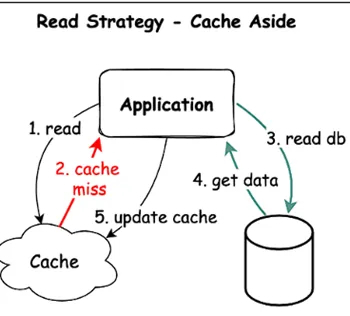
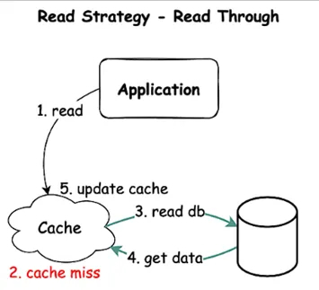
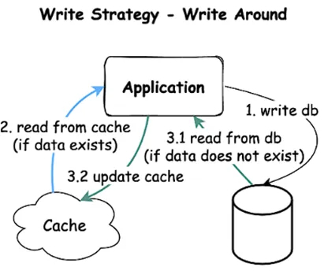
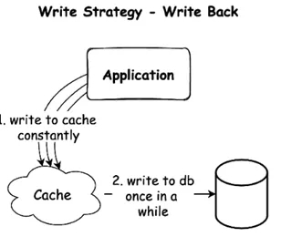
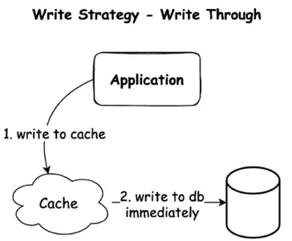

Read Strategies:

1. Cache-Aside (Lazy Loading) Pattern

Cache-aside is one of the commonly used caching strategies, where cache and database are independent, and it is the responsibility of the application code to manage cache and database to maintain data consistency. Let’s understand this from another perspective!

How it works: Tries cache first, then fetches from DB on cache miss.

Usage: When cache misses are rare or the latency of a cache miss + DB read is acceptable.

2. Read-Through Pattern

Here application will interact with the cache system that acts as an intermediary between the application and database.

How it works: cache handles DB reads, transparently fetching missing data on cache miss.

Usage: Abstracts DB logic from app code. Keeps cache consistently populated by handling misses automatically.

Write Strategies:

1. Write Around

How it works: Writes bypass the cache and go directly to the DB, read from cache if data exists, else gets from DB and updates Cache.

Usage: When written data won’t immediately be read back from cache.

2. Write-Behind (Write-Back) Pattern

How it works: Writes to cache first, async write to DB later.

Usage: In write-heavy environments where slight data loss is tolerable.

3. Write-Through Pattern

How it works: Immediate write to both cache and DB.

Usage: When data consistency is critical.

Other:

1. Cache Invalidation Pattern

Cache Invalidation ensures that when data in the main source changes, related information in the cache is removed to present the use of outdated or incorrect data.

2. Refresh-Ahead Pattern

Refresh-Ahead Pattern involves proactively updating data in the cache before it becomes stale or outdated.

Follow up:
- https://medium.com/silenttech/caching-strategies-8c9d80f507b8
- https://www.enjoyalgorithms.com/blog/write-behind-caching-pattern

#caching