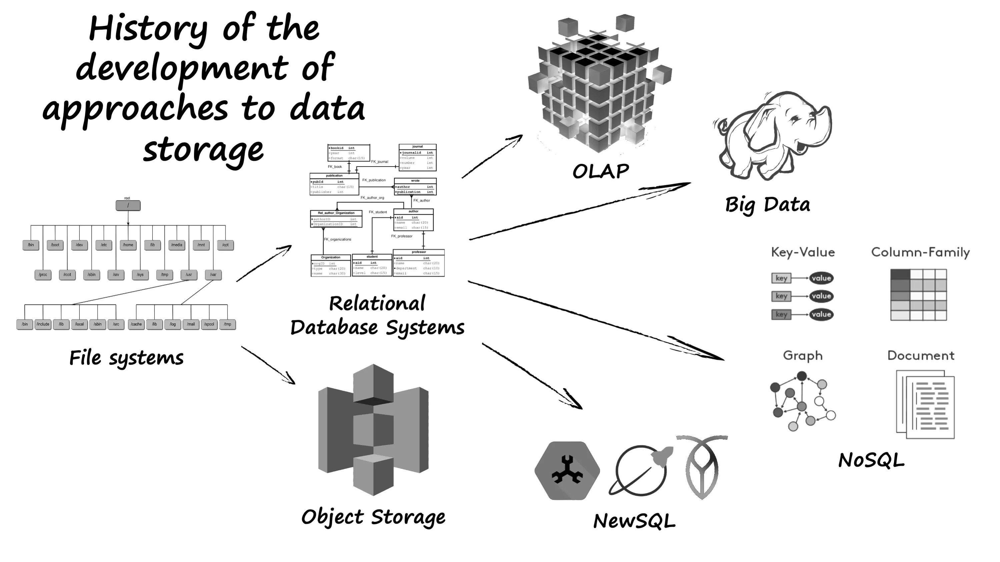

NewSQL is a class of relational database management systems (RDBMS) designed to provide the scalability of NoSQL systems for online transaction processing (OLTP) read-write workloads while maintaining the ACID guarantees (Atomicity, Consistency, Isolation, Durability) of traditional database systems.

.

Примеры:
- VoltDB
- NuoDB

#database #term