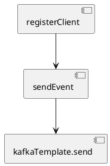
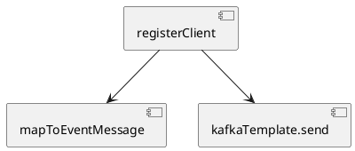

When I was a child, I used to lie on the bed and gaze for a long time at the patterns on an old Soviet rug, seeing animals and fantastical figures within them. Now, I more often look at code, but similar images still emerge in my mind. Like on the rug, these images form repetitive patterns. They can be either pleasing or repulsive. Today, I want to tell you about one such unpleasant pattern that can be found in programming.

## Scenario

Imagine a service that processes a client registration request and sends an event about it to the system. In this article, I will show an implementation example that I consider an antipattern and suggest an improved version.

### Option 1: Methodcentipede

The Java code below shows the code of the `RegistrationService` class, which processes the request and sends the event.

```java
public class RegistrationService {

    private final ClientRepository clientRepository;
    private final KafkaTemplate<Object, Object> kafkaTemplate;
    private final ObjectMapper objectMapper;

    public void registerClient(RegistrationRequest request) {
        var client = clientRepository.save(Client.builder()
                .email(request.email())
                .firstName(request.firstName())
                .lastName(request.lastName())
                .build());
        sendEvent(client);
    }

    @SneakyThrows
    private void sendEvent(Client client) {
        var event = RegistrationEvent.builder()
                .clientId(client.getId())
                .email(client.getEmail())
                .firstName(client.getFirstName())
                .lastName(client.getLastName())
                .build();
        Message message = MessageBuilder
                .withPayload(objectMapper.writeValueAsString(event))
                .setHeader(KafkaHeaders.TOPIC, "topic-registration")
                .setHeader(KafkaHeaders.KEY, client.getEmail())
                .build();
        kafkaTemplate.send(message).get();
    }

    @Builder
    public record RegistrationEvent(int clientId, String email, String firstName, String lastName) {}
}
```

The structure of the code can be simplified as follows:



Here, you can see that the methods form an unbroken chain through which the data flow, like through a long, narrow intestine. The methods in the middle of this chain are responsible not only for the logic directly described in their body but also for the logic of the methods they call and their contracts (e.g., the need to handle specific errors). All methods preceding the invoked one inherit its entire complexity. For example, if `kafkaTemplate.send` has a side effect of sending an event, then the calling `sendEvent` method also acquires the same side effect. The `sendEvent` method also becomes responsible for serialization, including handling its errors. Testing individual parts of the code becomes more challenging because there is no way to test each part in isolation without using mocks.

### Option 2: Improved Version

Code:

```java
public class RegistrationService {

    private final ClientRepository clientRepository;
    private final KafkaTemplate<Object, Object> kafkaTemplate;
    private final ObjectMapper objectMapper;

    @SneakyThrows
    public void registerClient(RegistrationController.RegistrationRequest request) {
        var client = clientRepository.save(Client.builder()
                .email(request.email())
                .firstName(request.firstName())
                .lastName(request.lastName())
                .build());
        Message<String> message = mapToEventMessage(client);
        kafkaTemplate.send(message).get();
    }

    private Message<String> mapToEventMessage(Client client) throws JsonProcessingException {
        var event = RegistrationEvent.builder()
                .clientId(client.getId())
                .email(client.getEmail())
                .firstName(client.getFirstName())
                .lastName(client.getLastName())
                .build();
        return MessageBuilder
                .withPayload(objectMapper.writeValueAsString(event))
                .setHeader(KafkaHeaders.TOPIC, "topic-registration")
                .setHeader(KafkaHeaders.KEY, event.email)
                .build();
    }

    @Builder
    public record RegistrationEvent(int clientId, String email, String firstName, String lastName) {}
}
```

The diagram is shown below:



Here, you can see that the `sendEvent` method is completely absent, and `kafkaTemplate.send` is responsible for sending the message. The entire process of constructing the message for Kafka has been moved to a separate `mapToEventMessage` method. The `mapToEventMessage` method has no side effects, and its responsibility boundaries are clearly defined. Exceptions related to serialization and message sending are part of the individual methods' contracts and can be handled separately.

The `mapToEventMessage` method is a pure function. When a function is deterministic and has no side effects, we call it a "pure" function. Pure functions are:
- easier to read,
- easier to debug,
- easier to test,
- independent of the order in which they are called,
- simple to run in parallel.

## Recommendations

I would suggest the following techniques that can help avoid such antipatterns in the code:
- Testing Trophy Approach
- One Pile Technique
- Test-Driven Development (TDD)

All these techniques are closely related and complement each other.

### Testing Trophy

This is an approach to test coverage that emphasizes integration tests, which verify the service's contract as a whole. Unit tests are used for individual functions that are difficult or costly to test through integration tests. I have described tests with this approach in my articles: [habr.com/ru/articles/781812](https://habr.com/ru/articles/781812/), [habr.com/ru/articles/804673](https://habr.com/ru/articles/804673/), [habr.com/ru/articles/797049](https://habr.com/ru/articles/797049/).

### One Pile

This technique is described in Kent Beck's book "Tidy First?" The main idea is that reading and understanding code is harder than writing it. If the code is broken into too many small parts, it may be helpful to first combine it into a whole to see the overall structure and logic, and then break it down again into more understandable pieces.

In the context of this article, it is suggested not to break the code into methods until it ensures the fulfillment of the required contract.

### Test-Driven Development

This approach allows separating the efforts of writing code to implement the contract and designing the code. We don't try to create a good design and write code that meets the requirements simultaneously, but instead, we separate these tasks. The development process looks like this:
1. Write tests for the service contract using the Testing Trophy approach.
2. Write code in the One Pile style, ensuring that it fulfills the required contract. Don't worry about code design quality.
3. Refactor the code. All the code is written, and we have a complete understanding of the implementation and potential bottlenecks.

## Conclusion

The article discusses an example of an antipattern that can lead to difficulties in maintaining and testing code. Approaches like Testing Trophy, One Pile, and Test-Driven Development allow you to structure your work in a way that prevents code from turning into an impenetrable labyrinth. By investing time in the proper organization of code, we lay the foundation for the long-term sustainability and ease of maintenance of our software products.

Thank you for your attention to the article, and good luck in your quest for writing simple code!

#code #design