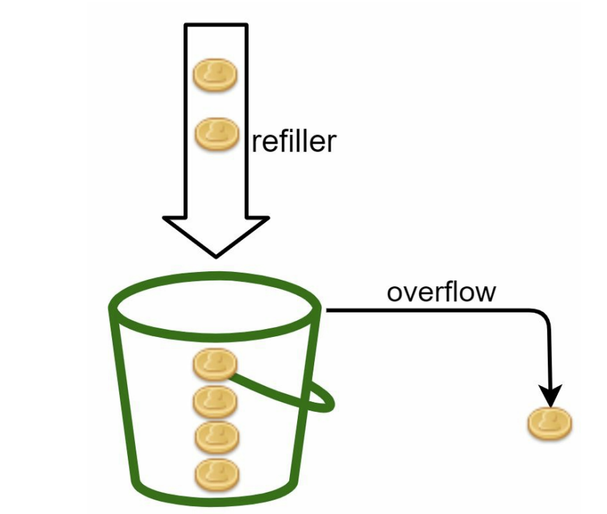

A token bucket is a container that has pre-defined capacity. Tokens are put in the bucket at preset rates periodically. Once the bucket is full, no more tokens are added. As shown in image, the token bucket capacity is 4. The refiller puts 2 tokens into the bucket every second. Once the bucket is full, extra tokens will overflow.

#rate_limiter #algorithm