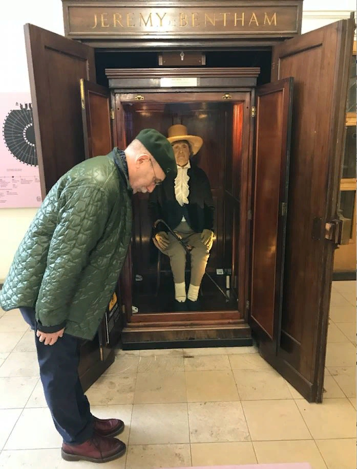

английский философ-моралист и правовед, социолог, юрист, родоначальник одного из направлений в английской философии — утилитаризма. Завещал, чтобы его тело было сохранено для потомства. Его останки были одеты в костюм, а на лице сделана восковая маска. В таком виде учёный до сих пор выставлен в главном здании Университетского колледжа Лондона.