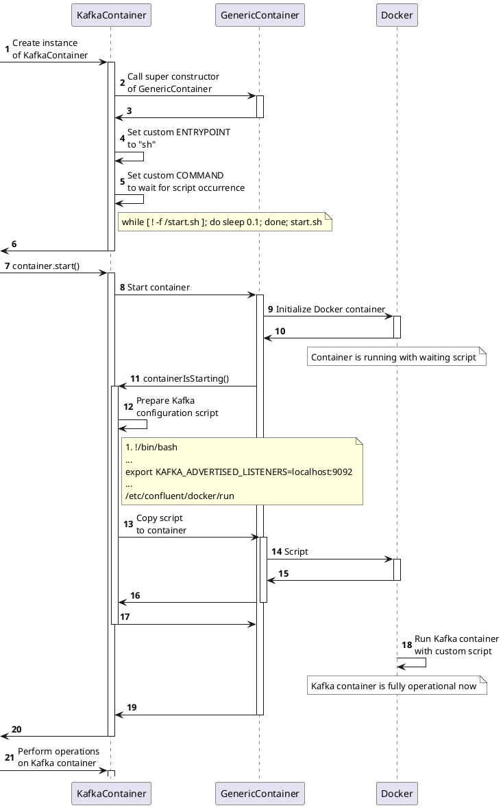

# How to Reduce Memory Consumption in Integration Tests with Kafka Using GraalVM

##

In this article, I want to share my experience with creating a native image for EmbeddedKafka using GraalVM. Utilizing this image in integration tests not only speeds up the execution of test scenarios but also reduces memory consumption. Interestingly, when compared to using `confluentinc/cp-kafka` in Testcontainers, there is a noticeable difference in both speed and memory usage — and it's not in favor of the latter.

## EmbeddedKafka, Testcontainers, GraalVM

A brief overview of the key components used in the project:

EmbeddedKafka is a tool that allows embedding a Kafka server directly into a JVM application or testing environment. This is useful for integration testing of applications that use Apache Kafka for data stream processing or as a messaging system. Embedded Kafka is primarily used for isolated testing of interactions with Kafka, simplifying setup and management of tests due to its quick startup and shutdown. This ensures test reproducibility in different environments and provides control over the Kafka configuration. However, running Embedded Kafka in a JVM application increases memory usage due to Kafka's resource-intensive nature and the need for data storage. This is a trade-off between development convenience and additional memory load, making an external Kafka server (relative to the JVM application) more preferable for production environments or in cases of limited memory resources.

Testcontainers is a framework used to support automated integration tests using Docker containers. It allows the creation, management, and deletion of containers during test execution. Using Docker containers ensures consistency of the testing environment across different machines and platforms, simplifying local development and testing. Using Kafka in Testcontainers offers several advantages, especially when it comes to testing in a more realistic and flexible environment. Testcontainers runs Kafka instances based on the official Confluent OSS Platform images.

GraalVM is a platform for running programs, supporting various programming languages and technologies. Among other things, it allows compiling Java applications into statically linked executable files (native binaries). These native executable files run faster, require less memory, and do not require an installed JVM.

## Test Scenario

To illustrate the approaches to writing tests, I have prepared code examples corresponding to a simple test scenario:
- Send a message `value1` to the topic `topic1`.
- Read the message from the topic `topic1`.
- Verify that the value is equal to `value1`.

Examples can be found in the [project repository](https://github.com/avvero/embedded-kafka):
- Tests using EmbeddedKafka are located in the [example-spring-embedded-kafka](https://github.com/avvero/embedded-kafka/tree/sb3/example-spring-embedded-kafka) module.
- Tests using Testcontainers are in the [example-testcontainers](https://github.com/avvero/embedded-kafka/tree/sb3/example-testcontainers) module.

The repository structure facilitates the comparison of modules to evaluate the differences in structure and composition of code when using each approach.

## Wrapping EmbeddedKafka in a Container

The first task was to implement the launch of EmbeddedKafka within a separate container. To do this, I took the following straightforward steps:
- Created a standard Spring Boot application using [https://start.spring.io/](https://start.spring.io/);
- In the application, I set up the launch of an instance of the `org.springframework.kafka.test.EmbeddedKafkaZKBroker` class with the necessary parameters;
- Described a Dockerfile and built the image.
All the above actions are reflected in the code of the [emk-application](https://github.com/avvero/embedded-kafka/tree/sb3/emk-application) module in the project repository.

## Launching EmbeddedKafka in a Container

The Testcontainers documentation provides a guide to launching a Kafka container using the `KafkaContainer` class as follows:
```
KafkaContainer kafka = new KafkaContainer(DockerImageName.parse("confluentinc/cp-kafka:6.2.1"))
```
However, this class was not suitable for my needs, as it is intended for use with `confluentinc/cp-kafka` compatible images. Nevertheless, examining it was beneficial as it revealed an interesting logic around the handling of the KAFKA_ADVERTISED_LISTENERS parameter:
1. At the start of the container, a substitution of ENTRYPOINT/COMMAND instructions is performed.
2. After starting, the KAFKA_ADVERTISED_LISTENERS parameters are passed to the container along with instructions for starting Kafka.

This process is detailed in the accompanying diagram.



Why is this necessary? During operation, a client may connect to any Kafka node to obtain the address for performing read/write operations, even if Kafka is represented by a single node. An external address is required for an external user, and similarly, an internal address for an internal user. By specifying KAFKA_ADVERTISED_LISTENERS, we provide the broker with information about its external address, which the broker then communicates to the client. The clients will be external relative to the broker since the broker is running in a container.

I implemented the logic described above in a new class - [EmbeddedKafkaContainer.java](https://github.com/avvero/embedded-kafka/blob/sb3/emk-testcontainers/src/main/java/pw/avvero/emk/EmbeddedKafkaContainer.java).

## Creating a Native Image for EmbeddedKafka

The simplest way to start a new Spring Boot project for GraalVM is to visit the site start.spring.io, add the “GraalVM Native Support” dependency, and generate the project. The project comes with a HELP.md file, which provides useful tips for getting started.

### Metadata Collection

The tool for building a native image relies on static analysis available during the execution of the application code. However, this analysis is not always capable of fully predicting all use cases of Java Native Interface (JNI), Java reflection, dynamic proxy objects, etc. Therefore, these use cases of dynamic functions need to be explicitly specified to the native image build tool in the form of metadata. One way to provide such metadata is through JSON files placed in the project directory `META-INF/native-image/<group.id>/<artifact.id>`.

GraalVM offers a Tracing Agent for convenient collection of metadata and preparation of configuration files. This agent tracks all instances of dynamic function usage during the application's execution on a standard Java VM.

My approach was as follows:
- I launched an instance of a Spring application with Embedded Kafka under the JVM with the Tracing Agent.
- I ran a large set of tests from one of my projects, using the launched application as the main Kafka broker.

The files generated during this process were placed in the project directory [META-INF/native-image](https://github.com/avvero/embedded-kafka/tree/sb3/emk-application/src/main/resources/META-INF/native-image).

## Launch and Usage

To demonstrate the results, I prepared the following artifacts:
- A library with the `EmbeddedKafkaContainer` class - `pw.avvero:emk-testcontainers:1.0.1`.
- Docker images: `avvero/emk` (JVM) and `avvero/emk-native` (native, platform=linux/arm64).
- An example usage corresponding to the test scenario can be found in the [example-embedded-kafka-container](https://github.com/avvero/embedded-kafka/tree/sb3/example-embedded-kafka-container) module.

The [KafkaContainerConfiguration](https://github.com/avvero/embedded-kafka/blob/sb3/example-embedded-kafka-container/src/test/java/pw/avvero/emk/KafkaContainerConfiguration.java) is configured as follows:
```java
@TestConfiguration(proxyBeanMethods = false)
public class KafkaContainerConfiguration {

    @Bean
    @RestartScope
    @ServiceConnection
    EmbeddedKafkaContainer kafkaContainer() {
        return new EmbeddedKafkaContainer("avvero/emk-native:1.0.0");
    }
}
```

To assess memory utilization, I ran tests for about 7 minutes from one of my projects. Based on observations in `docker stats`, I noticed the following trends in memory consumption:
- confluentinc/cp-kafka:7.3.3    1.331GiB
- avvero/emk                     677.3MiB
- avvero/emk-native              126.4MiB

Memory analysis (Young + Old + Meta space) through GC logs using https://gceasy.io showed the following:
- confluentinc/cp-kafka:7.3.3    1.06 gb/866.92 mb (Allocated/Peak)
- avvero/emk                     567.62 mb/241.74 mb (Allocated/Peak)
- avvero/emk-native              20.00M -> 15.50M  ?

Analyzing GC logs for the native image presents a more complex task since the format and composition of data differ from "standard" GC logs. Unfortunately, I could not find an analysis tool suitable for this purpose that could provide ready analytics. Therefore, below is a fragment of the log, which helps to estimate the general order of memory utilization in my case.
```log
[497.519s] GC(11371) Collect on allocation
[497.520s] GC(11371)   Eden: 4.50M->0.00M
[497.520s] GC(11371)   Survivor: 0.00M->0.00M
[497.520s] GC(11371)   Old: 15.50M->15.50M
[497.520s] GC(11371)   Free: 3.50M->8.00M
[497.520s] GC(11371) Incremental GC (Collect on allocation) 20.00M->15.50M 0.896ms
```
GC log files are attached to the [performance test module](https://github.com/avvero/embedded-kafka/tree/sb3/benchmark).

Regarding startup time, I conducted a [series of performance tests using JMH](https://github.com/avvero/embedded-kafka/tree/sb3/benchmark) to assess the launch time and operational readiness of different Kafka container configurations:
- `testContainersKafkaStartAndReady` - Testcontainers with `confluentinc/cp-kafka:7.3.3`.
- `emkJvmKafkaStartAndReady` - `avvero/emk` (JVM).
- `emkNativeKafkaStartAndReady` - `avvero/emk-native` (native, platform=linux/arm64).

The tests focus on verifying both startup and readiness. Simply launching a Kafka container does not always mean it is ready for operations. The readiness check simulates a real-world scenario in which Kafka is not only launched but also fully operationally ready. This provides a more comprehensive view of the time required for Kafka to be fully operational in various containerized environments.

The performance test results are as follows:
```
Benchmark                                                 Mode  Cnt  Score   Error  Units
TestContainersBenchmark.testContainersKafkaStartAndReady    ss   10  3,091 ± 0,354   s/op
TestContainersBenchmark.emkJvmKafkaStartAndReady            ss   10  2,659 ± 0,708   s/op
TestContainersBenchmark.emkNativeKafkaStartAndReady         ss   10  0,521 ± 0,055   s/op
```
The `avvero/emk-native:1.0.0` container demonstrates higher performance, showing an average startup and readiness check time of just 0.521 seconds with a deviation of ±0,055.

## Conclusion

The use of a native image for EmbeddedKafka with GraalVM in integration tests accelerates test startup time and reduces memory consumption, making it an efficient solution compared to traditional methods, such as using `confluentinc/cp-kafka` in Testcontainers.

The use of GraalVM opens up new opportunities for developers aiming to improve the performance and efficiency of integration tests. This approach can be adapted and expanded for other similar tasks and technologies, underscoring its versatility and potential in the field of software development.

Link to the project repository with test demonstrations - [https://github.com/avvero/embedded-kafka](https://github.com/avvero/embedded-kafka).

Thank you for your attention to the article, and good luck in your endeavor to write effective and fast tests!

#article #java #spring #native #graal