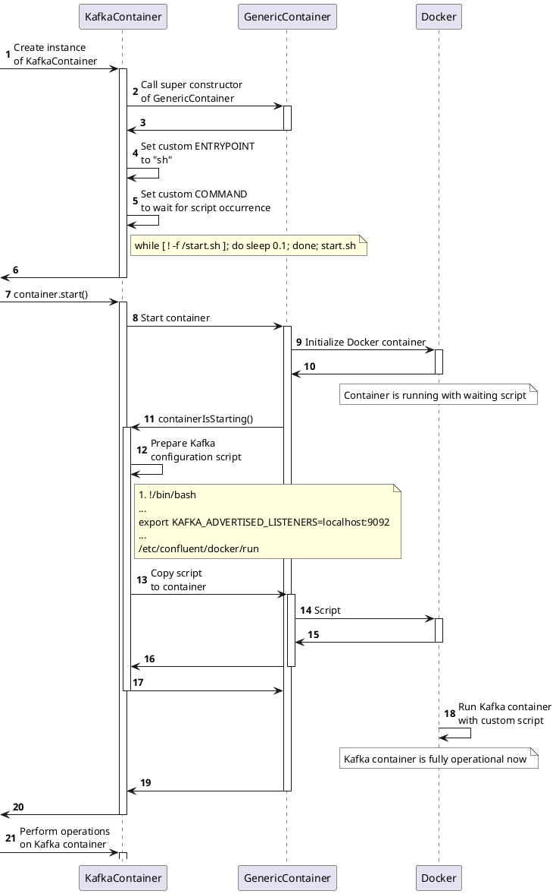

# Как сократить потребление памяти в интеграционных тестах с Kafka с помощью GraalVM

##

В данной статье я хочу поделиться своим опытом создания нативного образа для EmbeddedKafka с использованием GraalVM. Использование такого образа в интеграционных тестах позволяет увеличить скорость запуска тестовых сценариев и сократить объем потребляемой памяти. Интересно отметить, что в сравнении с использованием `confluentinc/cp-kafka` в Testcontainers, разница в скорости и потреблении памяти оказывается заметной — и не в пользу последнего.

## EmbeddedKafka, Testcontainers, GraalVM

Кратко о ключевых компонентах, использованных в проекте.

EmbeddedKafka — это инструмент, который позволяет встроить Kafka-сервер непосредственно в JVM-приложение или тестовую среду. Это полезно для интеграционного тестирования приложений, использующих Apache Kafka для обработки потоков данных или в качестве системы обмена сообщениями. Embedded Kafka преимущественно используется для изолированного тестирования взаимодействия с Kafka, упрощая настройку и управление тестами за счет быстрого запуска и остановки. Это обеспечивает воспроизводимость тестов в различных средах и предоставляет контроль над конфигурацией Kafka. Однако, работа Embedded Kafka в JVM-приложении увеличивает потребление памяти из-за ресурсоемкости Kafka и необходимости хранения данных. Это компромисс между удобством разработки и дополнительной нагрузкой на память, делая внешний (по отношению к JVM-приложению) Kafka-сервер более предпочтительным для производственной среды или при ограниченных ресурсах памяти.

Testcontainers — это фреймворк, который используется для поддержки автоматизированных интеграционных тестов с использованием Docker-контейнеров. Он позволяет создавать, управлять и удалять контейнеры во время выполнения тестов. Использование Docker-контейнеров обеспечивает согласованность тестовой среды на различных машинах и платформах, что упрощает локальную разработку и тестирование. Использование Kafka в Testcontainers по сравнению с Embedded Kafka предлагает ряд преимуществ, особенно когда дело касается тестирования в более реалистичной и гибкой среде. Testcontainers запускает экземпляры Kafka на основе официальных образов Confluent OSS Platform.

GraalVM — это платформа для выполнения программ, поддерживающая различные языки программирования и технологии. Она, кроме всего прочего, позволяет компилировать Java-приложения в статически связанные исполняемые файлы (native binaries). Эти нативные исполнимые файлы запускаются быстрее, требуют меньше памяти и не требуют установленной JVM. Недавняя статья по этой теме - https://habr.com/ru/articles/755550/.

## Тестовый сценарий

Для иллюстрации подходов к написанию тестов я подготовил примеры кода, соответствующие простому тестовому сценарию:
- отправляем сообщение `value1` в топик `topic1`;
- читаем сообщение из топика `topic1`;
- проверяем значение, оно должно быть равно `value1`.
  
Примеры можно найти в [репозитории проекта](https://github.com/avvero/embedded-kafka):
- тесты с использованием EmbeddedKafka находятся в модуле [example-spring-embedded-kafka](https://github.com/avvero/embedded-kafka/tree/sb3/example-spring-embedded-kafka);
- тесты с использованием Testcontainers находятся в модуле [example-testcontainers](https://github.com/avvero/embedded-kafka/tree/sb3/example-testcontainers).

Структура репозитория упрощает сравнение модулей для оценки разницы в структуре и составе кода при использовании каждого из подходов.

## Заворачиваем EmbeddedKafka в контейнер

Первым делом нужно было реализовать запуск EmbeddedKafka в рамках отдельного контейнера. Для этого я пошел прямым путем:
- описал стандартное Spring Boot приложение, используя https://start.spring.io/;
- в приложении описал запуск экземпляра класса  `org.springframework.kafka.test.EmbeddedKafkaZKBroker` с передачей необходимых параметров;
- описал Dockerfile и собрал образ.
Все описанные выше действия находят свое отражение в коде модуля [emk-application](https://github.com/avvero/embedded-kafka/tree/sb3/emk-application) в репозитории проекта.

## Запускаем EmbeddedKafka в контейнере

В документации Testcontainers представлено руководство к запуску контейнера с Kafka через использование класса `KafkaContainer` следующим образом:
```
KafkaContainer kafka = new KafkaContainer(DockerImageName.parse("confluentinc/cp-kafka:6.2.1"))
```
Данный класс мне не подошел, так как он предназначен для использования с совместимыми образами `confluentinc/cp-kafka`, но знакомство с ним было полезно - в нем можно увидеть любопытную логику вокруг передачи параметра KAFKA_ADVERTISED_LISTENERS:
1. На старте контейнера осуществляется подмена инструкций ENTRYPOINT/COMMAND.
2. После старта идет передача в контейнер параметров KAFKA_ADVERTISED_LISTENERS и инструкции по запуску Kafka.

Это подробно описано на прилагаемой схеме.



Зачем это нужно? В процессе работы клиент может обратиться к любому узлу Kafka для получения адреса, по которому необходимо выполнять операции записи/чтения, даже если Kafka представлена одним узлом. Для внешнего пользователя необходим внешний адрес, а для внутреннего — соответственно, внутренний. Указывая KAFKA_ADVERTISED_LISTENERS, мы предоставляем брокеру информацию о его внешнем адресе, которую брокер затем передает клиенту. Клиенты будут внешними по отношению к брокеру, так как брокер запущен в контейнере.

Я реализовал описанную выше логику в новом классе - [EmbeddedKafkaContainer.java](https://github.com/avvero/embedded-kafka/blob/sb3/emk-testcontainers/src/main/java/pw/avvero/emk/EmbeddedKafkaContainer.java).

## Создаем нативный образ EmbeddedKafka

Самый простой способ начать новый проект на Spring Boot для GraalVM — это перейти на сайт start.spring.io, добавить зависимость “GraalVM Native Support” и сгенерировать проект. В комплекте с проектом поставляется файл HELP.md, который предоставляет полезные подсказки для начала работы.

### Сбор меты

Инструмент сборки нативного образа зависит от статического анализа, доступного во время выполнения кода приложения. Однако этот анализ не всегда способен полностью предсказать все случаи использования Java Native Interface (JNI), рефлексии Java, динамических прокси-объектов и т.д. Следовательно, случаи использования этих динамических функций должны быть явно указаны инструменту сборки нативного образа в виде метаданных. Один из способов предоставления таких метаданных — это JSON файлы, размещенные в директории проекта `META-INF/native-image/<group.id>/<artifact.id>`.

GraalVM предлагает Tracing Agent для удобного сбора метаданных и подготовки файлов конфигурации. Этот агент отслеживает все случаи использования динамических функций во время выполнения приложения на стандартной Java VM.

Мой подход был следующим:
- запустил экземпляр Spring приложения с Embedded Kafka под JVM с Tracing Agent.
- прогнал большой набор тестов из одного из моих проектов, используя запущенное приложение в качестве основного брокера Kafka.

Полученные в ходе этого процесса файлы были размещены в директории проекта [META-INF/native-image](https://github.com/avvero/embedded-kafka/tree/sb3/emk-application/src/main/resources/META-INF/native-image).

## Запуск и использование

Для демонстрации результата я подготовил следующие артефакты:
- Библиотека с классом `EmbeddedKafkaContainer`  - `pw.avvero:emk-testcontainers:1.0.0`.
- Docker образы: `avvero/emk` (JVM) и `avvero/emk-native` (native, platform=linux/arm64).
- Пример использования, соответствующий тестовому сценарию, можно найти в модуле [example-embedded-kafka-container](https://github.com/avvero/embedded-kafka/tree/sb3/example-embedded-kafka-container).

Конфигурация [KafkaContainerConfiguration](https://github.com/avvero/embedded-kafka/blob/sb3/example-embedded-kafka-container/src/test/java/pw/avvero/emk/KafkaContainerConfiguration.java) выглядит следующим образом:
```java
@TestConfiguration(proxyBeanMethods = false)
public class KafkaContainerConfiguration {

    @Bean
    @RestartScope
    @ServiceConnection
    EmbeddedKafkaContainer kafkaContainer() {
        return new EmbeddedKafkaContainer("avvero/emk-native:1.0.0");
    }
}
```

Для оценки утилизации памяти я осуществил прогон тестов длительностью около 7 минут из одного из моих проектов. На основе наблюдений в `docker stats` я заметил следующие тенденции по потреблению памяти:
- confluentinc/cp-kafka:7.3.3    1.331GiB
- avvero/emk                     677.3MiB
- avvero/emk-native              126.4MiB

Анализ памяти (Young + Old + Meta space ) по логам GC c помощью https://gceasy.io показал следующее:
- confluentinc/cp-kafka:7.3.3    1.06 gb/866.92 mb (Allocated/Peak)
- avvero/emk                     567.62 mb/241.74 mb (Allocated/Peak)
- avvero/emk-native              20.00M -> 15.50M  ?

Анализ логов GC для нативного образа представляет собой более сложную задачу, поскольку формат и состав данных отличаются от "стандартных" логов GC. К сожалению, мне не удалось найти инструмент анализа, который бы подходил для этой цели и мог бы предоставить готовую аналитику. Поэтому ниже представлен фрагмент лога, который поможет оценить общий порядок утилизации памяти в моем случае.
```log
[497.519s] GC(11371) Collect on allocation
[497.520s] GC(11371)   Eden: 4.50M->0.00M
[497.520s] GC(11371)   Survivor: 0.00M->0.00M
[497.520s] GC(11371)   Old: 15.50M->15.50M
[497.520s] GC(11371)   Free: 3.50M->8.00M
[497.520s] GC(11371) Incremental GC (Collect on allocation) 20.00M->15.50M 0.896ms
```
Файлы логов GC прикреплены к модулю [тестов производительности](https://github.com/avvero/embedded-kafka/tree/sb3/benchmark).

Что касается времени запуска, я провел [серию тестов производительности с использованием JMH](https://github.com/avvero/embedded-kafka/tree/sb3/benchmark) для оценки времени запуска и операционной готовности различных конфигураций контейнеров Kafka:
- `testContainersKafkaStartAndReady` - Testcontainers c `confluentinc/cp-kafka:7.3.3`.
- `emkJvmKafkaStartAndReady` -  `avvero/emk` (JVM).
- `emkNativeKafkaStartAndReady` - `avvero/emk-native` (native, platform=linux/arm64).

Тесты сосредоточены на проверке запуска и готовности. Простой запуск контейнера Kafka не всегда означает, что он готов к выполнению операций. Проверка готовности симулирует реальный сценарий, в котором Kafka не только запущена, но и полностью операционно готова. Это обеспечивает более полное представление о времени, необходимом для того, чтобы Kafka была полностью готова к работе в различных средах контейнеризации.

Результаты тестирования производительности следующие:
```
Benchmark                                                 Mode  Cnt  Score   Error  Units
TestContainersBenchmark.testContainersKafkaStartAndReady    ss   10  3,091 ± 0,354   s/op
TestContainersBenchmark.emkJvmKafkaStartAndReady            ss   10  2,659 ± 0,708   s/op
TestContainersBenchmark.emkNativeKafkaStartAndReady         ss   10  0,521 ± 0,055   s/op
```
Контейнер `avvero/emk-native:1.0.0` демонстрирует более высокую производительность, показывая в среднем время запуска и проверки готовности всего 0,521 секунды с отклонением ±0,055 секунды.

## Заключение

Статья детально разбирает, как достигнуть изоляции в интеграционных тестах с Kafka, применяя Testcontainers, Spring Boot 3.1, и другие инструменты для создания надежных, воспроизводимых тестов без необходимости принудительного ожидания. Описанный подход упрощает тестирование, позволяя полный контроль над тестовым окружением и обеспечивая изоляцию тестов через стратегии, такие как синхронная отправка сообщений, ручное управление смещением и точное управление состоянием. Эта работа предоставляет ценные рекомендации для разработчиков, стремящихся улучшить качество и надежность своих интеграционных тестов с Kafka.

Использование нативного образа для EmbeddedKafka с GraalVM в интеграционных тестах ускоряет время запуска тестов и снижает потребление памяти, что делает его эффективным решением по сравнению с традиционными методами, например, использованием `confluentinc/cp-kafka` в Testcontainers.

Использованием GraalVM открывает новые возможности для разработчиков, стремящихся улучшить производительность и эффективность интеграционных тестов. Этот подход может быть адаптирован и расширен для других подобных задач и технологий, подчеркивая его универсальность и потенциал в области разработки программного обеспечения.

Ссылка на репозиторий проект с демонстрацией тестов -  https://github.com/avvero/embedded-kafka.

Спасибо за внимание к статье, и удачи в вашем стремлении к написанию эффективных и быстрых тестов!

## UPD

Добавил информацию бенчмарков JMH для оценки времени запуска и операционной готовности контейнеров.

#article #java #spring #native #graal
#draft