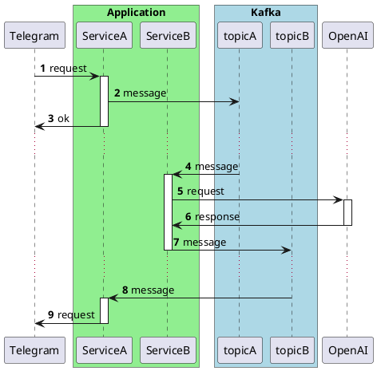

# Isolation in Testing with Kafka


The experience of running Kafka in test scenarios has reached a high level of convenience thanks to the use of Testcontainers and enhanced support in Spring Boot 3.1 with the `@ServiceConnection` annotation. However, writing and maintaining integration tests with Kafka remains a challenge. This article describes an approach that significantly simplifies the testing process by ensuring test isolation and providing a set of tools to achieve this goal. With successful implementation of isolation, Kafka tests can be organized in such a way that at the stage of result verification, there is full access to all messages that have arisen during the test, thereby avoiding the need for forced waiting methods such as `Thread.sleep()`.

This method is suitable for use with Testcontainers, Embedded Kafka, or other methods of running the Kafka service (e.g., a local instance).

## Test Isolation

As detailed in the article [Eradicating Non-Determinism in Tests](https://martinfowler.com/articles/nonDeterminism.html), clear control over the testing environment is crucial for the reliable execution of tests. This ensures that each test begins from a known state. An example could be a situation where one test creates data in a database and fails to clean it up afterwards, negatively impacting the execution of subsequent tests that expect a different database state.

Various methods can be applied to achieve test isolation, including:
- Restoring the system's original state before each test run.
- Mandatory data cleanup after the execution of each test to prevent influence on subsequent tests.

### Isolation in Kafka Testing

Restoring Kafka's initial environment state from scratch for each test scenario can be achieved by restarting Kafka. This option is straightforward in terms of implementation but costly in terms of startup time. There are methods to speed up this process (for more details, you can read about [running Kafka on GraalVM](https://medium.com/@avvero.abernathy/how-to-reduce-memory-consumption-in-integration-tests-with-kafka-using-graalvm-de2393f7fe8a)), but this article suggests considering an option where we work with a common Kafka instance across all test scenarios.

This approach poses certain challenges: if one test sends messages to a topic and neglects the fact of their receipt and processing, it could harm the execution of another test that may rely on a different topic state.

To ensure isolation, it is necessary that in the case of sending a message to a topic being listened to by the same application, all processes initiated by these messages are completed before the end of the test scenario.

## Implementation

Consider the example of a hypothetical Telegram bot that redirects requests to the OpenAI API and sends responses to users.

For simplicity, the interaction contracts with the services are described in a simplified form to highlight the main logic of operation. Below is a sequence diagram showing the architecture of the application. I understand that the design may raise questions from a system architecture perspective, but please bear with me—the main goal here is to demonstrate the approach to isolation in testing.



Below is a diagram illustrating the testing approach:


The key feature of the proposed solution is the strict division of test code into phases corresponding to the Arrange-Act-Assert pattern. You can read more about this approach in the article [Ordering Chaos: Arranging HTTP Request Testing in Spring](https://medium.com/@avvero.abernathy/ordering-chaos-arranging-http-request-testing-in-spring-c625520d2418).

To achieve isolation, it is critically important to maintain the following relationships between the key elements of the scheme (numbers correspond to those indicated in the diagram):
- (1) Scenario setup (Arrange) occurs before Scenario execution (Act).
- (2) The message is sent and (3) confirmed by the partition leader before the ServiceA's request processing is considered complete.
- (4) Manual offset management with commit occurs only after all processing by ServiceB or ServiceA is fully completed.
- (5) Scenario execution (Act) occurs before Result verification (Assert).

This approach ensures that by the time of result verification, all processes within the test scenario are completed, and all messages are sent and received, ensuring the test environment is in a known and final state.

### Scenario Setup (Arrange) Occurs Before Scenario Execution (Act)

The goal of this stage is to prepare everything necessary for the test scenario. In the context of our example, the main components of the test environment include the application context, HTTP request mocks, Kafka, and Record Captor.

Regarding integration with Kafka, it is critical to ensure that all consumers are ready to receive messages. This verification is implemented in the [KafkaSupport#waitForPartitionAssignment](https://github.com/avvero/kafka-test-support/blob/8e9bdbfebe865f3de48972ab9a7f33cb34326348/kafka-support/src/main/java/pw/avvero/test/kafka/KafkaSupport.java#L39) method. The solution is based on the original `ContainerTestUtils` from the `org.springframework.kafka:spring-kafka-test` library, modified according to the described usage scenario. This method guarantees that at least one partition will be assigned to each Kafka consumer. This implies a limitation: there must be only one partition per topic in the test environment, although this limitation is a result of the current implementation of the method and can be changed.

Using a common Kafka instance requires setting the `auto.offset.reset = latest` parameter for consumers. For Spring applications, this is done as follows:
```
spring.kafka.consumer.auto-offset-reset=latest
```

Record Captor is a key element of this solution. Its task is to "catch" messages from the specified topics in the configuration and provide access to them for the result verification step of the test scenario. Technically, it is a simple consumer for a Kafka topic with a message storage mechanism and an access interface. The Record Captor code is available in the [project repository](https://github.com/avvero/kafka-test-support/blob/sb3/kafka-support/src/main/java/pw/avvero/test/kafka/RecordCaptor.java).

The current implementation of Record Captor offers the use of the message key for identifying messages related to a specific test case. This is useful in systems where unique identifiers are present, such as a client ID or a process identifier in the domain model. Using such identifiers as the key allows for effectively grouping and tracking all messages related to the same test scenario, even if they are distributed across different topics or processed by different system components.

### Synchronous Message Sending with Acknowledgment

The goal is to implement synchronous message sending to Kafka with acknowledgment from the partition leader. To achieve this, the `acks = 1` parameter must be set for the producer. In the context of a Spring application, this setting is specified as follows:
```
spring.kafka.producer.acks=1
```
When using `KafkaTemplate` for sending messages, it is important to ensure the synchronicity of sending, as this component provides only an asynchronous interface `org.springframework.kafka.core.KafkaTemplate#send(org.springframework.messaging.Message<?>) return CompletableFuture<SendResult<K, V>>`. The following approach can be used for synchronous sending:
```java
kafkaTemplate.send(message).get()
```
This ensures that the message sending will be completed synchronously, with waiting for Kafka's acknowledgment before proceeding with the program execution.

### Manual Offset Management

Manual offset management with commit means that the message consumer will commit the message processing only after their complete processing. In this context, the offset for `topicA` will only be committed after the message has been successfully sent to `topicB` and the corresponding acknowledgment has been received.

To implement this logic, it is necessary to disable the automatic offset commit for consumers by setting the `enable.auto.commit = false` parameter. In the context of a Spring application, this is configured as follows:
```properties
spring.kafka.consumer.enable-auto-commit=false
```
Furthermore, the commit mechanism should be configured so that the offset is committed after processing each individual message, which is achieved by setting the parameter:
```properties
spring.kafka.listener.ack-mode=record
```

### Scenario Execution (Act) Occurs Before Result Verification (Assert)

Before starting the result verification stage, it is necessary to ensure that all processes related to the scenario are completed, all messages are sent and received, ensuring the test environment transitions to a "known" final state. Thanks to the preceding stages, we have ensured adherence to the happens-before principle between the actions of producers and consumers, as well as between all processing within the application. At this stage, it is required to perform a check for offset commits for each partition for each group of consumers.

To carry out this verification, the solution presented in the method [pw.avvero.emk.KafkaSupport#waitForPartitionOffsetCommit](https://github.com/avvero/kafka-test-support/blob/8e9bdbfebe865f3de48972ab9a7f33cb34326348/kafka-support/src/main/java/pw/avvero/test/kafka/KafkaSupport.java#L105) can be used.

### Result Verification (Assert)

The final stage involves analyzing the results of the test scenario. This process includes checking the state of mocks and analyzing the messages caught in RecordCaptor.

## Key Solution Elements Summarized

Here is a brief summary of the key components of the proposed solution for effective testing with Kafka:
1. One partition per topic.
2. The policy for message reading start for consumers - `spring.kafka.consumer.auto-offset-reset=latest`.
3. Acknowledgment policy for producers - `spring.kafka.producer.acks=1`.
4. Synchronous message sending - `kafkaTemplate.send(message).get()`.
5. Manual offset control - `spring.kafka.consumer.enable-auto-commit=false`, `spring.kafka.listener.ack-mode=record`.
6. Waiting for partition assignment before starting the test scenario - `pw.avvero.emk.KafkaSupport#waitForPartitionAssignment`.
7. Waiting for offset commitment before verifying test results - `pw.avvero.emk.KafkaSupport#waitForPartitionOffsetCommit`.

## Result

The application code is available in the [examples module](https://github.com/avvero/kafka-test-support/tree/sb3/example-testcontainers/src/main/java/pw/avvero/example/feature1). The test code is as follows.

```java
def "User Message Processing with OpenAI"() {
    setup:
(1) KafkaSupport.waitForPartitionAssignment(applicationContext)                           
    and:
    def openaiRequestCaptor = new RequestCaptor()
(2) restMock.expect(manyTimes(), requestTo("https://api.openai.com/v1/chat/completions")) 
            .andExpect(method(HttpMethod.POST))
            .andExpect(openaiRequestCaptor)
            .andRespond(withSuccess('{"content": "Hi, how can i help you?"}', MediaType.APPLICATION_JSON))
    and:
    def telegramRequestCaptor = new RequestCaptor()
(3) restMock.expect(manyTimes(), requestTo("https://api.telegram.org/sendMessage"))      
            .andExpect(method(HttpMethod.POST))
            .andExpect(telegramRequestCaptor)
            .andRespond(withSuccess('{}', MediaType.APPLICATION_JSON))
    when:
(4) mockMvc.perform(post("/telegram/webhook")                                           
            .contentType(APPLICATION_JSON_VALUE)
            .content("""{
              "message": {
                "from": {
                  "id": 10000000
                },
                "chat": {
                  "id": 20000000
                },
                "text": "Hello!"
              }
            }""".toString())
            .accept(APPLICATION_JSON_VALUE))
            .andExpect(status().isOk())
(5) KafkaSupport.waitForPartitionOffsetCommit(applicationContext)                     
    then:
(6) openaiRequestCaptor.times == 1                                                      
    JSONAssert.assertEquals("""{
        "content": "Hello!"
    }""", openaiRequestCaptor.bodyString, false)
    and:
    telegramRequestCaptor.times == 1
    JSONAssert.assertEquals("""{
        "chatId": "20000000",
        "text": "Hi, how can i help you?"
    }""", telegramRequestCaptor.bodyString, false)
}
```
Here are the key steps described in the test scenario:
1. Waiting for partition assignment before starting the test scenario.
2. Mocking requests to OpenAI.
3. Mocking requests to Telegram.
4. Executing the test scenario.
5. Waiting for offset confirmation.
6. Result verification.

Additional tests, including scenarios with intensive message sending and the use of the `@RetryableTopic` mechanism for retries, are also available in the [project repository](https://github.com/avvero/kafka-test-support/tree/sb3/kafka-support/src/test/groovy/pw/avvero/test/kafka), providing opportunities for study and adaptation to your own development needs.

## Conclusion

Successful testing of interactions with Kafka requires a careful approach to test isolation and environment control. The use of Testcontainers and the capabilities of Spring Boot 3.1 greatly simplifies this process, and the application of the proposed techniques and tools allows developers to focus on the application logic, making development more efficient and less prone to errors.

Thank you for paying attention to the article, and good luck in your pursuit of writing convenient and reliable tests!

##

Thrilled to share that I've recently published an article on achieving test isolation with Kafka, a topic that's both challenging and crucial for ensuring the reliability of integration tests.

The article outlines a comprehensive approach to maintain test isolation, detailing methods to control the testing environment effectively, and ensuring each test starts from a known state. This strategy not only facilitates more predictable and reliable testing outcomes but also significantly improves the development workflow.

For those grappling with the intricacies of Kafka in testing scenarios, this article offers insights into synchronous message sending with acknowledgment, manual offset management, and the criticality of the Arrange-Act-Assert pattern in testing phases. I've also included examples and additional test for scenarios with @RetryableTopic mechanism, aiming to provide a practical guide that can be adapted to various development needs.

You can explore the code and more detailed discussions in the examples module of the project repository.


[Link to the article]

#article #test #kafka