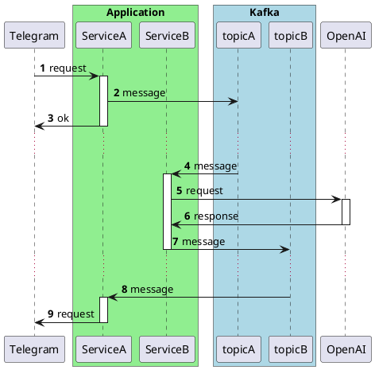

# Изоляция в тестах с Kafka


Написание и поддержка интеграционных тестов с Kafka являются вызовом. В этой статье описывается подход, который упрощает процесс тестирования, обеспечивая изоляцию тестов и удобные инструменты для достижения этой цели.

Благодаря изоляции тесты с Kafka можно организовать так, чтобы на этапе проверки результатов был доступ ко всем сообщениям, созданным в ходе теста, без необходимости использования методов ожидания, таких как `Thread.sleep()`, или инструментов вроде Awaitility.

Метод подходит для использования с Testcontainers, Embedded Kafka, а также при запуске Kafka локально или иными способами.

## Изоляция в тестах

Для надежного выполнения тестов критически [важен контроль над тестовым окружением](https://martinfowler.com/articles/nonDeterminism.html). Это гарантирует, что каждый тест начинается с заранее известного состояния. Примером может служить ситуация, когда один тест создает данные в базе и не удаляет их после себя, что может негативно сказаться на выполнении последующих тестов, ожидающих другое состояние базы.

Для достижения изоляции тестов можно применять различные методы, включая:
 - Восстановление исходного состояния системы перед запуском каждого теста.
 - Обязательная очистка данных после выполнения каждого теста, чтобы избежать влияния на следующие тесты.

### Изоляция в тестах с Kafka

Восстановление начального состояния среды Kafka с нуля для каждого тестового сценария может быть реализованно путем перезапуска Kafka. Этот вариант достаточно простой в плане реализации, но дорогой по времени запуска. Существуют [методы для ускорения этого процесса](https://habr.com/ru/articles/788812/), но в данной статье предлагается рассмотреть вариант, когда в рамках всех тестовых сценариев мы работаем с общим экземпляром Kafka.

Такой подход ставит перед нами определенные вызовы: если один тест отправляет сообщения в топик и оставляет без внимания факт их получения и обработки, это может повредить выполнению другого теста, который может полагаться на иное состояние топика. 

Для обеспечения изоляции необходимо, чтобы в случае отправки сообщения в топик, который прослушивается тем же приложением, до завершения тестового сценария были выполнены все процессы, инициированные этими сообщениями.

## Реализация

Рассмотрим на примере условного телеграм-бота, который перенаправляет запросы к OpenAI API и отправляет ответы пользователям. 

Контракты взаимодействия с сервисами описаны в упрощенном виде, чтобы подчеркнуть основную логику работы. Ниже приведена диаграмма последовательностей, демонстрирующая архитектуру приложения. Понимаю, что дизайн может вызвать вопросы с точки зрения системной архитектуры, но прошу отнестись к этому с пониманием — главная цель здесь продемонстрировать подход к изоляции в тестах.



Ниже представлена схема, иллюстрирующая подход к тестированию:


Основной особенностью предложенного решения является [строгое разделение кода теста на фазы](https://habr.com/ru/articles/781812/), соответствующие паттерну Arrange-Act-Assert.

Для достижения изоляции критически важно соблюдать следующие взаимосвязи между ключевыми элементами схемы (цифры соответствуют указанным на схеме):
- (1) Подготовка сценария (Arrange) происходит до Выполнения сценария (Act).
- (2) Сообщение отправлено и (3) подтверждено лидером партиции до того как обработка запроса сервисом ServiceA считается завершенной.
- (4) Ручное управление смещением (offset) c фиксацией (commit) происходит только после того, как вся обработка сервисами ServiceB или ServiceA будет полностью завершена.
- (5) Выполнение сценария (Act) происходит до Проверки результата (Assert).
  
Такой подход позволяет к моменту проверки результатов гарантировать выполнение всех процессов в рамках тестового сценария, отправку и прием всех сообщений, обеспечивая нахождение тестового окружения в известном и финальном состоянии.

### Подготовка сценария (Arrange) происходит до Выполнения сценария (Act)

Цель этого этапа — подготовить все необходимое для тестового сценария. В контексте нашего примера основные компоненты тестовой среды включают контекст приложения, моки HTTP-запросов, Kafka и Record Captor.

Что касается интеграции с Kafka, критически важно убедиться, что все консумеры готовы к приему сообщений. Данная проверка реализована в методе [KafkaSupport#waitForPartitionAssignment](https://github.com/avvero/kafka-test-support/blob/8e9bdbfebe865f3de48972ab9a7f33cb34326348/kafka-support/src/main/java/pw/avvero/test/kafka/KafkaSupport.java#L39). Решение основано на оригинальном `ContainerTestUtils` из библиотеки `org.springframework.kafka:spring-kafka-test` с доработкой согласно описываемому сценарию использования. Этот метод гарантирует, что каждому консумеру Kafka будет назначена хотя бы одна партиция. Это предполагает ограничение: в тестовой среде должна быть только одна партиция на топик, хотя данное ограничение является следствием текущей реализации метода и может быть изменено.

Использование общего экземпляра Kafka требует настройки параметра `auto.offset.reset = latest` для консумеров, для Spring приложения это делается следующим образом:
```
spring.kafka.consumer.auto-offset-reset=latest
```

Record Captor является ключевым элементом этого решения. Его задача - "ловить" сообщения из указанных в конфигурации топиков и предоставить к ним доступ для шага проверки результатов тестового сценария. Технически это простой консумер для Kafka топика с механизмом хранения сообщений и интерфейсом доступа к ним. Код Record Captor доступен в [репозитории проекта](https://github.com/avvero/kafka-test-support/blob/sb3/kafka-support/src/main/java/pw/avvero/test/kafka/RecordCaptor.java).

Текущая реализация Record Captor предлагает использование ключа сообщения для идентификации сообщений, связанных с конкретным тестовым случаем. Это будет полезно в системах, где присутствуют уникальные идентификаторы, такие как ID клиента или идентификатор процесса в доменной модели. Использование таких идентификаторов в качестве ключа позволяет эффективно группировать и отслеживать все сообщения, относящиеся к одному и тому же тестовому сценарию, даже если они распределены по различным топикам или обрабатываются разными компонентами системы.

### Синхронная отправка сообщения с подтверждением

Цель состоит в реализации синхронной отправки сообщений в Kafka с получением подтверждения от лидера партиции. Для достижения этого необходимо установить параметр `acks = 1` для продюсера. В контексте Spring приложения это настройка задается следующим образом:
```
spring.kafka.producer.acks=1
```
При использовании `KafkaTemplate` для отправки сообщений важно обеспечить синхронность отправки, поскольку данный компонент предоставляет только асинхронный интерфейс `org.springframework.kafka.core.KafkaTemplate#send(org.springframework.messaging.Message<?>) return CompletableFuture<SendResult<K, V>>`. Для синхронной отправки можно использовать следующий подход:
```java
kafkaTemplate.send(message).get()
```
Это гарантирует, что отправка сообщения будет завершена синхронно, с ожиданием подтверждения от Kafka перед продолжением выполнения программы.

### Ручное управление смещением

Ручное управление смещением c фиксацией означает, что консумер сообщения будет фиксировать обработку сообщений только после их полной обработки. В данном контексте фиксация смещения для топика `topicA` произойдет только после того, как сообщение будет успешно отправлено в `topicB` и получено соответствующее подтверждение.

Для реализации такой логики, необходимо отключить автоматическую фиксацию смещений для консумеров, установив параметр `enable.auto.commit = false`. В контексте Spring-приложения это настраивается следующим образом:
```properties
spring.kafka.consumer.enable-auto-commit=false
```
Кроме того, следует настроить механизм фиксации так, чтобы смещение фиксировалось после обработки каждого отдельного сообщения, что достигается установкой параметра
```properties
spring.kafka.listener.ack-mode=record
```

### Выполнение сценария (Act) происходит до Проверки результата (Assert)

До начала этапа проверки результатов необходимо убедиться, что все процессы, связанные со сценарием, завершены, все сообщения отправлены и получены, обеспечивая переход тестового окружения в "известное" финальное состояние. Благодаря предшествующим этапам, мы обеспечили соблюдение принципа happens-before между действиями продюсеров и консумеров, а также между всеми обработками внутри приложения. На этом этапе требуется выполнить проверку фиксации смещений для каждой партиции для каждой группы консумеров.

Для выполнения данной проверки можно воспользоваться решением, представленном в методе [pw.avvero.emk.KafkaSupport#waitForPartitionOffsetCommit](https://github.com/avvero/kafka-test-support/blob/8e9bdbfebe865f3de48972ab9a7f33cb34326348/kafka-support/src/main/java/pw/avvero/test/kafka/KafkaSupport.java#L105).
### Проверки результата (Assert)

На заключительном этапе происходит анализ результатов тестового сценария. Этот процесс включает проверку состояния моков и анализ сообщений, пойманных в RecordCaptor.

## Основные элементы решения вкратце

Вот краткое изложение ключевых компонентов предложенного решения для обеспечения эффективного тестирования с Kafka:
1. Одна партиция на топик.
2. Политика начала чтения сообщений для консумеров - `spring.kafka.consumer.auto-offset-reset=latest`.
3. Политика подтверждений для продюсеров `spring.kafka.producer.acks=1`.
4. Синхронная отправка сообщений `kafkaTemplate.send(message).get()`.
5. Ручной контроль за смещением `spring.kafka.consumer.enable-auto-commit=false`, `spring.kafka.listener.ack-mode=record`.
6. Ожидание назначения партиций до начала тестового сценария `pw.avvero.emk.KafkaSupport#waitForPartitionAssignment`.
7. Ожидание подтверждения смещения перед проверкой результатов теста `pw.avvero.emk.KafkaSupport#waitForPartitionOffsetCommit`.

## Результат

Код приложения доступен в [модуле примеров](https://github.com/avvero/kafka-test-support/tree/sb3/example-testcontainers/src/main/java/pw/avvero/example/feature1). Код теста выглядит следующим образом.

```java
def "User Message Processing with OpenAI"() {
    setup:
(1) KafkaSupport.waitForPartitionAssignment(applicationContext)                           
    and:
    def openaiRequestCaptor = new RequestCaptor()
(2) restMock.expect(manyTimes(), requestTo("https://api.openai.com/v1/chat/completions")) 
            .andExpect(method(HttpMethod.POST))
            .andExpect(openaiRequestCaptor)
            .andRespond(withSuccess('{"content": "Hi, how can i help you?"}', MediaType.APPLICATION_JSON))
    and:
    def telegramRequestCaptor = new RequestCaptor()
(3) restMock.expect(manyTimes(), requestTo("https://api.telegram.org/sendMessage"))      
            .andExpect(method(HttpMethod.POST))
            .andExpect(telegramRequestCaptor)
            .andRespond(withSuccess('{}', MediaType.APPLICATION_JSON))
    when:
(4) mockMvc.perform(post("/telegram/webhook")                                           
            .contentType(APPLICATION_JSON_VALUE)
            .content("""{
              "message": {
                "from": {
                  "id": 10000000
                },
                "chat": {
                  "id": 20000000
                },
                "text": "Hello!"
              }
            }""".toString())
            .accept(APPLICATION_JSON_VALUE))
            .andExpect(status().isOk())
(5) KafkaSupport.waitForPartitionOffsetCommit(applicationContext)                     
    then:
(6) openaiRequestCaptor.times == 1                                                      
    JSONAssert.assertEquals("""{
        "content": "Hello!"
    }""", openaiRequestCaptor.bodyString, false)
    and:
    telegramRequestCaptor.times == 1
    JSONAssert.assertEquals("""{
        "chatId": "20000000",
        "text": "Hi, how can i help you?"
    }""", telegramRequestCaptor.bodyString, false)
}
```
Вот ключевые шаги, описанные в тестовом сценарии:
1. Ожидание назначения партиций до начала тестового сценария
2. Мокирование запросов к OpenAI 
3. Мокирование запросов к Telegram
4. Выполнение тестового сценария
5. Ожидание подтверждения смещения
6. Проверки результата

Дополнительные тесты, включая сценарии с интенсивной отправкой сообщений и использованием механизма `@RetryableTopic` для повторных попыток, также доступны в [репозитории проекта](https://github.com/avvero/kafka-test-support/tree/sb3/kafka-support/src/test/groovy/pw/avvero/test/kafka), предоставляя возможности для изучения и адаптации под собственные нужды разработки.

## Заключение

Успешное тестирование взаимодействия с Kafka требует внимательного подхода к изоляции тестов и контролю окружения. Использование Testcontainers и возможностей Spring Boot 3.1 значительно упрощает этот процесс, а применение предложенных методик и инструментов позволяет разработчикам сфокусироваться на логике приложения, делая разработку более эффективной и менее подверженной ошибкам.

Спасибо за внимание к статье, и удачи в вашем стремлении к написанию удобных и надежных тестов!

#article #test #kafka
#draft