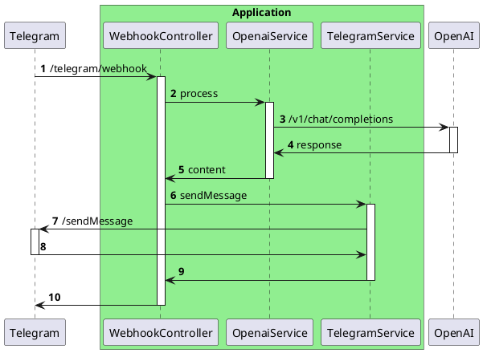

# Enhancing the Visibility of Integration Tests

In modern software development, effective testing plays a key role in ensuring the reliability and stability of applications.

This article offers practical recommendations for writing integration tests, demonstrating how to focus on the specifications of interactions with external services, making the tests more readable and easier to maintain. The approach not only enhances the efficiency of testing but also promotes a better understanding of the integration processes within the application. Through the lens of specific examples, various strategies and tools - such as DSL wrappers, JsonAssert, and Pact - will be explored, offering the reader a comprehensive guide to improving the quality and visibility of integration tests.

The article presents examples of integration tests performed using the Spock Framework in Groovy for testing HTTP interactions in Spring applications. At the same time, the main techniques and approaches suggested in it can be effectively applied to various types of interactions beyond HTTP.

## Problem Description

The article [Ordering Chaos: Arranging HTTP Request Testing in Spring](https://medium.com/@avvero.abernathy/ordering-chaos-arranging-http-request-testing-in-spring-c625520d2418) describes an approach to writing tests with a clear separation into distinct stages, each performing its specific role. Let's describe a test example according to these recommendations, but with mocking not one, but two requests. The Act stage (Execution) will be omitted for brevity (a full test example can be found in the [project repository](https://github.com/avvero/spring-sandbox/blob/main/src/test/groovy/pw/avvero/spring/sandbox/bot/mock/FeatureGTests.groovy)).


The presented code is conditionally divided into parts: "Supporting Code" (colored in gray) and "Specification of External Interactions" (colored in blue). The Supporting Code includes mechanisms and utilities for testing, including intercepting requests and emulating responses. The Specification of External Interactions describes specific data about external services that the system should interact with during the test, including expected requests and responses. The Supporting Code lays the foundation for testing, while the Specification directly relates to the business logic and main functions of the system that we are trying to test.

The Specification occupies a minor part of the code but represents significant value for understanding the test, whereas the Supporting Code, occupying a larger part, presents less value and is repetitive for each mock declaration. The code is intended for use with MockRestServiceServer. Referring to the [example on WireMock](https://github.com/avvero/spring-sandbox/blob/main/src/test/groovy/pw/avvero/spring/sandbox/bot/wiremock/FeatureWiremockGTests.groovy), one can see the same pattern: the specification is almost identical, and the Supporting Code varies.

The aim of this article is to offer practical recommendations for writing tests in such a way that the focus is on the specification, and the Supporting Code takes a back seat.

## Demonstration Scenario

For our test scenario, i propose a hypothetical Telegram bot that forwards requests to the OpenAI API and sends responses back to users.

The contracts for interacting with services are described in a simplified manner to highlight the main logic of the operation. Below is a sequence diagram demonstrating the application architecture. I understand that the design might raise questions from a systems architecture perspective, but please approach this with understanding—the main goal here is to demonstrate an approach to enhancing visibility in tests.



## Proposal

This article discusses the following practical recommendations for writing tests:
- Use of DSL wrappers for working with mocks.
- Use of JsonAssert for result verification.
- Storing the specifications of external interactions in JSON files.
- Use of Pact files.
  
## Using DSL Wrappers for Mocking

Using a DSL wrapper allows hiding the boilerplate mock code and provides a simple interface for working with the specification. It's important to emphasize that what's proposed is not a specific DSL, but a general approach it implements. A corrected test example using DSL is presented below ([full test text](https://github.com/avvero/spring-sandbox/blob/main/src/test/groovy/pw/avvero/spring/sandbox/bot/mock/FeatureGTestsStep1.groovy)).

```
setup:
def openaiRequestCaptor = restExpectation.openai.completions(withSuccess("{...}"))
def telegramRequestCaptor = restExpectation.telegram.sendMessage(withSuccess("{}"))
when:
...
then:
openaiRequestCaptor.times == 1
telegramRequestCaptor.times == 1
```
Where the method `restExpectation.openai.completions`, for example, is described as follows:
```java
public interface OpenaiMock {

    /**
     * This method configures the mock request to the following URL: {@code https://api.openai.com/v1/chat/completions}
     */
    RequestCaptor completions(DefaultResponseCreator responseCreator);
}
```

Having a comment on the method allows, when hovering over the method name in the code editor, to get help, including seeing the URL that will be mocked.

In the proposed implementation, the declaration of the response from the mock is made using `ResponseCreator` instances, allowing for custom ones, such as:
```java
public static ResponseCreator withResourceAccessException() {
    return (request) -> {
        throw new ResourceAccessException("Error");
    };
}
```
An example test for unsuccessful scenarios specifying a set of responses is shown below:
```java
import static org.springframework.http.HttpStatus.FORBIDDEN

setup:
def openaiRequestCaptor = restExpectation.openai.completions(openaiResponse)
def telegramRequestCaptor = restExpectation.telegram.sendMessage(withSuccess("{}"))
when:
...
then:
openaiRequestCaptor.times == 1
telegramRequestCaptor.times == 0
where:
openaiResponse                | _
withResourceAccessException() | _
withStatus(FORBIDDEN)         | _
```

For WireMock, everything is the same, except the response formation is slightly different ([test code](https://github.com/avvero/spring-sandbox/blob/main/src/test/groovy/pw/avvero/spring/sandbox/bot/wiremock/FeatureWiremockGTestsStep1.groovy), [response factory class code](https://github.com/avvero/spring-sandbox/blob/main/src/test/java/pw/avvero/spring/sandbox/bot/wiremock/CustomMockRestResponseCreators.java)).

## Using the @Language("JSON") Annotation for Better IDE Integration

When implementing a DSL, it's possible to annotate method parameters with `@Language("JSON")` to enable language feature support for specific code snippets in IntelliJ IDEA. With JSON, for example, the editor will treat the string parameter as JSON code, enabling features such as syntax highlighting, auto-completion, error checking, navigation, and structure search. Here's an example of the annotation's usage:

```java
public static DefaultResponseCreator withSuccess(@Language("JSON") String body) {
    return MockRestResponseCreators.withSuccess(body, APPLICATION_JSON);
}
```
Here's how it looks in the editor:


## Using JsonAssert for Result Verification

The JSONAssert library is designed to simplify testing of JSON structures. It enables developers to easily compare expected and actual JSON strings with a high degree of flexibility, supporting various comparison modes.

This allows moving from a verification description like this
```java
openaiRequestCaptor.body.model == "gpt-3.5-turbo"
openaiRequestCaptor.body.messages.size() == 1
openaiRequestCaptor.body.messages[0].role == "user"
openaiRequestCaptor.body.messages[0].content == "Hello!"
```
to something like this
```java
assertEquals("""{
    "model": "gpt-3.5-turbo",
    "messages": [{
        "role": "user",
        "content": "Hello!"
    }]
}""", openaiRequestCaptor.bodyString, false)
```
In my opinion, the main advantage of the second approach is that it ensures data representation consistency across various contexts - in documentation, logs, tests. This significantly simplifies the testing process, providing flexibility in comparison and accuracy in error diagnosis. Thus, we not only save time on writing and maintaining tests but also improve their readability and informativeness.

When working within Spring Boot, starting from at least version 2, no additional dependencies are needed to work with the library, as `org.springframework.boot:spring-boot-starter-test` already includes a dependency on `org.skyscreamer:jsonassert`.

## Storing the Specification of External Interactions in JSON Files

One observation we can make is that JSON strings take up a significant portion of the test. Should they be hidden? Yes and no. It's important to understand what brings more benefits. Hiding them makes tests more compact and simplifies grasping the essence of the test at first glance. On the other hand, for thorough analysis, part of the crucial information about the specification of external interaction will be hidden, requiring extra jumps across files. The decision depends on convenience: do what's more comfortable for you.

If you choose to store JSON strings in files, one simple option is to keep responses and requests separately in JSON files. Below is a test code ([full version](https://github.com/avvero/spring-sandbox/blob/main/src/test/groovy/pw/avvero/spring/sandbox/bot/mock/FeatureGTestsStep2.groovy)) demonstrating an implementation option:
```java
setup:
def openaiRequestCaptor = restExpectation.openai.completions(withSuccess(fromFile("json/openai/response.json")))
def telegramRequestCaptor = restExpectation.telegram.sendMessage(withSuccess("{}"))
when:
...
then:
openaiRequestCaptor.times == 1
telegramRequestCaptor.times == 1
```
The `fromFile` method simply reads a string from a file in the `src/test/resources` directory and doesn't carry any revolutionary idea but is still available in the project repository for reference.

For the variable part of the string, it's suggested to use substitution with [org.apache.commons.text.StringSubstitutor](https://commons.apache.org/proper/commons-text/apidocs/org/apache/commons/text/StringSubstitutor.html) and pass a set of values when describing the mock, for example:
```java
setup:
def openaiRequestCaptor = restExpectation.openai.completions(withSuccess(fromFile("json/openai/response.json",
        [content: "Hello! How can I assist you today?"])))
```
where the part with substitution in the JSON file looks like this:
```json
...
"message": {
    "role": "assistant",
    "content": "${content:-Hello there, how may I assist you today?}"
},
...
```

The single challenge for developers when adopting the file storage approach is to develop a proper file placement scheme in test resources and a naming scheme. It's easy to make a mistake that can worsen the experience of working with these files. One solution to this problem could be using specifications, such as those from Pact, which will be discussed later.

When using the described approach in tests written in Groovy, you might encounter inconvenience: there's no support in IntelliJ IDEA for navigating to the file from the code, but [support for this functionality is expected to be added in the future](https://youtrack.jetbrains.com/issue/IDEA-349059). In tests written in Java, this works great.

## Using Pact Contract Files

Let's start with the terminology.

Contract testing is a method of testing integration points where each application is tested in isolation to confirm that the messages it sends or receives conform to a mutual understanding documented in a "contract". This approach ensures that interactions between different parts of the system meet expectations.

A contract in the context of contract testing is a document or specification that records an agreement on the format and structure of messages (requests and responses) exchanged between applications. It serves as a basis for verifying that each application can correctly process data sent and received by others in the integration.

The contract is established between a consumer (for example, a client wanting to retrieve some data) and a provider (for example, an API on a server providing the data needed by the client).

Consumer-driven testing is an approach to contract testing where consumers generate contracts during their automated test runs. These contracts are passed to the provider, who then runs their set of automated tests. Each request contained in the contract file is sent to the provider, and the response received is compared with the expected response specified in the contract file. If both responses match, it means the consumer and service provider are compatible.

Finally, Pact. Pact is a tool that implements the ideas of consumer-driven contract testing. It supports testing both HTTP integrations and message-based integrations, focusing on code-first test development.

As I mentioned earlier, we can use Pact's contract specification and tools for our task. The implementation might look like this ([full test code](https://github.com/avvero/spring-sandbox/blob/main/src/test/groovy/pw/avvero/spring/sandbox/bot/mock/FeatureGTestsStep3.groovy)):
```java
setup:
def openaiRequestCaptor = restExpectation.openai.completions(fromContract("openai/SuccessfulCompletion-Hello.json"))
def telegramRequestCaptor = restExpectation.telegram.sendMessage(withSuccess("{}"))
when:
...
then:
openaiRequestCaptor.times == 1
telegramRequestCaptor.times == 1
```
The contract file is [available for review](https://github.com/avvero/spring-sandbox/blob/main/src/test/resources/contracts/openai/SuccessfulCompletion-Hello.json).

The advantage of using contract files is that they contain not only the request and response body but also other elements of the external interactions specification—request path, headers, HTTP response status, allowing a mock to be fully described based on such a contract.

It's important to note that in this case, we limit ourselves to contract testing and do not extend into consumer-driven testing. However, someone might want to explore Pact further.

## Conclusion

This article reviewed practical recommendations for enhancing the visibility and efficiency of integration tests in the context of development with the Spring Framework. My goal was to focus on the importance of clearly defining the specifications of external interactions and minimizing boilerplate code. To achieve this goal, I suggested using DSL wrappers, JsonAssert, storing specifications in JSON files, and working with contracts through Pact. The approaches described in the article aim to simplify the process of writing and maintaining tests, improve their readability, and most importantly, enhance the quality of testing itself by accurately reflecting interactions between system components.

Link to the project repository demonstrating the tests - [sandbox/bot](https://github.com/avvero/spring-sandbox/tree/main/src/test/groovy/pw/avvero/spring/sandbox/bot).

Thank you for your attention to the article, and good luck in your pursuit of writing effective and visible tests!

#idea #article
#draft