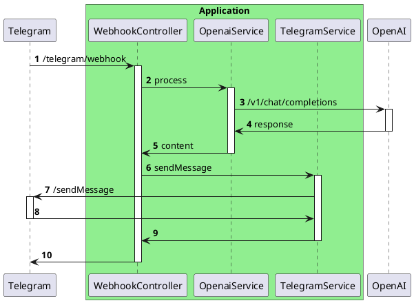

# Повышение наглядности интеграционных тестов

В современной разработке программного обеспечения эффективное тестирование играет ключевую роль в обеспечении надежности и стабильности приложений. 

Данная статья предлагает практические рекомендации по написанию интеграционных тестов, демонстрируя, как сосредоточиться на спецификациях взаимодействия с внешними сервисами, делая тесты более читаемыми и легкими для поддержки. Представленный подход не только повышает эффективность тестирования, но и способствует лучшему пониманию интеграционных процессов в приложении. Через призму конкретных примеров будут исследованы различные стратегии и инструменты - DSL-обертки, JsonAssert и Pact, предлагая читателю комплексное руководство по улучшению качества и наглядности интеграционных тестов.

Статья представляет примеры интеграционных тестов, выполненных с использованием Spock Framework на языке Groovy для тестирования HTTP-взаимодействий в Spring-приложениях. В то же время, основные методики и подходы, предложенные в ней, могут быть эффективно применены к различным типам взаимодействий за пределами HTTP.

## Описание проблемы

В статье [Разносим по полочкам этапы тестирования http запросов в Spring](https://habr.com/ru/articles/781812/) описывается подход к написанию тестов с чётким разделением на отдельные этапы, каждый из которых выполняет свою специфическую роль. Давайте опишем пример теста согласно этим рекомендациям, но уже с мокированием не одного, а двух запросов. Этап Act (Выполнение) опустим для краткости (полный пример тестов можно найти в [репозитории проекта](https://github.com/avvero/spring-sandbox/blob/main/src/test/groovy/pw/avvero/spring/sandbox/bot/mock/FeatureGTests.groovy)).


Представленный код условно делится на части: "Обслуживающий код" (покрашено серым) и "Спецификация внешних взаимодействий" (покрашено синим). Обслуживающий код – это механизмы и утилиты для тестирования, включая перехват запросов и эмуляцию ответов. Спецификация внешних взаимодействий описывает конкретные данные о внешних сервисах, с которыми система должна взаимодействовать во время теста, включая ожидаемые запросы и ответы. Обслуживающий код создаёт основу для тестирования, в то время как спецификация напрямую касается бизнес-логики и основных функций системы, тестирование которых мы пытаемся выполнить.

Спецификация занимает незначительную часть кода, но представляет большую ценность для понимания теста, в то время как обслуживающий код, занимая большую часть, представляет меньшую ценность и повторяется для каждой декларации мока. Приведённый код предназначен для использования с MockRestServiceServer. Если обратиться к [примеру на WireMock](https://github.com/avvero/spring-sandbox/blob/main/src/test/groovy/pw/avvero/spring/sandbox/bot/wiremock/FeatureWiremockGTests.groovy), можно увидеть ту же картину: спецификация практически идентична, а обслуживающий код различается.

Цель данной статьи – предложить практические рекомендации по написанию тестов так, чтобы в фокусе была спецификация, а обслуживающий код отходил на второй план.

## Демонстрационный сценарий

В качестве сценария для тестов предлагается условный телеграм-бот, который перенаправляет запросы к OpenAI API и отправляет ответы пользователям.

Контракты взаимодействия с сервисами описаны в упрощенном виде, чтобы подчеркнуть основную логику работы. Ниже приведена диаграмма последовательностей, демонстрирующая архитектуру приложения. Понимаю, что дизайн может вызвать вопросы с точки зрения системной архитектуры, но прошу отнестись к этому с пониманием — главная цель здесь продемонстрировать подход к повышению наглядности в тестах.



## Предложение

В данной статье рассматриваются следующие практические рекомендации по написанию тестов:
- Использование DSL-обёртки для работы с моками.
- Использование JsonAssert для проверки результатов.
- Хранение спецификации внешних взаимодействий в JSON-файлах.
- Использование Pact-файлов.

## Использование DSL-обёртки для работы с моками

Использование DSL-обёртки позволяет скрыть обслуживающий мокирование код и предоставить простой интерфейс для работы со спецификацией. Важно подчеркнуть, что предлагается не конкретный DSL, а общий подход, который он реализует. Исправленный пример теста с использованием DSL представлен ниже ([полный текст теста](https://github.com/avvero/spring-sandbox/blob/main/src/test/groovy/pw/avvero/spring/sandbox/bot/mock/FeatureGTestsStep1.groovy)).

```
setup:
def openaiRequestCaptor = restExpectation.openai.completions(withSuccess("{...}"))
def telegramRequestCaptor = restExpectation.telegram.sendMessage(withSuccess("{}"))
when:
...
then:
openaiRequestCaptor.times == 1
telegramRequestCaptor.times == 1
```
Где метод `restExpectation.openai.completions`, например, описан так:
```java
public interface OpenaiMock {

    /**
     * This method configures the mock request to the following URL: {@code https://api.openai.com/v1/chat/completions}
     */
    RequestCaptor completions(DefaultResponseCreator responseCreator);
}
```

Наличие комментария к методу позволяет в редакторе кода при наведении на имя метода получить справку, в том числе увидеть URL, запрос к которому будет мокироваться.

В предложенной реализации декларация ответа от мока осуществляется с помощью экземпляров `ResponseCreator`, что позволяет предлагать свои, например, такой:
```java
public static ResponseCreator withResourceAccessException() {
    return (request) -> {
        throw new ResourceAccessException("Error");
    };
}
```
Пример теста для неуспешных сценариев с указанием набора ответа представлен ниже:
```java
import static org.springframework.http.HttpStatus.FORBIDDEN

setup:
def openaiRequestCaptor = restExpectation.openai.completions(openaiResponse)
def telegramRequestCaptor = restExpectation.telegram.sendMessage(withSuccess("{}"))
when:
...
then:
openaiRequestCaptor.times == 1
telegramRequestCaptor.times == 0
where:
openaiResponse                | _
withResourceAccessException() | _
withStatus(FORBIDDEN)         | _
```

Для WireMock всё то же самое, за исключением того, что формирование ответа идёт немного иначе ([код теста](https://github.com/avvero/spring-sandbox/blob/main/src/test/groovy/pw/avvero/spring/sandbox/bot/wiremock/FeatureWiremockGTestsStep1.groovy), [код класса фабрики ответов](https://github.com/avvero/spring-sandbox/blob/main/src/test/java/pw/avvero/spring/sandbox/bot/wiremock/CustomMockRestResponseCreators.java)).

## Использование аннотации @Language("JSON") для улучшения интеграции с IDE

При реализации DSL есть возможность пометить параметры методов аннотацией `@Language("JSON")`, чтобы включить поддержку языковых особенностей для конкретного фрагмента кода в IntelliJ IDEA. В случае с JSON, редактор будет обрабатывать строковый параметр как JSON-код, что позволяет активировать функции, такие как: подсветка синтаксиса, автодополнение, проверка ошибок, навигация и поиск по структуре. Пример использования аннотации:

```java
public static DefaultResponseCreator withSuccess(@Language("JSON") String body) {
    return MockRestResponseCreators.withSuccess(body, APPLICATION_JSON);
}
```
Вот так это выглядит в редакторе:


## Использование JsonAssert для проверки результатов

Библиотека JSONAssert предназначена для упрощения тестирования JSON-структур. Она позволяет разработчикам легко сравнивать ожидаемые и фактические JSON-строки с высокой степенью гибкости, поддерживая различные режимы сравнения.

С её помощью возможен переход от такого варианта описания проверки
```java
openaiRequestCaptor.body.model == "gpt-3.5-turbo"
openaiRequestCaptor.body.messages.size() == 1
openaiRequestCaptor.body.messages[0].role == "user"
openaiRequestCaptor.body.messages[0].content == "Hello!"
```
к такому
```java
assertEquals("""{
    "model": "gpt-3.5-turbo",
    "messages": [{
        "role": "user",
        "content": "Hello!"
    }]
}""", openaiRequestCaptor.bodyString, false)
```
Основное преимущество второго варианта, на мой взгляд, заключается в обеспечении консистентности представления данных на разных уровнях присутствия - в документации, логах, тестах. Это значительно упрощает процесс тестирования, обеспечивая гибкость сравнения и точность диагностики ошибок. Таким образом, мы не только экономим время на написание и поддержку тестов, но и повышаем их читаемость и информативность.

При работе в рамках Spring Boot, начиная минимум с 2-й версии, для работы с библиотекой никаких дополнительных зависимостей добавлять не нужно, так как `org.springframework.boot:spring-boot-starter-test` уже включает в себя зависимость на `org.skyscreamer:jsonassert`.

## Хранение спецификации внешних взаимодействий в JSON файлах

Следующее наблюдение, которое мы можем сделать, - JSON строки занимают существенную часть теста. Нужно ли их спрятать? И да, и нет. Важно понять, что принесет больше пользы. Если их спрятать, с одной стороны, тесты становятся компактнее, и проще уловить суть теста при первом взгляде. С другой стороны, для тщательного анализа теста часть важной информации о спецификации внешнего взаимодействия будет скрыта и потребует лишних прыжков по файлам. Решение зависит от удобства: делайте так, как вам удобнее.

Если ваше решение - хранить JSON строки в файлах, одним из простых вариантов является хранение ответов и запросов отдельно в JSON файлах. Ниже предложен код теста ([полная версия](https://github.com/avvero/spring-sandbox/blob/main/src/test/groovy/pw/avvero/spring/sandbox/bot/mock/FeatureGTestsStep2.groovy)) для демонстрации варианта реализации:
```java
setup:
def openaiRequestCaptor = restExpectation.openai.completions(withSuccess(fromFile("json/openai/response.json")))
def telegramRequestCaptor = restExpectation.telegram.sendMessage(withSuccess("{}"))
when:
...
then:
openaiRequestCaptor.times == 1
telegramRequestCaptor.times == 1
```
Метод `fromFile` просто вычитывает строку из файл в директории `src/test/resources` и в целом никакой революционной мысли не несет, но все же доступен в репозитории проекта для ознакомления.

Переменную часть строки предлагается реализовать за счет подстановки с использованием [org.apache.commons.text.StringSubstitutor](https://commons.apache.org/proper/commons-text/apidocs/org/apache/commons/text/StringSubstitutor.html) и передачи набора значений при описании мока, например, так:
```java
setup:
def openaiRequestCaptor = restExpectation.openai.completions(withSuccess(fromFile("json/openai/response.json",
        [content: "Hello! How can I assist you today?"])))
```
где часть с подстановкой в JSON файле выглядит так:
```json
...
"message": {
    "role": "assistant",
    "content": "${content:-Hello there, how may I assist you today?}"
},
...
```

Единственный вызов для разработчика при подходе с хранением в файлах - разработка правильной схемы расположения файлов в тестовых ресурсах и схемы именования. Легко допустить ошибку, что ухудшит опыт работы с этими файлами. В качестве одного из решений этой проблемы можно использовать спецификации, например, из Pact. Подробнее об этом будет рассказано ниже.

При использовании описанного подхода в тестах на языке Groovy можно столкнуться с неудобством: в IntelliJ IDEA нет поддержки навигации к файлу из кода, но [ожидается, что поддержка этой функциональности будет добавлена в будущем](https://youtrack.jetbrains.com/issue/IDEA-349059). В тестах, написанных на Java, это работает отлично.

## Использование файлов контрактов Pact

Давайте начнём с терминологии.

Контрактное тестирование — это методика тестирования точек интеграции, при которой каждое приложение проверяется в изоляции для подтверждения, что сообщения, которые оно отправляет или получает, соответствуют общему пониманию, задокументированному в "контракте". Этот подход позволяет убедиться, что взаимодействие между различными частями системы происходит в соответствии с ожиданиями.

Контракт в контексте контрактного тестирования — это документ или спецификация, фиксирующая соглашение о формате и структуре сообщений (запросов и ответов), которыми обмениваются приложения. Он служит основой для проверки, что каждое приложение может корректно обрабатывать данные, отправляемые и принимаемые другими приложениями в рамках интеграции.

Контракт устанавливается между потребителем ("consumer", например, клиентом, который хочет получить какие-то данные) и поставщиком ("provider", например, API на сервере, который предоставляет данные, необходимые клиенту).

Consumer-driven тестирование — это подход к контрактному тестированию, при котором потребители генерируют контракты в процессе выполнения своих автоматизированных тестов. Контракты передаются провайдеру, для которого запускается свой набор автоматизированных тестов. Каждый запрос, содержащийся в файле контракта, отправляется поставщику, и полученный ответ сравнивается с ожидаемым ответом, указанным в файле контракта. Если оба ответа совпадают, это означает, что потребитель и поставщик услуг совместимы.

И наконец, Pact. Pact является инструментом, реализующим идеи consumer-driven контрактного тестирования. Pact поддерживает тестирование как HTTP-интеграций, так и интеграций на основе сообщений, ориентируясь на разработку тестов на основе кода (code-first).

Как я писал выше, мы можем воспользоваться спецификацией контрактов и инструментарием Pact для нашей задачи. Реализация может быть такой ([полный код теста](https://github.com/avvero/spring-sandbox/blob/main/src/test/groovy/pw/avvero/spring/sandbox/bot/mock/FeatureGTestsStep3.groovy)):
```java
setup:
def openaiRequestCaptor = restExpectation.openai.completions(fromContract("openai/SuccessfulCompletion-Hello.json"))
def telegramRequestCaptor = restExpectation.telegram.sendMessage(withSuccess("{}"))
when:
...
then:
openaiRequestCaptor.times == 1
telegramRequestCaptor.times == 1
```
Файл контракта [доступен для ознакомления](https://github.com/avvero/spring-sandbox/blob/main/src/test/resources/contracts/openai/SuccessfulCompletion-Hello.json).

Преимущество использования файлов контрактов заключается в том, что они содержат не только тело запроса и ответа, но и другие элементы спецификации внешних взаимодействий — путь запроса, заголовки, HTTP-статус ответа, что позволяет на основе такого контракта полностью описать мок.

Важно заметить, что в данном случае мы ограничиваемся контрактным тестированием и до consumer-driven тестирования "не доходим". Но возможно, кто-то захочет пойти с Pact до конца.

## Заключение

В данной статье были рассмотрены практические рекомендации по повышению наглядности и эффективности интеграционных тестов в контексте разработки на Spring Framework. Моя цель была сосредоточить внимание на важности четкого выделения спецификаций внешних взаимодействий и сведения к минимуму обслуживающего кода. Для достижения этой цели, я предложил использование DSL-оберток, JsonAssert, хранение спецификаций в JSON-файлах и работу с контрактами через Pact. Подходы, описанные в статье, направлены на достижение нескольких целей: упрощение процесса написания и поддержки тестов, улучшение их читаемости и, самое главное, повышение качества самого тестирования за счет точного отображения взаимодействий между компонентами системы.

Ссылка на репозиторий проект с демонстрацией тестов - [sandbox/bot](https://github.com/avvero/spring-sandbox/tree/main/src/test/groovy/pw/avvero/spring/sandbox/bot).

Спасибо за внимание к статье, и удачи в вашем стремлении к написанию эффективных и наглядных тестов!

#idea #article
#draft