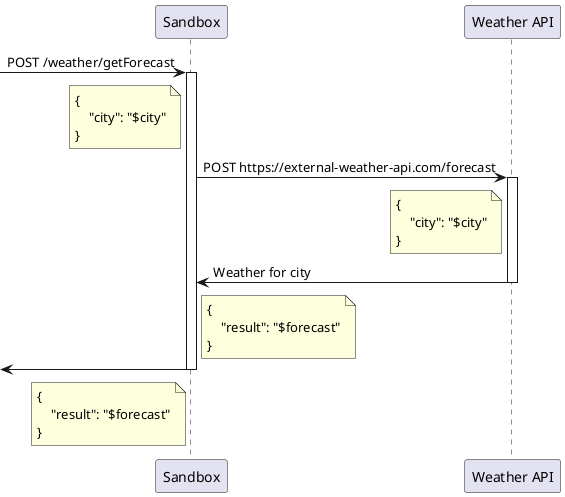

# Testcontainers-based Load Testing Bench

Just published my article where I delve into the world of load testing using Testcontainers. In this piece, I cover how to set up an efficient load testing environment with tools like Gatling, Wrk, and Yandex.Tank, and how to effectively manage configurations and logs for optimal performance analysis.

Check out the full article to learn how to improve your load testing strategy and ensure the stability and performance of your applications. Your feedback and thoughts are welcome!

https://medium.com/@avvero.abernathy/testcontainers-based-load-testing-bench-112a275f549d

Article is also available on Habr = https://habr.com/ru/articles/819589

#Testing #LoadTesting #Testcontainers #Gatling #Wrk #YandexTank #PerformanceTesting

## 

Using Testcontainers has radically improved the process of working with test scenarios. Thanks to this tool, creating environments for integration tests has become simpler (see the article [Isolation in Testing with Kafka](https://hackernoon.com/streamlining-kafka-integration-testing-isolation-with-testcontainers-and-spring-boot-31)). Now we can easily launch containers with different versions of databases, message brokers, and other services. For integration tests, Testcontainers has proven indispensable. Although load testing is less common than functional testing, it can be much more enjoyable. Studying graphs and analyzing the performance of a particular service can bring real pleasure. Such tasks are rare, but they are especially exciting for me.

The purpose of this article is to demonstrate an approach to creating a setup for load testing in the same way that regular integration tests are written: in the form of Spock tests using Testcontainers in a Gradle project environment. Load testing utilities such as Gatling, WRK, and Yandex.Tank are used.

## Creating a Load Testing Environment

Toolset: Gradle + Spock Framework + Testcontainers. The implementation variant is a separate Gradle module. Load testing utilities used are Gatling, WRK, and Yandex.Tank.

There are two approaches to working with the test object:
- Testing published images;
- Building images from the project's source code and testing.

In the first case, we have a set of load tests that are independent of the project's version and changes. This approach is easier to maintain in the future, but it is limited to testing only published images. We can, of course, manually build these images locally, but this is less automated and reduces reproducibility. When running in CI/CD without the necessary images, the tests will fail.

In the second case, the tests are run on the latest version of the service. This allows for integrating load tests into CI and obtaining performance data changes between service versions. However, load tests usually take longer than unit tests. The decision to include such tests in CI as part of the quality gate is up to you.

This article considers the first approach. Thanks to Spock, we can run tests on multiple versions of the service for comparative analysis:

```groovy
where:
image                  | _
'avvero/sandbox:1.0.0' | _
'avvero/sandbox:1.1.0' | _
```

It is important to note that the goal of this article is to demonstrate the organization of the testing space, not full-scale load testing.

### Target Service

For the testing object, let's take a simple HTTP service named Sandbox, which publishes an endpoint and uses data from an external source to handle requests. The service has a database.



The source code of the service, including the Dockerfile, is available in the project repository [spring-sandbox](https://github.com/avvero/spring-sandbox).

### Module Structure Overview

As we delve into the details later in the article, I want to start with a brief overview of the structure of the `load-tests` Gradle module to provide an understanding of its composition:

```
load-tests/
|-- src/
|   |-- gatling/
|   |   |-- scala/
|   |   |   |-- MainSimulation.scala         # Main Gatling simulation file
|   |   |-- resources/
|   |   |   |-- gatling.conf                 # Gatling configuration file
|   |   |   |-- logback-test.xml             # Logback configuration for testing
|   |-- test/
|   |   |-- groovy/
|   |   |   |-- pw.avvero.spring.sandbox/
|   |   |   |   |-- GatlingTests.groovy      # Gatling load test file
|   |   |   |   |-- WrkTests.groovy          # Wrk load test file
|   |   |   |   |-- YandexTankTests.groovy   # Yandex.Tank load test file
|   |   |-- java/
|   |   |   |-- pw.avvero.spring.sandbox/
|   |   |   |   |-- FileHeadLogConsumer.java # Helper class for logging to a file
|   |   |-- resources/
|   |   |   |-- wiremock/
|   |   |   |   |-- mappings/                # WireMock setup for mocking external services
|   |   |   |   |   |-- health.json          
|   |   |   |   |   |-- forecast.json
|   |   |   |-- yandex-tank/                 # Yandex.Tank load testing configuration
|   |   |   |   |-- ammo.txt
|   |   |   |   |-- load.yaml
|   |   |   |   |-- make_ammo.py
|   |   |   |-- wrk/                         # LuaJIT scripts for Wrk
|   |   |   |   |-- scripts/                 
|   |   |   |   |   |-- getForecast.lua
|-- build.gradle
```
Project repository - https://github.com/avvero/testing-bench.

### Environment

From the description above, we see that the service has two dependencies: the service https://external-weather-api.com and a database. Their description will be provided below, but let's start by enabling all components of the scheme to communicate in a Docker environment — we'll describe the network:
```groovy
def network = Network.newNetwork()
```
and provide network aliases for each component. This is extremely convenient and allows us to statically describe the integration parameters.

Dependencies such as WireMock and the load testing utilities themselves require configuration to work. These can be parameters that can be passed to the container or entire files and directories that need to be mounted to the containers. In addition, we need to retrieve the results of their work from the containers. To solve these tasks, we need to provide two sets of directories:
- `workingDirectory` — the module's resource directory, directly at `load-tests/`.
- `reportDirectory` — the directory for the results of the work, including metrics and logs. More on this will be in the section on reports.
  
#### Database

The Sandbox service uses Postgres as its database. Let's describe this dependency as follows:
```groovy
def postgres = new PostgreSQLContainer<>("postgres:15-alpine")
        .withNetwork(network)
        .withNetworkAliases("postgres")
        .withUsername("sandbox")
        .withPassword("sandbox")
        .withDatabaseName("sandbox")
```
The declaration specifies the network alias `postgres`, which the Sandbox service will use to connect to the database. To complete the integration description with the database, the service needs to be provided with the following parameters:
```yaml
'spring.datasource.url'                         : 'jdbc:postgresql://postgres:5432/sandbox',
'spring.datasource.username'                    : 'sandbox',
'spring.datasource.password'                    : 'sandbox',
'spring.jpa.properties.hibernate.default_schema': 'sandbox'
```
The database structure is managed by the application itself using Flyway, so no additional database manipulations are needed in the test.

#### Mocking Requests to https://external-weather-api.com

If we don't have the possibility, necessity, or desire to run the actual component in a container, we can provide a mock for its API. For the service https://external-weather-api.com, WireMock is used.

The declaration of the WireMock container will look like this:
```groovy
def wiremock = new GenericContainer<>("wiremock/wiremock:3.5.4")
        .withNetwork(network)
        .withNetworkAliases("wiremock")
        .withFileSystemBind("${workingDirectory}/src/test/resources/wiremock/mappings", "/home/wiremock/mappings", READ_WRITE)
        .withCommand("--no-request-journal")
        .waitingFor(new LogMessageWaitStrategy().withRegEx(".*https://wiremock.io/cloud.*"))
wiremock.start()
```
WireMock requires mock configuration. The `withFileSystemBind` instruction describes the file system binding between the local file path and the path inside the Docker container. In this case, the directory `"${workingDirectory}/src/test/resources/wiremock/mappings"` on the local machine will be mounted to `/home/wiremock/mappings` inside the WireMock container. Below is an additional part of the project structure to understand the file composition in the directory:
```
load-tests/
|-- src/
|   |-- test/
|   |   |-- resources/
|   |   |   |-- wiremock/
|   |   |   |   |-- mappings/               
|   |   |   |   |   |-- health.json
|   |   |   |   |   |-- forecast.json
```
To ensure that the mock configuration files are correctly loaded and accepted by WireMock, you can use a helper container:
```groovy
helper.execInContainer("wget", "-O", "-", "http://wiremock:8080/health").getStdout() == "Ok"
```
The helper container is described as follows:
```groovy
def helper = new GenericContainer<>("alpine:3.17")
        .withNetwork(network)
        .withCommand("top")
```
By the way, IntelliJ IDEA version 2024.1 [introduced support for WireMock](https://blog.jetbrains.com/idea/2024/02/intellij-idea-2024-1-eap-7), and the IDE provides suggestions when forming mock configuration files.

### Target Service Launch Configuration

The declaration of the Sandbox service container looks as follows:
```groovy
def javaOpts = ' -Xloggc:/tmp/gc/gc.log -XX:+PrintGCDetails' +
        ' -XX:+UnlockDiagnosticVMOptions' +
        ' -XX:+FlightRecorder' +
        ' -XX:StartFlightRecording:settings=default,dumponexit=true,disk=true,duration=60s,filename=/tmp/jfr/flight.jfr'
def sandbox = new GenericContainer<>(image)
        .withNetwork(network)
        .withNetworkAliases("sandbox")
        .withFileSystemBind("${reportDirectory}/logs", "/tmp/gc", READ_WRITE)
        .withFileSystemBind("${reportDirectory}/jfr", "/tmp/jfr", READ_WRITE)
        .withEnv([
                'JAVA_OPTS'                                     : javaOpts,
                'app.weather.url'                               : 'http://wiremock:8080',
                'spring.datasource.url'                         : 'jdbc:postgresql://postgres:5432/sandbox',
                'spring.datasource.username'                    : 'sandbox',
                'spring.datasource.password'                    : 'sandbox',
                'spring.jpa.properties.hibernate.default_schema': 'sandbox'
        ])
        .waitingFor(new LogMessageWaitStrategy().withRegEx(".*Started SandboxApplication.*"))
        .withStartupTimeout(Duration.ofSeconds(10))
sandbox.start()
```
Notable parameters and JVM settings include:
- Collection of garbage collection event information.
- Use of Java Flight Recorder (JFR) to record JVM performance data.

Additionally, directories are configured for saving diagnostic results of the service.

### Logging

If you need to see the logs of any container to a file, which is likely necessary during the test scenario writing and configuration stage, you can use the following instruction when describing the container:
```groovy
.withLogConsumer(new FileHeadLogConsumer("${reportDirectory}/logs/${alias}.log"))
```
In this case, the `FileHeadLogConsumer` class is used, which allows writing a limited amount of logs to a file. This is done because the entire log is likely not needed in load testing scenarios, and a partial log will be sufficient to assess whether the service is functioning correctly.

## Implementation of Load Tests

There are many tools for load testing. In this article, I propose to consider using three of them: Gatling, Wrk, and Yandex.Tank. All three tools can be used independently of each other.

### Gatling

Gatling is an open-source load testing tool written in Scala. It allows creating complex testing scenarios and provides detailed reports. The main simulation file of Gatling is connected as a Scala resource to the module, making it convenient to work with using the full range of support from IntelliJ IDEA, including syntax highlighting and navigation through methods for documentation reference.

The container configuration for Gatling is as follows:
```groovy
def gatling = new GenericContainer<>("denvazh/gatling:3.2.1")
        .withNetwork(network)
        .withFileSystemBind("${reportDirectory}/gatling-results", "/opt/gatling/results", READ_WRITE)
        .withFileSystemBind("${workingDirectory}/src/gatling/scala", "/opt/gatling/user-files/simulations", READ_WRITE)
        .withFileSystemBind("${workingDirectory}/src/gatling/resources", "/opt/gatling/conf", READ_WRITE)
        .withEnv("SERVICE_URL", "http://sandbox:8080")
        .withCommand("-s", "MainSimulation")
        .waitingFor(new LogMessageWaitStrategy()
                .withRegEx(".*Please open the following file: /opt/gatling/results.*")
                .withStartupTimeout(Duration.ofSeconds(60L * 2))
        );
gatling.start()
```
The setup is almost identical to other containers:
- Mount the directory for reports from `reportDirectory`.
- Mount the directory for configuration files from `workingDirectory`.
- Mount the directory for simulation files from `workingDirectory`.

Additionally, parameters are passed to the container:
- The `SERVICE_URL` environment variable with the URL value for the Sandbox service. Although, as mentioned earlier, using network aliases allows hardcoding the URL directly in the scenario code.
- The `-s MainSimulation` command to run a specific simulation.

Here is a reminder of the project source file structure to understand what is being passed and where:
```
load-tests/
|-- src/
|   |-- gatling/
|   |   |-- scala/
|   |   |   |-- MainSimulation.scala         # Main Gatling simulation file
|   |   |-- resources/
|   |   |   |-- gatling.conf                 # Gatling configuration file
|   |   |   |-- logback-test.xml             # Logback configuration for testing
```

Since this is the final container, and we expect to get results upon its completion, we set the expectation `.withRegEx(".*Please open the following file: /opt/gatling/results.*")`. The test will end when this message appears in the container logs or after `60 * 2` seconds.

I will not delve into the DSL of this tool's scenarios. You can check out the code of the used scenario in the [project repository](https://github.com/avvero/testing-bench/blob/main/load-tests/src/gatling/scala/MainSimulation.scala).

### Wrk

[Wrk](https://github.com/wg/wrk) is a simple and fast load testing tool. It can generate significant load with minimal resources. Key features include:
- Support for Lua scripts to configure requests.
- High performance due to multithreading.
- Ease of use with minimal dependencies.

The container configuration for Wrk is as follows:
```groovy
def wrk = new GenericContainer<>("ruslanys/wrk")
        .withNetwork(network)
        .withFileSystemBind("${workingDirectory}/src/test/resources/wrk/scripts", "/tmp/scripts", READ_WRITE)
        .withCommand("-t10", "-c10", "-d60s", "--latency", "-s", "/tmp/scripts/getForecast.lua", "http://sandbox:8080/weather/getForecast")
        .waitingFor(new LogMessageWaitStrategy()
                .withRegEx(".*Transfer/sec.*")
                .withStartupTimeout(Duration.ofSeconds(60L * 2))
        )
wrk.start()
```
To make Wrk work with requests to the Sandbox service, the request description via a Lua script is required, so we mount the script directory from `workingDirectory`. Using the command, we run Wrk, specifying the script and the URL of the target service method. Wrk writes a report to the log based on its results, which can be used to set expectations.

### Yandex.Tank

Yandex.Tank is a load testing tool developed by Yandex. It supports various load testing engines, such as JMeter and Phantom. For storing and displaying load test results, you can use the free service [Overload](https://overload.yandex.net/).

Here is the container configuration:
```groovy
copyFiles("${workingDirectory}/src/test/resources/yandex-tank", "${reportDirectory}/yandex-tank")
def tank = new GenericContainer<>("yandex/yandex-tank")
        .withNetwork(network)
        .withFileSystemBind("${reportDirectory}/yandex-tank", "/var/loadtest", READ_WRITE)
        .waitingFor(new LogMessageWaitStrategy()
                .withRegEx(".*Phantom done its work.*")
                .withStartupTimeout(Duration.ofSeconds(60L * 2))
        )
tank.start()
```
The load testing configuration for Sandbox is represented by two files: `load.yaml` and `ammo.txt`. As part of the container description, configuration files are copied to the `reportDirectory`, which will be mounted as the working directory. Here is the structure of the project source files to understand what is being passed and where:
```
load-tests/
|-- src/
|   |-- test/
|   |   |-- resources/
|   |   |   |-- yandex-tank/                
|   |   |   |   |-- ammo.txt
|   |   |   |   |-- load.yaml
|   |   |   |   |-- make_ammo.py
```

## Reports

Test results, including JVM performance recordings and logs, are saved in the directory `build/${timestamp}`, where `${timestamp}` represents the timestamp of each test run.

The following reports will be available for review:
- Garbage Collector logs.
- WireMock logs.
- Target service logs.
- Wrk logs.
- JFR (Java Flight Recording).

If Gatling was used:
- Gatling report.
- Gatling logs.

If Wrk was used:
- Wrk logs.

If Yandex.Tank was used:
- Yandex.Tank result files, with an additional upload to [Overload](https://overload.yandex.net/).
- Yandex.Tank logs.

The directory structure for the reports is as follows:
```
load-tests/
|-- build/
|   |-- ${timestamp}/
|   |   |-- gatling-results/
|   |   |-- jfr/
|   |   |-- yandex-tank/
|   |   |-- logs/
|   |   |   |-- sandbox.log
|   |   |   |-- gatling.log
|   |   |   |-- gc.log
|   |   |   |-- wiremock.log
|   |   |   |-- wrk.log
|   |   |   |-- yandex-tank.log
|   |-- ${timestamp}/
|   |-- ...
```

## Conclusion

Load testing is a crucial phase in the software development lifecycle. It helps assess the performance and stability of an application under various load conditions. This article presented an approach to creating a load testing environment using Testcontainers, which allows for easy and efficient setup of the testing environment.

Testcontainers significantly simplifies the creation of environments for integration tests, providing flexibility and isolation. For load testing, this tool enables the deployment of necessary containers with different versions of services and databases, making it easier to conduct tests and improve result reproducibility.

The provided configuration examples for Gatling, Wrk, and Yandex.Tank, along with container setup, demonstrate how to effectively integrate various tools and manage testing parameters. Additionally, the process of logging and saving test results was described, which is essential for analyzing and improving application performance. This approach can be expanded in the future to support more complex scenarios and integration with other monitoring and analysis tools.

Thank you for your attention to this article, and good luck in your endeavor to write useful tests!

#article #todo #testcontainers