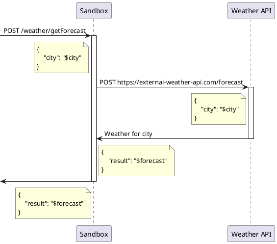

# Стенд для нагрузочного тестирования на Testcontainers

[[Стенд для нагрузочного тестирования на Testcontainers (материалы для статьи)]]

## 

Использование Testcontainers кардинально улучшило процесс работы с тестовыми сценариями. Благодаря этому инструменту, создание окружений для интеграционных тестов стало проще (см. статью [[Изоляция в тестах с Kafka]]). Теперь мы можем легко поднимать контейнеры с разными версиями баз данных, брокеров сообщений и других сервисов. Для интеграционных тестов Testcontainers оказался просто незаменимым. Хотя нагрузочное тестирование встречается реже, чем функциональное, оно может быть гораздо более увлекательным. Изучение графиков и анализ работы конкретного сервиса может доставить настоящее удовольствие. Такие задачи редки, но для меня они особенно захватывающие.

Цель данной статьи — продемонстрировать подход к созданию стенда для нагрузочного тестирования в том виде, в котором пишутся обычные интеграционные тесты: в форме spock-тестов с использованием Testcontainers в среде Gradle проекта. В качестве утилит нагрузочного тестирования используются Gatling, WRK и Yandex.Tank.

## Создание стенда для нагрузочного тестирования

Набор инструментов: Gradle + Spock Framework + Testcontainers. Вариант исполнения — отдельный Gradle модуль. В качестве утилит нагрузочного тестирования используются Gatling, WRK и Yandex.Tank.

В работе с объектом для тестирования можно выделить два подхода:
- тестирование готовых образов;
- сборка образов из исходного кода проекта и тестирование.

В первом случае мы имеем независимый от версии проекта и изменений в нем набор нагрузочных тестов. Этот подход проще поддерживать в будущем, но он ограничен тем, что мы можем тестировать только готовые образы. Мы, конечно, можем вручную собрать эти образы локально, но это менее автоматизировано и снижает воспроизводимость. При запуске в CI/CD без необходимых образов тесты не пройдут.

Во втором случае тесты выполняются на свежей версии сервиса. Это позволяет интегрировать нагрузочные тесты в CI и получать данные об изменениях производительности между версиями сервиса. Однако нагрузочные тесты обычно занимают больше времени, чем unit-тесты. Решение о включении таких тестов в CI как части quality gate остается за вами.

В данной статье рассматривается первый вариант. Благодаря Spock мы можем запускать тесты на нескольких версиях сервиса для сравнительного анализа:
```groovy
where:
image                  | _
'avvero/sandbox:1.0.0' | _
'avvero/sandbox:1.1.0' | _
```

Важно отметить, что цель статьи — демонстрация организации пространства для тестирования, а не полновесной нагрузки.

### Целевой сервис

В качестве объекта для тестирования давайте возьмем простой HTTP сервис с именем Sandbox, который публикует endpoint и для обработки запросов на него пользуется данными из стороннего источника. Сервис имеет базу данных.



Исходный код сервиса, включая Dockerfile, представлен в репозитории проекта [spring-sandbox](https://github.com/avvero/spring-sandbox).

### Обзор структуры модуля

Дальше по статье я расскажу подробно о деталях, но вначале хотел бы сделать краткий обзор структуры Gradle модуля `load-tests` для получения информации о составе:

```
load-tests/
|-- src/
|   |-- gatling/
|   |   |-- scala/
|   |   |   |-- MainSimulation.scala         # Основной файл симуляции Gatling
|   |   |-- resources/
|   |   |   |-- gatling.conf                 # Файл конфигурации Gatling
|   |   |   |-- logback-test.xml             # Конфигурация Logback для тестирования
|   |-- test/
|   |   |-- groovy/
|   |   |   |-- pw.avvero.spring.sandbox/
|   |   |   |   |-- GatlingTests.groovy      # Файл нагрузочного теста с Gatling
|   |   |   |   |-- WrkTests.groovy          # Файл нагрузочного теста с Wrk
|   |   |   |   |-- YandexTankTests.groovy   # Файл нагрузочного теста с Yandex.Tank
|   |   |-- java/
|   |   |   |-- pw.avvero.spring.sandbox/
|   |   |   |   |-- FileHeadLogConsumer.java # Вспомогательный класс логирования в файл
|   |   |-- resources/
|   |   |   |-- wiremock/
|   |   |   |   |-- mappings/                # WireMock набор для мокирования внешних сервисов
|   |   |   |   |   |-- health.json          
|   |   |   |   |   |-- forecast.json
|   |   |   |-- yandex-tank/                 # Конфигурация тестирования нагрузки с Yandex.Tank
|   |   |   |   |-- ammo.txt
|   |   |   |   |-- load.yaml
|   |   |   |   |-- make_ammo.py
|   |   |   |-- wrk/                         # Скрипты LuaJIT для Wrk
|   |   |   |   |-- scripts/                 
|   |   |   |   |   |-- getForecast.lua
|-- build.gradle
```
Предлагаю ознакомится с проектам по ссылке на репозиторий.

### Окружение

Из описания выше мы видим, что у сервиса есть две зависимости: сервис https://external-weather-api.com и база данных. Их описание будет предоставлено ниже, но начнем с того, чтобы предоставить возможность всем компонентам схемы коммуницировать в докер среде — опишем сеть:
```groovy
def network = Network.newNetwork()
```
и предоставим сетевые псевдонимы для каждой компоненты. Это чрезвычайно удобно и позволит нам статически описывать параметры интеграции.

Зависимости типа WireMock и непосредственно сами утилиты нагрузочного тестирования требуют настройки для работы. Это могут быть как параметры, которые можно передать в контейнер, так и целые файлы, директории с которыми нужно примонтировать к контейнерам. Кроме этого, нам необходимо забирать результаты их работы из контейнеров. Для решения этих задач необходимо предоставить два набора директорий:
- `workingDirectory` — директория ресурсов модуля, непосредственно по адресу `load-tests/`.
- `reportDirectory` — директория для результатов работы, включая метрики и логи. Подробнее про это будет в разделе статьи про отчеты.
  
#### База данных

В качестве базы данных сервис Sandbox использует Postgres. Опишем эту зависимость следующим образом:
```groovy
def postgres = new PostgreSQLContainer<>("postgres:15-alpine")
        .withNetwork(network)
        .withNetworkAliases("postgres")
        .withUsername("sandbox")
        .withPassword("sandbox")
        .withDatabaseName("sandbox")
```
В декларации указан сетевой псевдоним `postgres`, по нему сервис Sandbox и будет обращаться к базе. Для завершения описания интеграции с базой в сервис нужно передать параметры
```yaml
'spring.datasource.url'                         : 'jdbc:postgresql://postgres:5432/sandbox',
'spring.datasource.username'                    : 'sandbox',
'spring.datasource.password'                    : 'sandbox',
'spring.jpa.properties.hibernate.default_schema': 'sandbox'
```
Структура базы формируется самим приложением через Flyway, поэтому никаких дополнительных манипуляций с базой в тесте не нужны.

#### Мокирование запросов к https://external-weather-api.com

Если у нас нет возможности, необходимости или желания поднять реальный компонент в контейнере, можно предоставить мок для его API. Для сервиса https://external-weather-api.com используется WireMock.

Декларация контейнера WireMock будет выглядеть следующим образом:
```groovy
def wiremock = new GenericContainer<>("wiremock/wiremock:3.5.4")
        .withNetwork(network)
        .withNetworkAliases("wiremock")
        .withFileSystemBind("${workingDirectory}/src/test/resources/wiremock/mappings", "/home/wiremock/mappings", READ_WRITE)
        .withCommand("--no-request-journal")
        .waitingFor(new LogMessageWaitStrategy().withRegEx(".*https://wiremock.io/cloud.*"))
wiremock.start()
```
WireMock требует настройки мокирования. Инструкция `withFileSystemBind` описывает привязку файловой системы между локальным файловым путем и путем внутри контейнера Docker. В данном случае директория `"${workingDirectory}/src/test/resources/wiremock/mappings"` на локальной машине будет смонтирована в директорию `/home/wiremock/mappings` внутри контейнера WireMock. Ниже приведу дополнительно часть структуры проекта, чтобы можно было понять состав файлов в директории:
```
load-tests/
|-- src/
|   |-- test/
|   |   |-- resources/
|   |   |   |-- wiremock/
|   |   |   |   |-- mappings/               
|   |   |   |   |   |-- health.json
|   |   |   |   |   |-- forecast.json
```
Чтобы убедиться, что файлы настройки мокирования правильно подгружены и приняты WireMock, можно воспользоваться вспомогательным контейнером:
```groovy
helper.execInContainer("wget", "-O", "-", "http://wiremock:8080/health").getStdout() == "Ok"
```
Сам вспомогательный контейнер описан следующим образом:
```groovy
def helper = new GenericContainer<>("alpine:3.17")
        .withNetwork(network)
        .withCommand("top")
```
К слову, в IntelliJ IDEA версии 2024.1 [появилась поддержка WireMock](https://blog.jetbrains.com/idea/2024/02/intellij-idea-2024-1-eap-7), и IDE дает подсказки при формировании файлов настройки мокирования.

### Настройка запуска целевого сервиса

Декларация контейнера сервиса Sandbox выглядит следующим образом:
```groovy
def javaOpts = ' -Xloggc:/tmp/gc/gc.log -XX:+PrintGCDetails' +
        ' -XX:+UnlockDiagnosticVMOptions' +
        ' -XX:+FlightRecorder' +
        ' -XX:StartFlightRecording:settings=default,dumponexit=true,disk=true,duration=60s,filename=/tmp/jfr/flight.jfr'
def sandbox = new GenericContainer<>(image)
        .withNetwork(network)
        .withNetworkAliases("sandbox")
        .withFileSystemBind("${reportDirectory}/logs", "/tmp/gc", READ_WRITE)
        .withFileSystemBind("${reportDirectory}/jfr", "/tmp/jfr", READ_WRITE)
        .withEnv([
                'JAVA_OPTS'                                     : javaOpts,
                'app.weather.url'                               : 'http://wiremock:8080',
                'spring.datasource.url'                         : 'jdbc:postgresql://postgres:5432/sandbox',
                'spring.datasource.username'                    : 'sandbox',
                'spring.datasource.password'                    : 'sandbox',
                'spring.jpa.properties.hibernate.default_schema': 'sandbox'
        ])
        .waitingFor(new LogMessageWaitStrategy().withRegEx(".*Started SandboxApplication.*"))
        .withStartupTimeout(Duration.ofSeconds(10))
sandbox.start()
```
Из интересного тут можно отметить наличие следующих параметров и настроек JVM:
- Сборка информации о событиях сборки мусора.
- Использование Java Flight Recorder (JFR) для записи данных о работе JVM.

Кроме того, настроены директории для сохранения результатов диагностики сервиса.

### Логирование

Если необходим вывод логов работы любого используемого контейнера в файл, а это скорее всего понадобится именно на этапе написания тестовых сценариев и настройки, можно воспользоваться следующей инструкцией при описании контейнера:
```groovy
.withLogConsumer(new FileHeadLogConsumer("${reportDirectory}/logs/${alias}.log"))
```
В данном случае применяется класс `FileHeadLogConsumer`, который позволяет писать в файл ограниченный объем лога. Это делается потому, что весь лог скорее всего никогда не понадобится в рамках сценариев нагрузочного тестирования, а частичного будет достаточно, чтобы оценить, правильно ли сервис работает или нет.

## Реализация нагрузочных тестов

Существует множество инструментов для нагрузочного тестирования (некоторые из них разобраны в статье [Обзор инструментария для нагрузочного и перформанс-тестирования](https://habr.com/ru/companies/jugru/articles/337928/)). В данной статье я предлагаю рассмотреть использование трех из них: Gatling, Wrk, Yandex.Tank. Все три инструмента можно использовать независимо друг от друга.

### Gatling 

Gatling — это open-source инструмент для нагрузочного тестирования, написанный на Scala. Он позволяет создавать сложные сценарии тестирования и предоставляет подробные отчеты. Основной файл симуляции Gatling подключен в виде scala ресурса к модулю, что позволяет удобно работать с ним, используя весь спектр поддержки со стороны IntelliJ IDEA, включая подсветку синтаксиса и переход по методам для получения справки из документации.

Описание контейнера для Gatling следующее:
```groovy
def gatling = new GenericContainer<>("denvazh/gatling:3.2.1")
        .withNetwork(network)
        .withFileSystemBind("${reportDirectory}/gatling-results", "/opt/gatling/results", READ_WRITE)
        .withFileSystemBind("${workingDirectory}/src/gatling/scala", "/opt/gatling/user-files/simulations", READ_WRITE)
        .withFileSystemBind("${workingDirectory}/src/gatling/resources", "/opt/gatling/conf", READ_WRITE)
        .withEnv("SERVICE_URL", "http://sandbox:8080")
        .withCommand("-s", "MainSimulation")
        .waitingFor(new LogMessageWaitStrategy()
                .withRegEx(".*Please open the following file: /opt/gatling/results.*")
                .withStartupTimeout(Duration.ofSeconds(60L * 2))
        );
gatling.start()
```
Схема настройки практически идентична прочим контейнерам:
- Монтируем директорию для отчетов с `reportDirectory`.
- Монтируем директорию для файлов конфигурации с `workingDirectory`.
- Монтируем директорию для файлов симуляции с `workingDirectory`.

Кроме этого, реализована передача параметров в контейнер:
- Переменная `SERVICE_URL` со значением URL для сервиса Sandbox. Хотя, как указано выше, за счет использования сетевых псевдонимов, можно зашить URL прямо в код сценария.
- Команда `-s MainSimulation` для запуска конкретной симуляции.

Напомню структуру исходных файлов проекта, чтобы было удобно понимать, что и куда передаем:
```
load-tests/
|-- src/
|   |-- gatling/
|   |   |-- scala/
|   |   |   |-- MainSimulation.scala         # Основной файл симуляции Gatling
|   |   |-- resources/
|   |   |   |-- gatling.conf                 # Файл конфигурации Gatling
|   |   |   |-- logback-test.xml             # Конфигурация Logback для тестирования
```

Так как это финальный контейнер и на его завершение мы рассчитываем с целью получения результатов, то выставляем ожидание в нем ` .withRegEx(".*Please open the following file: /opt/gatling/results.*")`. Тест будет завершен, когда в логах контейнера появится это сообщение или пройдет `60 * 2` секунд.

Я не буду подробно рассказывать про DSL сценариев этого инструмента, на Хабре много отличных статей на эту тему. С кодом используемого сценария предлагаю ознакомиться в [репозитории проекта](https://github.com/avvero/testing-bench/blob/main/load-tests/src/gatling/scala/MainSimulation.scala).

### Wrk

[Wrk](https://github.com/wg/wrk) — это простой и быстрый инструмент для нагрузочного тестирования. Он может генерировать значительную нагрузку с минимальным количеством ресурсов. Основные возможности:
- Поддержка Lua-скриптов для настройки запросов.
- Высокая производительность благодаря использованию многопоточности.
- Простота в использовании с минимальными зависимостями.

Описание контейнера для Wrk следующее:

```groovy
def wrk = new GenericContainer<>("ruslanys/wrk")
        .withNetwork(network)
        .withFileSystemBind("${workingDirectory}/src/test/resources/wrk/scripts", "/tmp/scripts", READ_WRITE)
        .withCommand("-t10", "-c10", "-d60s", "--latency", "-s", "/tmp/scripts/getForecast.lua", "http://sandbox:8080/weather/getForecast")
        .waitingFor(new LogMessageWaitStrategy()
                .withRegEx(".*Transfer/sec.*")
                .withStartupTimeout(Duration.ofSeconds(60L * 2))
        )
wrk.start()
```
Для работы Wrk с запросами к сервису Sandbox требуется описание запроса через Lua-скрипт, для этого монтируем директорию скриптов с `workingDirectory`. С помощью команды запускаем Wrk, указывая скрипт и URL метода целевого сервиса. По результатам своей работы Wrk пишет в лог отчет, на содержимое которого можно завязаться при выставлении ожидания.

### Yandex.Tank

Yandex.Tank — это инструмент для нагрузочного тестирования, разработанный в Яндексе. Он поддерживает различные движки нагрузочного тестирования, такие как JMeter и Phantom. Для хранения и отображения результатов нагрузочных тестов можно использовать специальный бесплатный сервис [Overload](https://overload.yandex.net/).

Ниже представлено описание контейнера:
```groovy
copyFiles("${workingDirectory}/src/test/resources/yandex-tank", "${reportDirectory}/yandex-tank")
def tank = new GenericContainer<>("yandex/yandex-tank")
        .withNetwork(network)
        .withFileSystemBind("${reportDirectory}/yandex-tank", "/var/loadtest", READ_WRITE)
        .waitingFor(new LogMessageWaitStrategy()
                .withRegEx(".*Phantom done its work.*")
                .withStartupTimeout(Duration.ofSeconds(60L * 2))
        )
tank.start()
```
Конфигурация тестирования для Sandbox представлена двумя файлами: `load.yaml` и `ammo.txt`. В рамках описания контейнера происходит копирование файлов конфигурации в `reportDirectory`, которая будет монтироваться как рабочая. Напомню структуру исходных файлов проекта, чтобы было удобно понимать, что и куда передаем:
```
load-tests/
|-- src/
|   |-- test/
|   |   |-- resources/
|   |   |   |-- yandex-tank/                
|   |   |   |   |-- ammo.txt
|   |   |   |   |-- load.yaml
|   |   |   |   |-- make_ammo.py
```

## Отчеты

Результаты тестов, включая записи данных о работе JVM и логи, сохраняются в директории `build/${timestamp}`, где `${timestamp}` представляет собой временную метку, указывающую на каждый запуск теста.

К просмотру будут доступны следующие отчеты:
- Логи сборщика мусора.
- Логи WireMock.
- Логи целевого сервиса.
- Логи Wrk.
- JFR (Java Flight Recording).

Если использовался Gatling:
- Отчет Gatling.
- Логи Gatling.

Если использовался Wrk:
- Логи Wrk.

Если использовался Yandex.Tank:
- Файлы результатов Yandex.Tank, дополнительно выгрузка в [Overload](https://overload.yandex.net/).
- Логи Yandex.Tank.

Структура директории отчетов приведена ниже:
```
load-tests/
|-- build/
|   |-- ${timestamp}/
|   |   |-- gatling-results/
|   |   |-- jfr/
|   |   |-- yandex-tank/
|   |   |-- logs/
|   |   |   |-- sandbox.log
|   |   |   |-- gatling.log
|   |   |   |-- gc.log
|   |   |   |-- wiremock.log
|   |   |   |-- wrk.log
|   |   |   |-- yandex-tank.log
|   |-- ${timestamp}/
|   |-- ...
```

## Заключение

Нагрузочное тестирование — важный этап в жизненном цикле разработки программного обеспечения. Оно позволяет оценить производительность и стабильность приложения под различными условиями нагрузки. В данной статье был представлен подход к созданию стенда для нагрузочного тестирования на базе Testcontainers, который позволяет легко и эффективно организовать окружение для таких тестов.

Testcontainers существенно упрощает создание окружений для интеграционных тестов, обеспечивая гибкость и изоляцию. В случае нагрузочного тестирования данный инструмент позволяет поднимать необходимые контейнеры с различными версиями сервисов и баз данных, что упрощает проведение тестов и улучшает воспроизводимость результатов. 

Представленные примеры конфигурации Gatling, Wrk и Yandex.Tank и настройки контейнеров демонстрируют, как можно эффективно интегрировать различные инструменты и управлять параметрами тестирования. Кроме того, был описан процесс логирования и сохранения результатов тестов, что важно для анализа и улучшения производительности приложений. В будущем возможно расширение данного подхода для поддержки более сложных сценариев и интеграции с другими инструментами для мониторинга и анализа.

Спасибо за внимание к статье, и удачи в вашем стремлении к написанию полезных тестов!

#article #todo #testcontainers
#draft