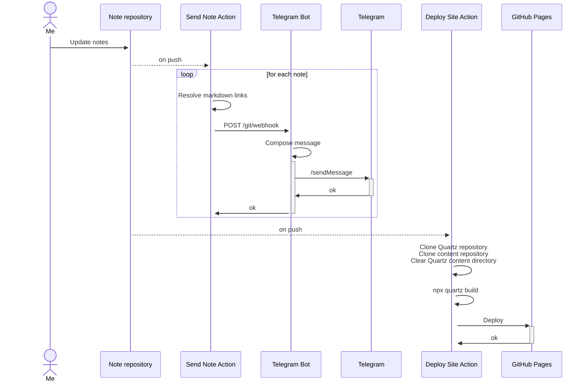

I built this project using the following components:

- [Personal public repository](https://github.com/avvero/devirium) with notes in Obsidian style (Zettelkasten)
- Branch of script to manage consistency of notes, notes relations, tags, etc. (Quartz4)
- Telegram channel for sharing updates
- [Telegram Bot](https://github.com/avvero/devirium-bot) to post updates in the channel
- [Quartz4](https://quartz.jzhao.xyz/) for static site generation
- GitHub Actions for bot auto-deploy
- GitHub Actions for static site generation on push to the note repository
- GitHub Actions for posting to the Telegram channel on push to the note repository

The design schema is provided below:

#digital_garden #ignore