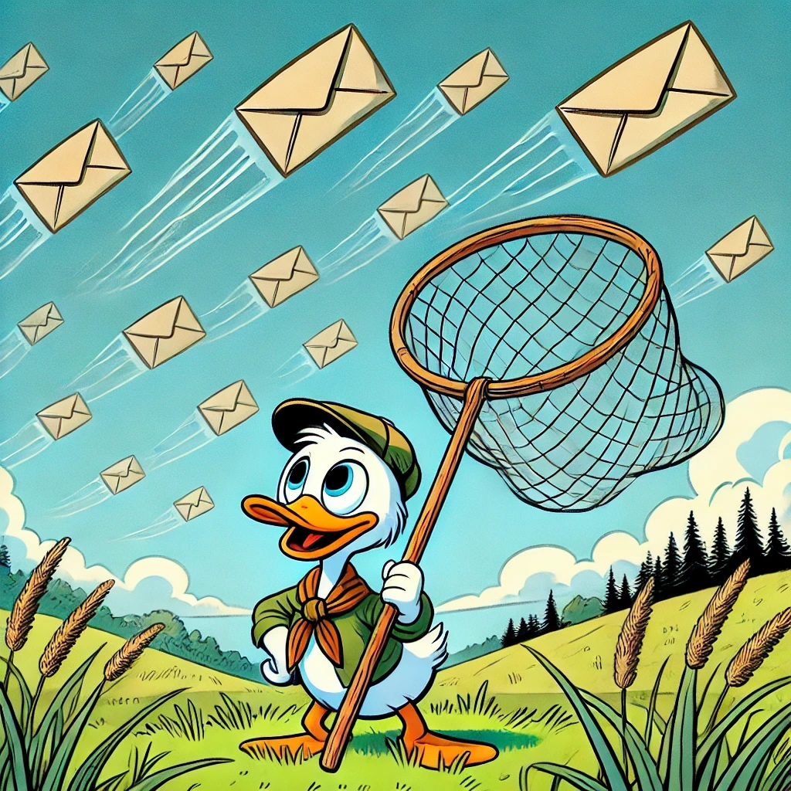

This article offers an approach to writing integration tests for Kafka-based applications that focuses on interaction specification, making tests more readable and easier to maintain. The proposed method not only enhances testing efficiency but also contributes to a better understanding of the integration processes within the application.

The article builds on three ideas presented in relevant articles: [writing tests with a clear separation of Arrange-Act-Assert stages](https://dzone.com/articles/arranging-http-request-testing-in-spring), [isolation in Kafka tests](https://dzone.com/articles/isolation-in-testing-with-kafka), and [using tools to enhance test visibility](https://dzone.com/articles/enhancing-the-visibility-of-integration-tests). I recommend reviewing these before delving into the material of this article.

## Demonstration Scenario

Let's take a Telegram bot that forwards requests to the OpenAI API and returns the result to the user as an example. If the request to OpenAI violates the system's security rules, the client will be notified. Additionally, a message will be sent to Kafka for the behavioral control system so that the manager can contact the user, explain that their request was too sensitive even for our bot, and ask them to review their preferences.

The interaction contracts with services are described in a simplified manner to emphasize the core logic. Below is a sequence diagram demonstrating the application's architecture. I understand that the design may raise questions from a system architecture perspective, but please approach it with understanding—the main goal here is to demonstrate the approach to writing tests.

```plantuml
@startuml
autonumber

participant "Telegram" as tg
box "Application" #lightgreen
     participant "ServiceA" as ServiceA
     participant "ServiceB" as ServiceB
end box
box "Kafka" #lightblue
participant "topicA" as topicA
participant "topicB" as topicB
participant "topicC" as topicC
end box
participant "OpenAI" as openai

tg -> ServiceA++: request
ServiceA -> topicA: message
ServiceA -> tg--: ok
...
topicA -> ServiceB++: message
ServiceB -> openai++: request
openai -> ServiceB--: response
alt content policy violation error
ServiceB -> topicC++: policy violation event
topicC--
end
ServiceB -> topicB--: message
...
topicB -> ServiceA++: message
ServiceA -> tg--: request

@enduml
```

### Message Capture

The main testing tool will be the message capture object — [RecordCaptor](https://github.com/avvero/kafka-test-support/blob/sb3/kafka-support/src/main/java/pw/avvero/test/kafka/RecordCaptor.java). Its operation is quite similar to the outgoing request capture object — [RequestCaptor](https://github.com/avvero/spring-sandbox/blob/main/request-captor/src/main/java/pw/avvero/test/http/RequestCaptor.java), which can be read about in the article [Ordering Chaos: Arranging HTTP Request Testing in Spring](https://dzone.com/articles/arranging-http-request-testing-in-spring).

Message capture will be performed through a standard Kafka consumer. The list of topics must be specified explicitly via a configuration parameter.

```java
@KafkaListener(id = "recordCaptor", topics = "#{'${test.record-captor.topics}'.split(',')}", groupId = "test")
public void eventCaptorListener(ConsumerRecord<Object, Object> record,
                                @Headers Map<String, Object> boundedHeaders) {
    RecordSnapshot recordSnapshot = mapper.recordToSnapshot(record, boundedHeaders);
    recordCaptor.capture(recordSnapshot);
}
```

The `RecordCaptor` object accumulates information from captured messages.

Using this approach requires adhering to [isolation in Kafka tests](https://dzone.com/articles/isolation-in-testing-with-kafka). Waiting for offset commit confirmation before verifying test results should be done using the [KafkaSupport#waitForPartitionOffsetCommit](https://github.com/avvero/kafka-test-support/blob/6595086188252f4ed89dff24e2129d75e26d9ece/kafka-support/src/main/java/pw/avvero/test/kafka/KafkaSupport.java#L109) method.

### Test Example

Below is the test code for the described scenario.

```java
def "User Message Processing with OpenAI"() {
    setup:
    KafkaSupport.waitForPartitionAssignment(applicationContext)                           // 1
    and:                                                                                  // 2
    def openaiRequestCaptor = restExpectation.openai.completions(withBadRequest().contentType(APPLICATION_JSON)
            .body("""{
                "error": {
                "code": "content_policy_violation",
                "message": "Your request was rejected as a result of our safety system."
                }
            }"""))
    def telegramRequestCaptor = restExpectation.telegram.sendMessage(withSuccess('{}', APPLICATION_JSON))
    when:
    mockMvc.perform(post("/telegram/webhook")                                             // 3
            .contentType(APPLICATION_JSON_VALUE)
            .content("""{
                "message": {
                "from": {
                    "id": 10000000
                },
                "chat": {
                    "id": 20000000
                },
                "text": "Hello!"
                }
            }""".toString())
            .accept(APPLICATION_JSON_VALUE))
            .andExpect(status().isOk())
    KafkaSupport.waitForPartitionOffsetCommit(applicationContext)                         // 4
    then:
    openaiRequestCaptor.times == 1                                                        // 5
    JSONAssert.assertEquals("""{
        "content": "Hello!"
    }""", openaiRequestCaptor.bodyString, false)
    and:
    telegramRequestCaptor.times == 1
    JSONAssert.assertEquals("""{
        "chatId": "20000000",
        "text": "Your request was rejected as a result of our safety system."
    }""", telegramRequestCaptor.bodyString, false)
    when:                                                                                 // 6
    def message = recordCaptor.getRecords("topicC", "20000000").last
    then:
    message != null
    JSONAssert.assertEquals("""{
        "webhookMessage": {
        "message": {
            "chat": {
            "id": "20000000"
            },
            "text": "Hello!"
        }
        },
        "error": {
            "code": "content_policy_violation",
            "message": "Your request was rejected as a result of our safety system."
        }
    }""", message.value as String, false)
}
```

Key steps:
1. Wait for partition assignment before starting the test scenario.
2. Mock requests to OpenAI and Telegram.
3. Execute the test scenario.
4. Wait for offset confirmation.
5. Verify requests to OpenAI and Telegram.
6. Check the message in Kafka.

Using `JSONAssert.assertEquals` ensures consistency in data representation across Kafka messages, logs, and tests. This simplifies testing by providing flexibility in comparison and accuracy in error diagnosis.

The article provides an example with JSON message format; other formats are not covered, but the described approach does not impose format restrictions.

### How to Find Your Message in `RecordCaptor`

Messages in `RecordCaptor` are organized by topic name and key. In the provided test, the key used is the Kafka message key. When sending, we explicitly specify it:

```java
sendMessage("topicC", chatId, ...);
...
private void sendMessage(String topic, String key, Object payload) {
    Message message = MessageBuilder
            .withPayload(objectMapper.writeValueAsString(payload))
            .setHeader(KafkaHeaders.TOPIC, topic)
            .setHeader(KafkaHeaders.KEY, key)                          <-- set key
            .build();
    kafkaTemplate.send(message).get();
}
```

To search by message key within a topic:

```java
when:                                                                                
def message = recordCaptor.getRecords("topicC", "20000000").last       <-- use key
```

If this option is not suitable, you need to describe your own indexes based on message parameters for constructing the search. An example can be seen in the tests [PolicyViolationTestsCustomIndex.groovy](https://github.com/avvero/kafka-test-support/blob/sb3/example-testcontainers/src/test/groovy/pw/avvero/example/feature1/PolicyViolationTestsCustomIndex.groovy).

### Connecting RecordCaptor

The code for connecting `RecordCaptor` looks as follows:

```java
@TestConfiguration(proxyBeanMethods = false)
public class RecordCaptorConfiguration {
    @Bean
    RecordCaptor recordCaptor() {
        return new RecordCaptor();
    }

    @Bean
    RecordCaptorConsumer recordCaptorConsumer(RecordCaptor recordCaptor) {
        return new RecordCaptorConsumer(recordCaptor, new RecordSnapshotMapper());
    }
}
```

## OffsetSnapshotFrame

Experience has shown that working with Kafka-based applications requires tools to facilitate understanding the state of consumers and message consumption status. For this task, you can compare topic offsets and consumer groups in the offset confirmation waiting operation and log discrepancies, as illustrated in the image:

The code for [OffsetComparisonFrame](https://github.com/avvero/kafka-test-support/blob/sb3/kafka-support/src/main/java/pw/avvero/test/kafka/OffsetSnapshotFrame.java) is available for review.

## Conclusion

Testing messages in Kafka using the proposed approach not only simplifies test writing but also makes it more structured and understandable. Utilizing tools like `RecordCaptor`, as well as adhering to isolation principles and clear separation of test stages, ensures high accuracy and efficiency.

Link to the project repository with test demonstrations — [kafka-test-support](https://github.com/avvero/kafka-test-support/tree/sb3/example-testcontainers).

Thank you for reading the article, and good luck in your efforts to write effective and clear tests!

#article #test #kafka