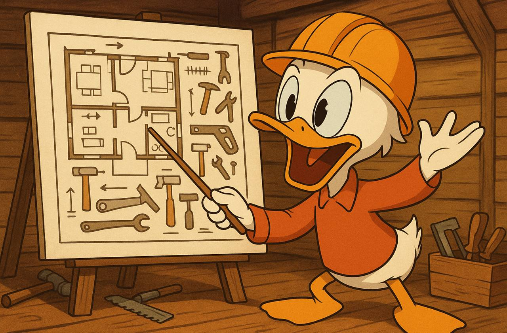

Начинал всё по уму: разбил эпик на задачи, расставил приоритеты. Какие-то оценил сам, по другим — созвал консилиум. Привлек электрика: в команде не было экспертизы, хотя сын уверенно заявил, что справится. Оставим это на его совести — еще вчера он пытался вставить батарейку в игрушку вверх ногами, но делал это с таким выражением лица, что потенциал сеньора виден невооружённым глазом.

Проект, конечно, со спецификой: параллелить задачи сложно. Идею "я утепляю, а жена в это время красит обои, а потом как-нибудь сольем" мы отвергли сразу — архитектура не позволяла.

Поначалу шло бодро: за первый месяц 30% задач закрыто — утепление, 3 из 4 стен покрашены. Но как водится, наступил кризис ресурсов - внезапно вышел Kingdom Come: Deliverance II и съел все капасити ведущего разработчика. Прогресс застопорился.

Ретроспективы с женой проходят регулярно: я зажигаю команду речами о важности коммитмента, о наших ценностях и цели. Но стена всё еще не покрашена.

Дополнительные таски множатся: надо помыть окна по всей квартире, разобраться с дверцей шкафа, которая теперь открывается строго по фазе луны. Думаю, пора внедрять SAFe — горизонт проектов растёт.

P.S. Прогресса по основной задаче нет, но радует, что бизнес пока не планирует резать косты.

#humor #agile #scrum