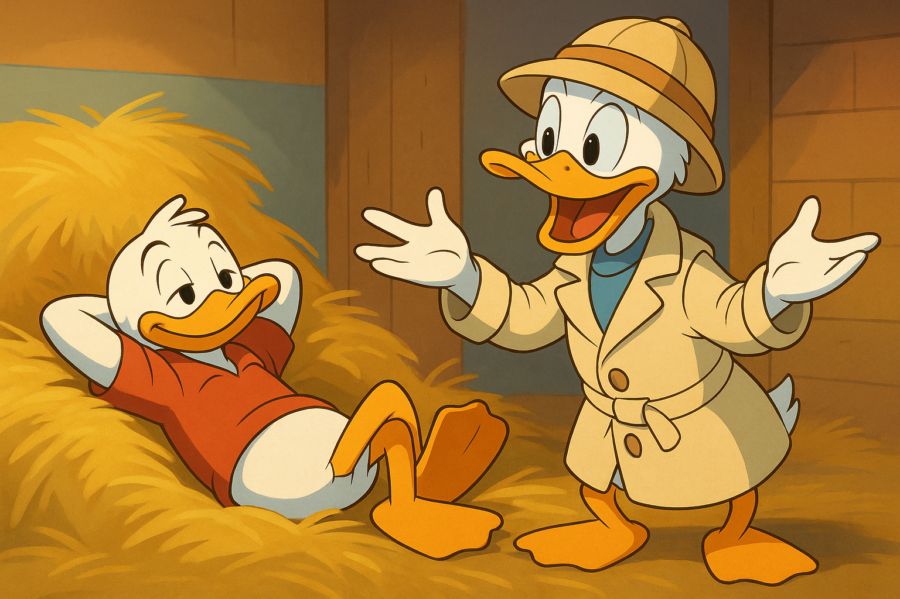

Перфоманс-ревью нужно не только для роста, но и как останавливающий механизм - иначе в компании расплодятся сеньоры и некому будет работать.

Бывало у вас такое: берёте фичу в теханализ, всё расписываете, делаете дизайн, декомпозируете, оцениваете риски. Отдаёте задачу мидлу - и он делает ровно то, что написано. В срок, без лишних нервов. Дал сеньору - и понеслась: беглого взгляда хватило, чтобы объявить твой план ошибкой. Дальше - часы разговоров, где тебе нужно доказывать, что ты не верблюд. Сеньор - избранный богом, он на месте, а твой дизайн - дело рук смертного, значит обречён на ошибки. Не говоря уже о том, что Сеньор жаждет создать очередную оду своему величию, фича при этом - побочный эффект.

Перфоманс-ревью - это не про карьерный рост. Это про то, чтобы в итоге остались люди, которые ещё могут работать!

#humor