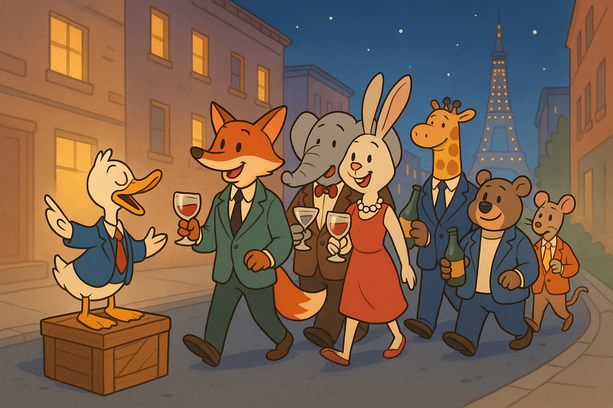

Товарищи. Снова эксплуатируют - но уже не нас, а наши страсти, чтобы потом эксплуатировать и нас. Давайте разбираться.

В корпорациях работает много людей, и все мы понимаем: действовать нужно совместно и эффективно. Но как этого добиться? Марк Аврелий сказал бы, что это естественно: мы люди, мы созданы для совместного действия. Допустим. Но будем ли мы бездумно слушать человека, который сам ипотеку не платил?

Что остается корпорациям, как не прибегнуть к страстям? У нас у всех есть свои интересы: кто-то любит играть в настолки, кто-то - на музыкальных инструментах или на басу, кто-то - бокал вина. И корпоративная мысль ловко этим пользуется, превращая личные увлечения в инструмент сближения. Они устраивают корпоративы - "хлеба и зрелищ" в миниатюре.

Но давайте вспомним, сколько сил наши предшественники потратили на то, чтобы у нас был восьмичасовой рабочий день и оплачиваемые переработки. И вот мы снова тратим личное время - теперь на корпоратив. Чтобы через наши же страсти уменьшать трение и создавать иллюзию близости. Такая себе социальная смазка. Только вот смазка какая-то сомнительная... На деле это просто плевок. И если вам говорят, что это ради команды, помните: это ваше личное время. А личное время стоит денег. А сверхурочное время двойных денег!

#humor