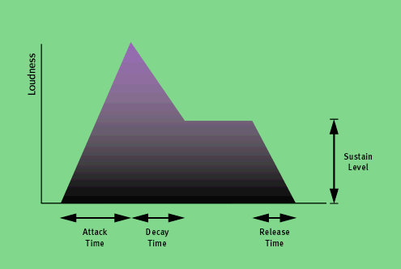

Envelope Generators may be basic or complex, but (if they are not themselves modified in some way by another signal) they all share one attribute: each time they are initiated (or 'triggered') they provide a consistent contour, both in terms of the CVs produced and the times taken for them to change.

The most famous, and for a long time the most common envelope generators, are called ADSRs. The acronym stands for Attack/Decay/Sustain/Release, and these names represent the four stages of the EG. Three of them — Attack, Decay, and Release — are measures of time, while the fourth — the Sustain — is a voltage level.

For example, imagine the sounds produced by things as different as a pipe organ, a trombone and a thunderclap. Now consider how the loudness contour of each of these can be described in terms of its A, D, S and R stages. Remember:
- The Attack time determines the speed at which the sound reaches its maximum loudness.
- The Decay time determines the speed at which the loudness drops until it reaches...
- ...the Sustain Level, the level the loudness maintains until...
- ...it decays to its final level (usually silence) in a time determined by the Release time.

The organ has a rapid attack and maintains its full volume before dropping to silence when the player releases the key. Hence its loudness contour is almost precisely rectangular.

[[Synth Secrets]]

#synth