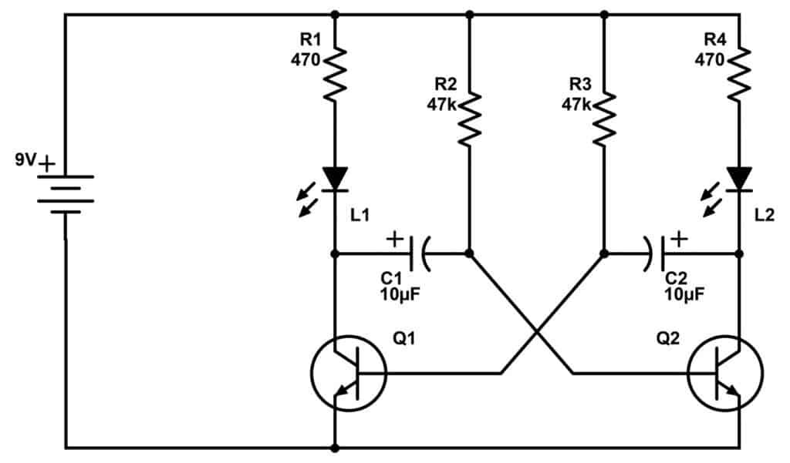

Электронная схема, которая непрерывно генерирует прямоугольные колебания (сигнал), самопроизвольно переключаясь между двумя неустойчивыми состояниями, без необходимости внешнего запускающего импульса. Его принцип работы основан на поочередном зарядке и разрядке конденсаторов резистивно-конденсаторными цепочками, которые управляют двумя транзисторами, заставляя их попеременно открываться и закрываться. 

Симулятор - http://www.falstad.com/circuit/e-multivib-a.html.

#electronics