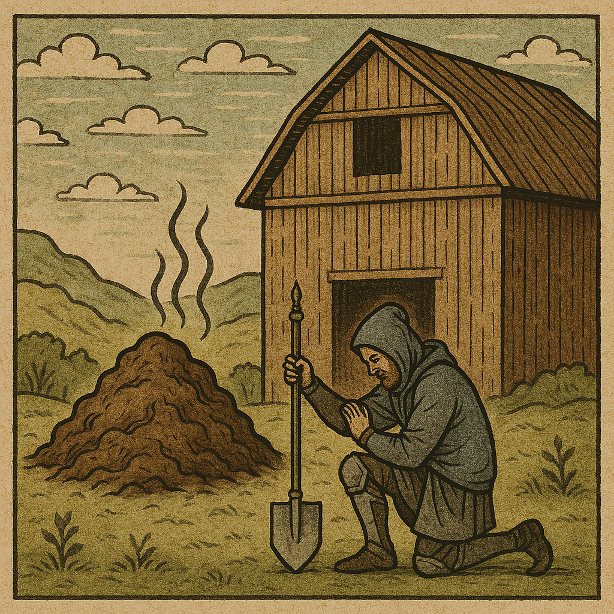

"О, великие принципы SOLID, благословите мой код на чистоту и ясность. Пусть функции мои будут едины в своей ответственности, как воины в строю, и не возьмут на себя бремя чужих забот. Пусть классы мои будут открыты для расширения, но закрыты для изменения, как крепость, стойкая против врага. Да не нарушит новый код работу старого! Пусть заменяются мои подтипы без нарушения порядка, как звенья одной цепи. Пусть интерфейсы будут разделены, как ветви дерева, и зависимости инверсированы, как отражение в зеркале. Пусть будет так, как завещал Мартин, и код мой будет чист, как ряса, как помыслы мои."

Отрывок из [[Современные идолы разработки]].

#development #solid #humor