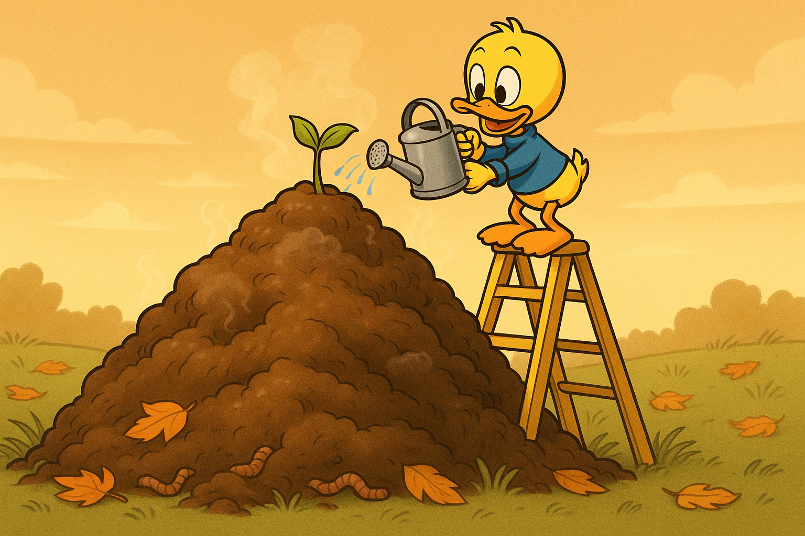

Не говнокод, а плодородная почва для прекрасного кода будущего.

Знакомо ли вам это чувство, когда вы приходите в проект — и вам кажется, что вокруг один говнокод? Нет, не кажется. Я называю это "нарастающим циклом улучшения кода". Каждый новый разработчик уверен: до него было плохо, а теперь всё станет хорошо. И каждый следующий — тоже. Забавно, но никто не догадывается, что предыдущий думал ровно то же самое.

Наивный скажет: это просто борзость и переоценка собственной крутости. Но что, если это правда? Что если каждый новый код действительно лучше предыдущего? Ведь тот самый "говнокод", что вы нашли, вполне возможно, когда-то заменил ещё больший ужас. Просто вы этого уже не видите.

Так что всё хорошо: код проекта действительно улучшается.  
А твой код — плодородная почва для прекрасного будущего.

#humor