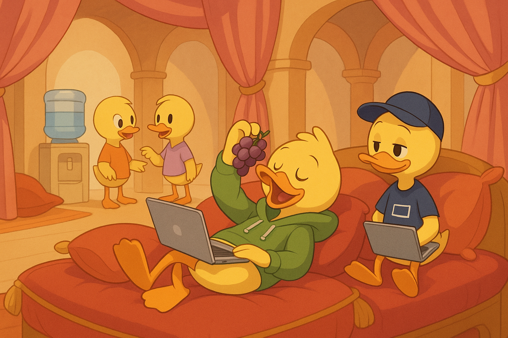

Заметьте: компании требуют от вас эксклюзивности — никакой второй работы, никаких сторонних проектов. У вас два работодателя? Ах ты профурсетка! (А если вы сеньор — извините, куртизанка.)

При этом сама компания может иметь хоть тысячу сотрудников, и всё это считается нормальным. А вам в итоге не принадлежит ничего, кроме опыта и пары футболок с логотипом.

#humor #essay