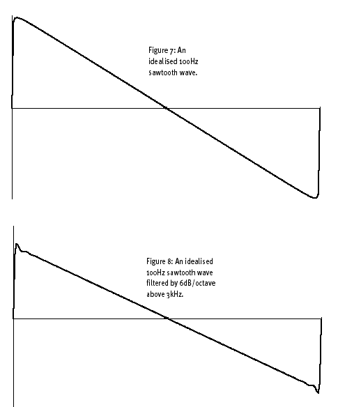

So let's see what a 6dB/octave RC filter with a cutoff frequency of, say, 3kHz does to the harmonics and waveform of a 100Hz [[sawtooth wave]].

If you now look at Figures 7 and 8, you'll see that the first diagram shows our idealised 100Hz sawtooth waveform with all its harmonics up to 20kHz unattenuated, while the latter shows the same signal processed by our 3kHz filter. As you can see, there's not much visible difference between the two waveforms. This is because the 3kHz cutoff frequency allows the first 30 harmonics through untouched, and it's only the low-amplitude high-frequency harmonics that are affected. Nevertheless, the human ear's enormous sensitivity ensures that you hear even this tiny difference as a 'dullness' or lack of 'top end' in the filtered sound.

[[Synth Secrets]]

#synth