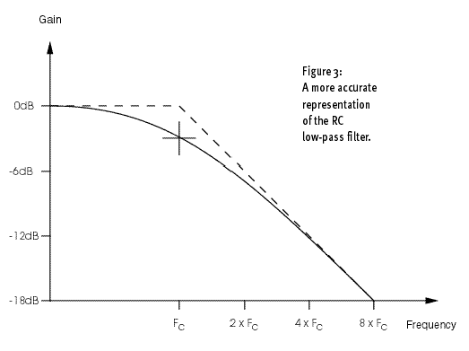

For every doubling of the frequency above the cutoff frequency (which I will call Fc), the gain at the output is halved.

So, for example, if Fc is 1kHz, the gain at 2kHz is 1/2 (ie. the output is halved), the gain at 4kHz is 1/4 (the output is a quarter)... and so on. Since each doubling of the frequency is equivalent to moving up an octave, and each successive halving of the gain is known as an attenuation of six decibels (6dB), this response is most commonly called a 6dB/octave filter.

>The cutoff frequency of a passive low-pass filter does not define the frequency at which the filter starts to work; it is itself defined as that frequency at which the signal is already attenuated by 3dB. And, since an attenuation of 3dB is easily perceived by the human ear, this means that you are already significantly affecting the signal at the cutoff frequency.

[[Synth Secrets]]

#synth