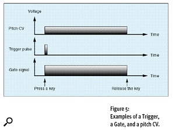

Although a Trigger will initiate a transient generator, it's the Gate that tells the synth to continue developing the contour until the key is released. Without a Gate, all you would hear would be a short 'blip' at the start of the sound, but nothing thereafter.

[[Synth Secrets]]

#synth