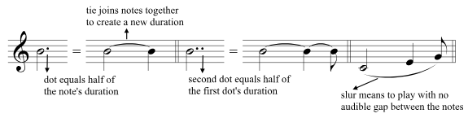

We have a whole note, which lasts for four beats, and a half note, which lasts for two beats, but we don’t have a durational value that lasts three beats. To do so requires using a dot or a tie.

A tie links two notes together to create a new duration. Ties occur between notes of the same pitch. A slur, which looks like a tie, is placed over or under notes of different pitches and means to play them in a connected manner.

A dot added to a note increases the duration of that note by half. A second dot represents half the value of the first dot, or a quarter of the original duration. (These are known as double-dotted notes.)

From [[Music Theory for the 21st-Century Classroom]]

#music #theory