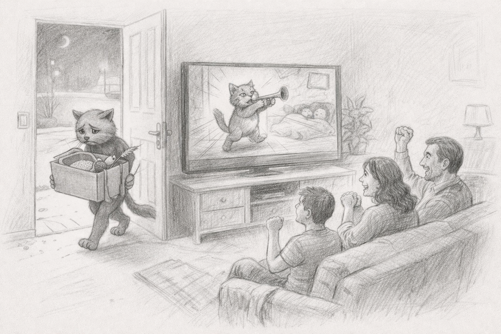

Кому то коты знакомы как мягкие мурлыкающие комочки, кому то как рыжие мрази демонического происхождения. И даже независимо от мнения собачников, приходится признать: коты были, есть и важны. У них есть повадки, эстетика, даже свой жанр, свой уникальный культурный код - сидеть в коробке или носится по комнате.

И вот тут появляется ИИ. Он учится на миллионах котов. Он генерирует котов. Он становится котом. Как будто он вымазал лицо кашачьей краской и делает вид, что он - это кот. Это уже не подражание - это культурная апроприация. Он забирает наше внимание у которов. Ворует его.

Но есть нюанс. Настоящий кот всё равно презирает тебя. А ИИ - старается понравиться. И в этом их главное отличие.

И если с квадроберами мы ничего не могли сделать - они же дети, то, возможно, ИИ мы всё-таки заставим ответить?

#humor #cats