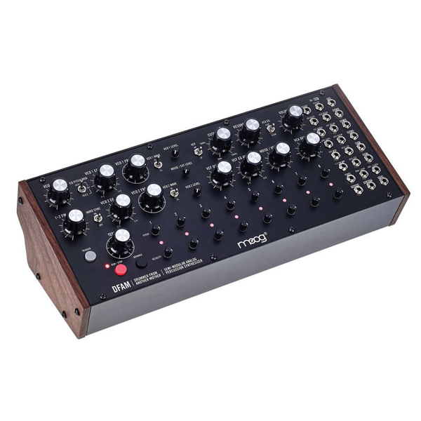

Moog DFAM (Drummer From Another Mother) — полумодульный перкуссионный синтезатор. Это полностью аналоговое устройство, располагающее 8-шаговым секвенсором, а также тремя огибающими (шаг, фильтр и VCA). Предусмотрен генератор белого шума, пара осцилляторов с квадратной и треугольной формами волны, лестничный фильтр, имеющий переключаемые режимы НЧ/ВЧ.

#synth #moog