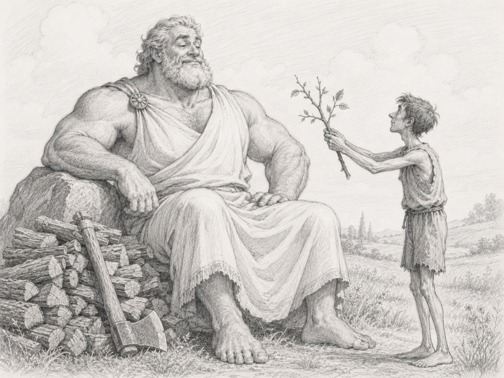

Вам знакома ситуация, когда лид приходит в ваш merge request и предлагает совершенно бессмысленную правку? Она не приносит пользы, не наносит вреда, но требует от вас дополнительных усилий.

Просто сделайте её.

Обсуждение может занять больше времени, чем сама правка, а в худшем случае перерасти в ненужный спор и проблемы в коммуникации. Разве нам это нужно? Скорее всего, нет.

Проявите снисходительность. Поймите: у лида и так осталось не так много радостей в жизни. Когда-то и он был разработчиком с горящими глазами. Он мечтал писать код, создавать новое, менять мир. Теперь же у него горят совсем не глаза. И сам он лишь раб структуры.

У вас же есть всё необходимое для счастья: код, тесты и ощущение, что вы сделали что-то настоящее. У него остались только дашборды и диаграммы Ганта.

Сделайте эту правку, проявите добродетель. Дайте человеку хотя бы ненадолго почувствовать, что он всё ещё кому-то нужен и полезен.

#reflection