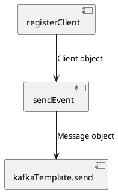
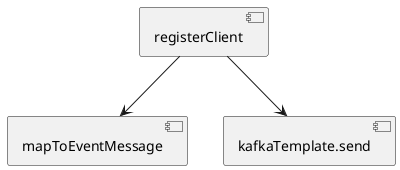

---
Было ли у вас такое, что вы маленький лежите на кровати и смотрите на стену, где весит старый советский ковер с замысловатыми рисунками и видите как в этих линиях отчетливо вырисовываются животные и прочие причудливые формы? 
Сейчас я смотрю больше в код, но в моем сознании все так же возникают удивительные образы. Эти образы бывают приятными и не очень. Но не зависимо от эстетической составляющей, все эти образы складываются в повторяющиеся паттерны. Часть из них прекрасны, а часть из них безобразны. И им можно дать имена. Об одном из таких паттернов я бы хотел поговорить в этом небольшой статье.

---

Помните, как в детстве вы лежали на кровати и смотрели на старый советский ковер с замысловатыми узорами, видя, как в этих линиях отчетливо вырисовываются животные и причудливые формы? Теперь я чаще смотрю на код, но в моем сознании по-прежнему возникают удивительные образы. Эти образы могут быть как приятными, так и не очень. Но независимо от их эстетической привлекательности, все они складываются в повторяющиеся паттерны. Одни из них прекрасны, а другие безобразны. И им можно дать имена. О одном из таких 'безобразных' паттернов я бы хотел рассказать в этой небольшой статье.

---

## Сценарий 

Давайте представим, что перед нами сервис, который обрабатывает запрос на регистрацию клиента и отправляет событие о завершении такой регистрации в кафку. 

Для начала предлагаю рассмотреть пример реализации, который в моем понимании, является антипатерном и далее рассмотрим исправленную версию метода.

### Вариант 1: Methodcentipede

Код
```

```

Схема представлена ниже



Первое наблюдение такое: Из методов формируется неразрывная цепочка по которой перетекает масса данных. Код разделен на методы таким образом, что весь процесс обработки просто вытянуть в некий пайплайн данных и нарезан на методы. Цепочка не разрывна, методы в середине цепочке ответственны не только за логику, непосредственно описанную в теле метода, но и за всю логику вызываемого ими методов. 

Все методы следующие перед вызываемым наследуют всю сложность, например если kafkaTemplate.send является не чистой функцией (есть сайд эффект), то то и вызывающий его sendEvent чисто функцией не является и наследует сайд эффект.

Логика будто бы разделена, но за счет того, что это все сцеплено вместе

Код метода обработки описанного запроса представлен ниже.

Методы атрофируются с точки зрения ответственности, границы которой в общейй цепочке размыты. При этом методы сохраняют собственные названия. Но вляются ничем иным, как частью пайплайна.

Тестирование затруднено тем, что мы вынуждены тестировать иили всю цепочку следующих методов, учитывая особенности (сайд эффекты и прочую недетрминипованность)

Цель стремиться к методам с четкой ответственность, к чистым функциям.

### Вариант реализации: Чистая функция

Код
```

```

Схема представлена ниже




Когда функция детерминированная и не имеет побочных эффектов, мы называем её "чистой" функцией. Чистые функции:
- проще читать,
- проще отлаживать,
- проще тестировать,
- не зависят от порядка, в котором они вызываются,
- просто запустить параллельно (одновременно).

Чистые функции независимы от времени. Недетерминизм и побочные эффекты добавляют понятие времени. Если функция зависит от чего-то, что может случиться, а может не случиться и меняет что-то за пределами своих границ, то она неожиданно становится зависимой от времени.

===

проблема с поддержкой, придумать сценарий - когда будет плохо, например отправляем не для всех клиентов

---
Сосидж дизайн
Как сосиска растянутый код

Sausage links design 

Человеческая многоножка, скрин из сауспарка

Human Centipede - Method Centipede
Нарисовать на планшете набросок и попросит гпт дорисовать. Нужно повторить стиль сауспарка но с методами.
Найти хороший пример 

--
Я придумал дурацкие названия для антипартернов 
Я встречаю повторяющиеся паттерны кода, которые я считаю не правильным и придумываю им дурацкие названия.

#draft #design