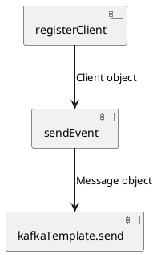
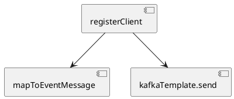

Когда-то в детстве я лежал на кровати и долго разглядывал узоры на старом советском ковре, видя в них животных и фантастические фигуры. Теперь я чаще смотрю на код, но в моем сознании по-прежнему рождаются похожие образы. Как и на ковре, эти образы складываются в повторяющиеся паттерны. Они могут быть как приятными, так и отталкивающими. Сегодня я хочу рассказать вам о таком неприятном паттерне, который встречается в программировании.

## Сценарий 

Представьте себе сервис, который обрабатывает запрос на регистрацию клиента и отправляет событие об этом в систему. В статье я покажу пример реализации, который считаю антипаттерном, и предложу исправленный вариант.

### Вариант 1: Methodcentipede

В коде Java ниже представлен код класса RegistrationService, который обрабатывает запрос и отправляет событие.

```java
public class RegistrationService {

    private final ClientRepository clientRepository;
    private final KafkaTemplate<Object, Object> kafkaTemplate;
    private final ObjectMapper objectMapper;

    public void registerClient(RegistrationController.RegistrationRequest request) {
        var client = clientRepository.save(Client.builder()
                .email(request.email())
                .firstName(request.firstName())
                .lastName(request.lastName())
                .build());
        sendEvent(client);
    }

    @SneakyThrows
    private void sendEvent(Client client) {
        var event = RegistrationEvent.builder()
                .clientId(client.getId())
                .email(client.getEmail())
                .firstName(client.getFirstName())
                .lastName(client.getLastName())
                .build();
        Message message = MessageBuilder
                .withPayload(objectMapper.writeValueAsString(event))
                .setHeader(KafkaHeaders.TOPIC, "topic-registration")
                .setHeader(KafkaHeaders.KEY, client.getEmail())
                .build();
        kafkaTemplate.send(message).get();
    }

    @Builder
    public record RegistrationEvent(int clientId, String email, String firstName, String lastName) {}
}
```

Структуру кода упрощенно можно представить в таком виде:



Здесь видно, что методы образуют неразрывную цепочку, по которой перетекает масса данных, как по длинной узкой кишке. Методы в середине цепочки ответственны не только за логику, непосредственно описанную в теле метода, но и за всю логику вызываемых ими методов и их контракт (например, необходимость в обработке конкретных ошибок). Все методы, следующие перед вызываемым, наследуют всю сложность. Например, если `kafkaTemplate.send` имеет сайд-эффект в виде отправки события, то и вызывающий его `sendEvent` уже перестает быть чистой функцией и приобретает минимум тот же сайд-эффект. Контракта метод `sendEvent` связан как с отправкой сообщений, так и с сериализацией.

Хотя метод registerClient выглядит компактно, вызов метода sendEvent может затруднить понимание, поскольку он обрабатывает как создание события, так и его отправку. При дальнейшем расширении функционала это может стать проблемой. Unit-тестирование методов при данном подходе будет сложным для разработчика — нет возможности проверить логику маппинга в объект события изолированно от отправки, придется мокировать.

### Вариант 2: Исправленный вариант

Код:

```java
public class RegistrationService {

    private final ClientRepository clientRepository;
    private final KafkaTemplate<Object, Object> kafkaTemplate;
    private final ObjectMapper objectMapper;

    @SneakyThrows
    public void registerClient(RegistrationController.RegistrationRequest request) {
        var client = clientRepository.save(Client.builder()
                .email(request.email())
                .firstName(request.firstName())
                .lastName(request.lastName())
                .build());
        Message<String> message = mapToEventMessage(client);
        kafkaTemplate.send(message).get();
    }

    private Message<String> mapToEventMessage(Client client) throws JsonProcessingException {
        var event = RegistrationEvent.builder()
                .clientId(client.getId())
                .email(client.getEmail())
                .firstName(client.getFirstName())
                .lastName(client.getLastName())
                .build();
        return MessageBuilder
                .withPayload(objectMapper.writeValueAsString(event))
                .setHeader(KafkaHeaders.TOPIC, "topic-registration")
                .setHeader(KafkaHeaders.KEY, event.email)
                .build();
    }

    @Builder
    public record RegistrationEvent(int clientId, String email, String firstName, String lastName) {}
}
```

Схема представлена ниже:



Здесь видно, что метода `sendEvent` вовсе нет, и за отправку отвечает `kafkaTemplate.send`. Весь процесс построения сообщения для Kafka вынесен в отдельный метод `mapToEventMessage`. Метод `mapToEventMessage` не имеет сайд-эффектов, граница его ответственности четко очерчена. Исключения, связанные с сериализацией и отправкой сообщений, являются частью контракта отдельных методов и могут быть индивидуально обработаны.

Метод `mapToEventMessage` является чистой функцией. Когда функция детерминированная и не имеет побочных эффектов, мы называем её "чистой" функцией. Чистые функции:
- проще читать,
- проще отлаживать,
- проще тестировать,
- не зависят от порядка, в котором они вызываются,
- просто запустить параллельно.

## Рекомендации

Я бы указал следующие техники, позволяющие избежать подобных антипаттернов в коде:
- Testing Trophy подход
- One pile техника
- Test-Driven Development (TDD)

Все эти техники тесно связаны и взаимно дополняют друг друга.

### Testing Trophy

Это подход к покрытию кода тестами, при котором акцент делается на интеграционные тесты, проверяющие контракт сервиса в целом. Unit-тесты используются для отдельных функций, которые сложно или дорого тестировать через интеграционные тесты. Тесты с подобным подходом я описывал в своих статьях: https://habr.com/ru/articles/781812/, https://habr.com/ru/articles/804673/, https://habr.com/ru/articles/797049. 

### One Pile техника

Эта техника описана в книге "Tidy First?" Кента Бека. Основная мысль: чтение и понимание кода сложнее, чем его написание. Если код разбит на слишком много мелких частей, может быть полезно сначала объединить его в одно целое, чтобы увидеть общую структуру и логику, а затем снова разделить на более понятные куски.

В контексте данной статьи предлагается не разделять код на методы до тех пор, пока он не будет обеспечивать выполнение требуемого контракта.

### Testing Driven Development

Этот подход позволяет разделить усилия на написание кода для реализации контракта и на формирование дизайна кода. Мы не пытаемся сразу сделать хороший дизайн и правильный с точки зрения требований код, а разделяем эти активности. Процесс разработки выглядит следующим образом:
1. Пишем тесты к контракту сервиса, используя подход Testing Trophy.
2. Пишем код в стиле One Pile. Добиваемся того, что он обеспечивает выполнение требуемого контракта. Не обращаем внимания на качество дизайна кода.
3. Делаем рефакторинг кода. Весь код написан, у нас есть полное представление о реализации и узких местах.

## Заключение

В этой статье мы рассмотрели пример антипаттерна, который может привести к сложностям в поддержке и тестировании кода. Мы также обсудили техники, которые помогают избежать подобных проблем. Ключевой вывод заключается в том, что качественный код — это не только работающий код, но и код, который легко читать, понимать и тестировать. Подходы, такие как Testing Trophy, One Pile и Test-Driven Development, позволяют структурировать работу таким образом, чтобы код не превращался в непроходимый лабиринт. Инвестируя время в правильную организацию кода, мы закладываем основу для долговременной устойчивости и простоты сопровождения наших программных продуктов.

#draft #design