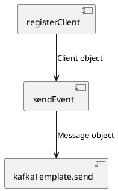
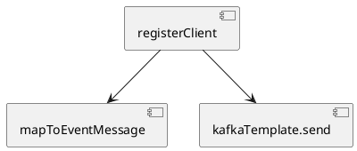

---
Было ли у вас такое, что вы маленький лежите на кровати и смотрите на стену, где весит старый советский ковер с замысловатыми рисунками и видите как в этих линиях отчетливо вырисовываются животные и прочие причудливые формы? 
Сейчас я смотрю больше в код, но в моем сознании все так же возникают удивительные образы. Эти образы бывают приятными и не очень. Но не зависимо от эстетической составляющей, все эти образы складываются в повторяющиеся паттерны. Часть из них прекрасны, а часть из них безобразны. И им можно дать имена. Об одном из таких паттернов я бы хотел поговорить в этом небольшой статье.

---

Помните, как в детстве вы лежали на кровати и смотрели на старый советский ковер с замысловатыми узорами, видя, как в этих линиях отчетливо вырисовываются животные и причудливые формы? Теперь я чаще смотрю на код, но в моем сознании по-прежнему возникают удивительные образы. Эти образы могут быть как приятными, так и не очень. Но независимо от их эстетической привлекательности, все они складываются в повторяющиеся паттерны. Одни из них прекрасны, а другие безобразны. И им можно дать имена. О одном из таких 'безобразных' паттернов я бы хотел рассказать в этой небольшой статье.

---

## Сценарий 

Давайте представим, что перед нами сервис, который обрабатывает запрос на регистрацию клиента и отправляет событие о завершении такой регистрации в Kafka. Я покажу пример реализации, который считаю антипаттерном, и предложу исправленный вариант.

### Вариант 1: Methodcentipede

В коде Java ниже вы можете увидеть класс RegistrationService, который обрабатывает запрос и отправляет событие.
```java
public class RegistrationService {

    private final ClientRepository clientRepository;
    private final KafkaTemplate<Object, Object> kafkaTemplate;
    private final ObjectMapper objectMapper;

    public void registerClient(RegistrationController.RegistrationRequest request) {
        var client = clientRepository.save(Client.builder()
                .email(request.email())
                .firstName(request.firstName())
                .lastName(request.lastName())
                .build());
        sendEvent(client);
    }

    @SneakyThrows
    private void sendEvent(Client client) {
        var event = RegistrationEvent.builder()
                .clientId(client.getId())
                .email(client.getEmail())
                .firstName(client.getFirstName())
                .lastName(client.getLastName())
                .build();
        Message message = MessageBuilder
                .withPayload(objectMapper.writeValueAsString(event))
                .setHeader(KafkaHeaders.TOPIC, "topic-registration")
                .setHeader(KafkaHeaders.KEY, client.getEmail())
                .build();
        kafkaTemplate.send(message).get();
    }

    @Builder
    public record RegistrationEvent(int clientId, String email, String firstName, String lastName) {}
}
```

Структуру кода упрощенно можно представить в таком виде



Здесь видно, что методы образуют неразрывную цепочку по которой перетекает масса данных как по длинной узкой кишке. Методы в середине цепочке ответственны не только за логику, непосредственно описанную в теле метода, но и за всю логику вызываемого ими методов и его контракт (например необходимость в обработке конкретных ошибок). Все методы следующие перед вызываемым наследуют всю сложность, например если `kafkaTemplate.send` имеет сайд-эффект в виде отправке события, то и вызывающий его `sendEvent` уже перестает быть чистой функцией и имеет уже минимум тот же сайд-эффект. Часть контракта метода `sendEvent` являются как ошибся связанные непосредственно с отправкой сообщений, так и связанные с сериализацией.

Хотя метод registerClient выглядит компактно, вызов метода sendEvent может затруднить понимание, поскольку он обрабатывает как создание события, так и его отправку. При дальнейшем расширении функционала это может стать проблемой. Unit тестирование методов при данном подходе будет представлять вызов для разработчика - нет возможности проверить логику мапинга в объект события изолированно от отправки - придется мокировать.

### Вариант 2: Чистая функция

Код
```java
public class RegistrationService2 {

    private final ClientRepository clientRepository;
    private final KafkaTemplate<Object, Object> kafkaTemplate;
    private final ObjectMapper objectMapper;

    @SneakyThrows
    public void registerClient(RegistrationController.RegistrationRequest request) {
        var client = clientRepository.save(Client.builder()
                .email(request.email())
                .firstName(request.firstName())
                .lastName(request.lastName())
                .build());
        Message<String> message = mapToEventMessage(client);
        kafkaTemplate.send(message).get();
    }

    private Message<String> mapToEventMessage(Client client) throws JsonProcessingException {
        var event = RegistrationEvent.builder()
                .clientId(client.getId())
                .email(client.getEmail())
                .firstName(client.getFirstName())
                .lastName(client.getLastName())
                .build();
        return MessageBuilder
                .withPayload(objectMapper.writeValueAsString(event))
                .setHeader(KafkaHeaders.TOPIC, "topic-registration")
                .setHeader(KafkaHeaders.KEY, event.email)
                .build();
    }

    @Builder
    public record RegistrationEvent(int clientId, String email, String firstName, String lastName) {}
}
```

Схема представлена ниже



Здесь видно, что метода `sendEvent` вовсе нет и за отправку отвечает `kafkaTemplate.send`. Весь процесс построения сообщения для Kafka вынесен в отдельный метод `mapToEventMessage`. Метод `mapToEventMessage` не имеет сайд эффектов, граница его ответственности четко очерчена. Исключения, связанные с сериализацией и отправкой сообщений, являются часть контракта отдельных методов и могут быть индивидуально обработаны. 

Метод `mapToEventMessage` является чистой функцией. Когда функция детерминированная и не имеет побочных эффектов, мы называем её "чистой" функцией. Чистые функции:
- проще читать,
- проще отлаживать,
- проще тестировать,
- не зависят от порядка, в котором они вызываются,
- просто запустить параллельно.

## Как прийти к такому варианту

Основная рекомендация для решения подобных проблем это pile technic когда мы собираем весь код в кучу и только потом делаем а не делим сразу по ходу мысли

Не пилить на методы до того как код написан 

## Резюме

Второй вариант лучше соответствует принципам и паттернам проектирования, таким как SRP, SoC, и инкапсуляция. Это делает код более модульным, гибким и удобным для расширения и поддержки, что особенно важно в долгосрочных проектах.

Разделение ответственности и снижение

===

проблема с поддержкой, придумать сценарий - когда будет плохо, например отправляем не для всех клиентов

---
Сосидж дизайн
Как сосиска растянутый код

Sausage links design 

Человеческая многоножка, скрин из сауспарка

Human Centipede - Method Centipede
Нарисовать на планшете набросок и попросит гпт дорисовать. Нужно повторить стиль сауспарка но с методами.
Найти хороший пример 

--
Я придумал дурацкие названия для антипартернов 
Я встречаю повторяющиеся паттерны кода, которые я считаю не правильным и придумываю им дурацкие названия.

#draft #design