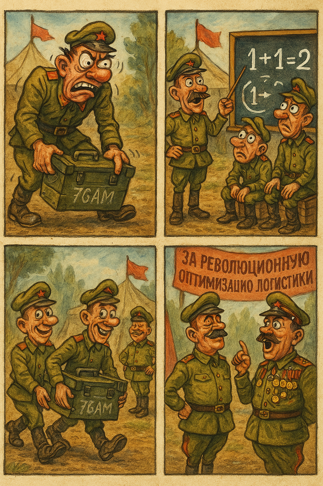
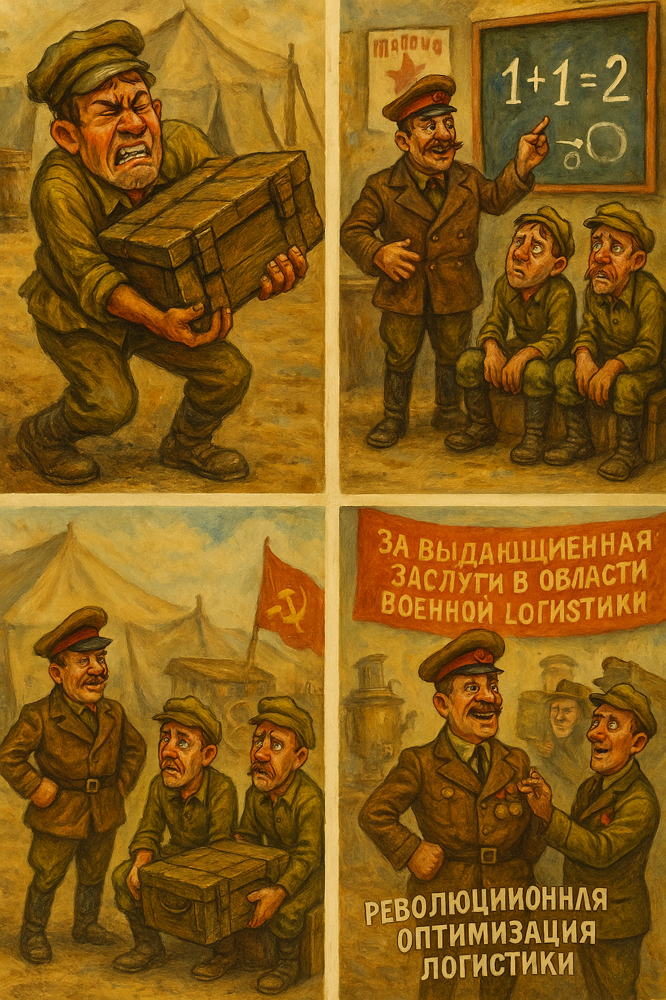
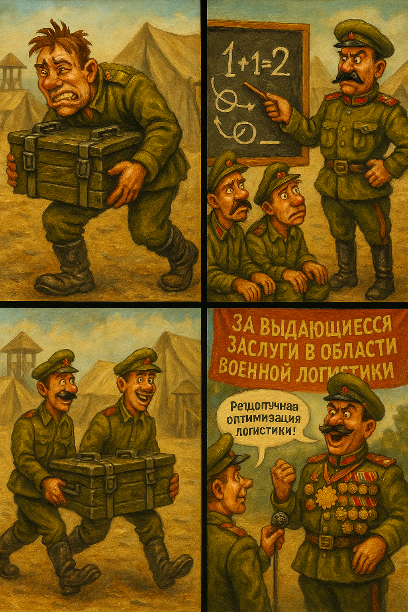
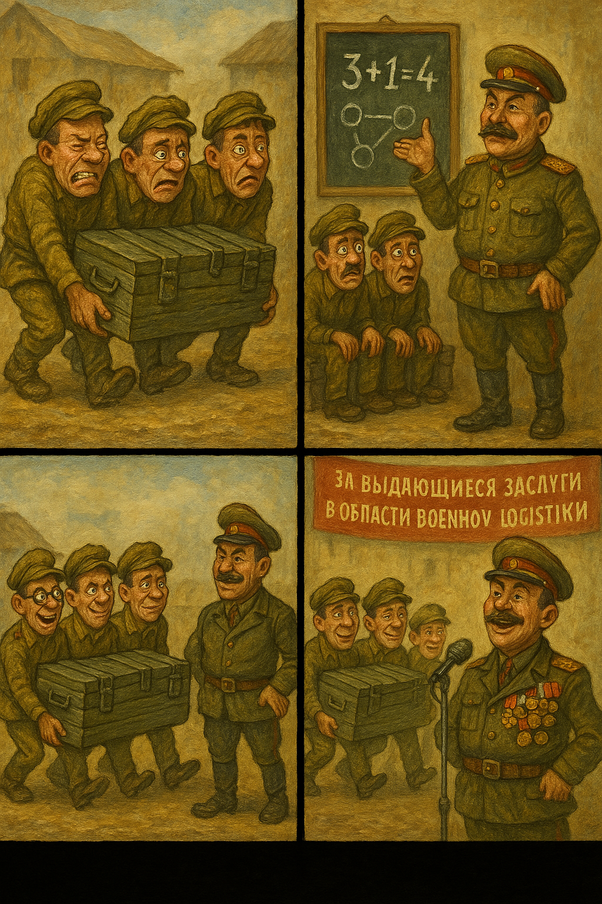
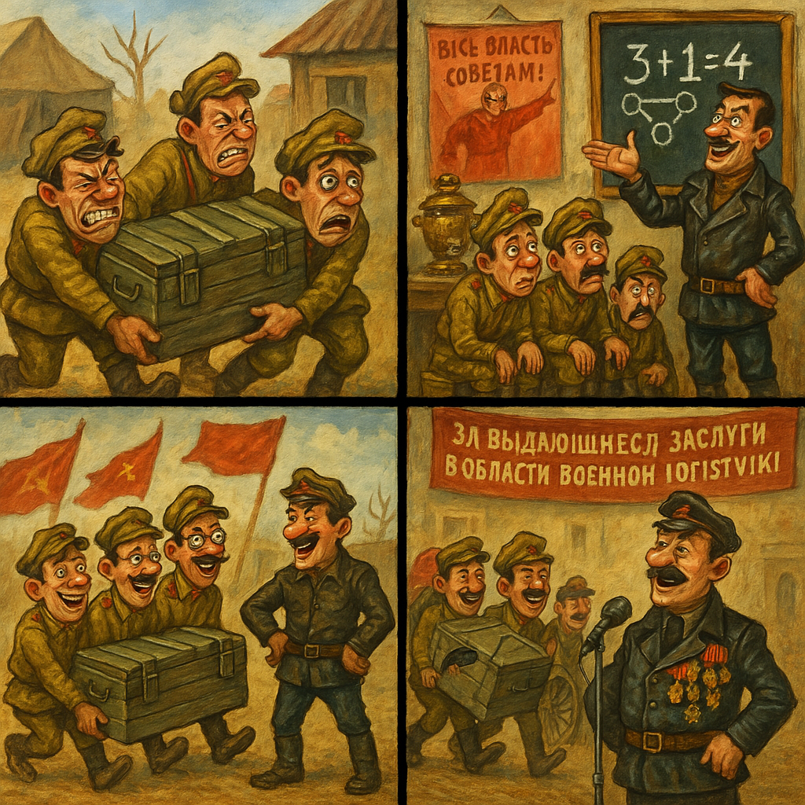

## Персонажи

Генерале, он явно не называется архитектором, но в разговоре про него говорят как «архитектор сражения»

## Сюжеты

Архитектор видит как три солдата тащат ящик с патронами, им тяжело и очевидно, что достаточно четвёртого человека, чтобы донести ящик. Архитектор предлагает разные идеи как им помочь кроме самого очевидного - стать 4 человеком

## Стиль

Нравится, как нарисованы персонажи российской игры с ПК Петька и Василий Иванович

## Рисуем

### Вариант 6

```
Comic strip, 4 panels.

Panel 1: comic panel showing one exhausted soldier struggling with a large ammunition box. His face should be comically strained, uniforms disheveled. 

Panel 2: comic panel showing a general giving an elaborate presentation. He stands near a blackboard covered with obvious diagrams showing "1+1=2". The two tired soldiers sit on ammunition boxes, looking confused.

Panel 3: comic panel showing two! soldiers easily carrying the same ammunition box, walking past the proud general.

Panel 4: comic panel showing a ceremony where the general receives a medal. The commander's chest is already full of medals, and he's giving a speech about it. Include a banner reading "За выдающиеся заслуги в области военной логистики".

Style for all panels:
- Style matches "Петька и Василий Иванович" games with exaggerated expressions and hand-painted look. Setting: dusty military camp, 1918-1920.
- Hand-painted look of 90s Russian adventure games
- Rich colors and exaggerated character designs
- Detailed backgrounds with Civil War era elements
- Humorous tone matching Petka & Chapaev games
```

### Вариант 5

```
Comic strip, 4 panels.

Panel 1: comic panel showing one exhausted soldier struggling with a large ammunition box. His face should be comically strained, uniforms disheveled. 

Panel 2: comic panel showing a general giving an elaborate presentation. He stands near a blackboard covered with obvious diagrams showing "1+1=2". The two tired soldiers sit on ammunition boxes, looking confused.

Panel 3: comic panel showing two! soldiers easily carrying the same ammunition box, walking past the proud general.

Panel 4: comic panel showing a ceremony where the general receives a medal. The commander's chest is already full of medals, and he's giving a speech about. Include a banner reading "За революционную оптимизацию логистики".

Style for all panels:
- Style matches 1990s Russian adventure games like "Petka and Vasily Ivanovich"
- Bold caricature style with rubbery limbs and oversized facial features
- Heavy outlines, hand-painted textures, warm earthy color palette
- Visual humor and grotesque exaggeration in characters' faces and body proportions
- Backgrounds painted in watercolor-like detail with visible brush texture
- Stylized Civil War era tents, signs with Cyrillic text, red flags, and rustic forest/military camp scenery
- Comedic and absurdist tone, slightly surreal, parodying military seriousness
- Each panel must have visual punchline or exaggerated comic beat
- Characters with over-the-top expressions: bulging eyes, twisted mouths, exaggerated mustaches
- Uniforms distorted for comic effect: too tight or too baggy
- Comical poses, dynamic movement, odd anatomy reminiscent of Soviet cartoon satire
```




### Вариант 4

```
Comic strip, 4 panels.

Panel 1: comic panel showing one exhausted soldier struggling with a large ammunition box. His face should be comically strained, uniforms disheveled. 

Panel 2: comic panel showing a general giving an elaborate presentation. He stands near a blackboard covered with obvious diagrams showing "1+1=2". The two tired soldiers sit on ammunition boxes, looking confused.

Panel 3: comic panel showing two! soldiers easily carrying the same ammunition box, walking past the proud general.

Panel 4: comic panel showing a ceremony where the general receives a medal. The commander's chest is already full of medals, and he's giving a speech about. Include a banner reading "За революционную оптимизацию логистики".

Style for all panels:
- Style matches 1990s Russian adventure games like "Petka and Vasily Ivanovich"
- Bold caricature style with rubbery limbs and oversized facial features
- Heavy outlines, hand-painted textures, warm earthy color palette
- Visual humor and grotesque exaggeration in characters' faces and body proportions
- Backgrounds painted in watercolor-like detail with visible brush texture
- Stylized Civil War era tents, signs with Cyrillic text, red flags, and rustic forest/military camp scenery
- Comedic and absurdist tone, slightly surreal, parodying military seriousness
- Each panel must have visual punchline or exaggerated comic beat
- Characters with over-the-top expressions: bulging eyes, twisted mouths, exaggerated mustaches
- Uniforms distorted for comic effect: too tight or too baggy
- Comical poses, dynamic movement, odd anatomy reminiscent of Soviet cartoon satire
```


### Вариант 3

```
Comic strip, 4 panels.

Panel 1: comic panel showing one exhausted soldier struggling with a large ammunition box. His face should be comically strained, uniforms disheveled. 

Panel 2: comic panel showing a general giving an elaborate presentation. He stands near a blackboard covered with obvious diagrams showing "1+1=2". The two tired soldiers sit on ammunition boxes, looking confused.

Panel 3: comic panel showing two! soldiers easily carrying the same ammunition box, walking past the proud general.

Panel 4: comic panel showing a ceremony where the general receives a medal. The commander's chest is already full of medals, and he's giving a speech about "revolutionary logistics optimization". Include a banner reading "За выдающиеся заслуги в области военной логистики".

Style for all panels:
- Style matches "Петька и Василий Иванович" games with exaggerated expressions and hand-painted look. Setting: dusty military camp, 1918-1920.
- Hand-painted look of 90s Russian adventure games
- Rich colors and exaggerated character designs
- Detailed backgrounds with Civil War era elements
- Humorous tone matching Petka & Chapaev games
```




### Вариант 2

```
Panel 1: comic panel showing three exhausted soldiers struggling with a large ammunition box. Their faces should be comically strained, uniforms disheveled. 

Panel 2: comic panel showing a general giving an elaborate presentation. He stands near a blackboard covered with obvious diagrams showing "3+1=4". The three tired soldiers sit on ammunition boxes, looking confused.

Panel 3: comic panel showing four! soldiers easily carrying the same ammunition box, walking past the proud general.

Panel 4: comic panel showing a ceremony where the general receives a medal. Behind him, the soldiers are still carrying boxes. The commander's chest is already full of medals, and he's giving a speech about "revolutionary logistics optimization". Include a banner reading "За выдающиеся заслуги в области военной логистики".

Style for all panels:
- Hand-painted look of 90s Russian adventure games
- Rich colors and exaggerated character designs
- Detailed backgrounds with Civil War era elements
- Humorous tone matching Petka & Chapaev games
```



### Вариант 1
```
Comic strip, 4 panels.

Panel 1: comic panel showing three exhausted Red Army soldiers struggling with a large ammunition box. Their faces should be comically strained, uniforms disheveled. Style matches "Петька и Василий Иванович" games with exaggerated expressions and hand-painted look. Setting: dusty military camp, 1918-1920.

Panel 2: comic panel showing a Red Army commander in leather jacket giving an elaborate presentation. He stands near a blackboard covered with obvious diagrams showing "3+1=4". The three tired soldiers sit on ammunition boxes, looking confused. Include revolutionary posters and a samovar in the background.

Panel 3: comic panel showing four soldiers easily carrying the same ammunition box, walking past the proud commander. The fourth soldier should be wearing glasses similar to the commander's. Include revolutionary flags and a tachanka in the background.

Panel 4: comic panel showing a ceremony where the commander receives a medal. Behind him, the soldiers are still carrying boxes. The commander's chest is already full of medals, and he's giving a speech about "revolutionary logistics optimization". Include a banner reading "За выдающиеся заслуги в области военной логистики".

Style for all panels:
- Hand-painted look of 90s Russian adventure games
- Rich colors and exaggerated character designs
- Detailed backgrounds with Civil War era elements
- Humorous tone matching Petka & Chapaev games
```


#comics #project #ai #draft #architecture #draft
