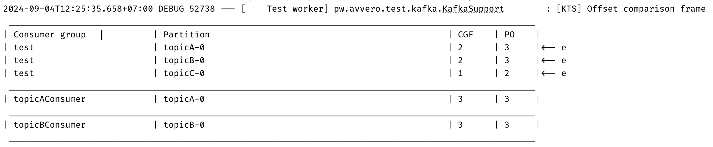

Данная статья предлагает подход к написанию интеграционных тестов для приложений с Kafka, позволяющий сосредоточиться на спецификации взаимодействия, делая тесты более читаемыми и легкими для поддержки. Представленный подход не только повышает эффективность тестирования, но и способствует лучшему пониманию интеграционных процессов в приложении.

Статья опирается на три идеи, изложенные в соответствующих статьях: [написание тестов с четким разделением на отдельные этапы Arrange-Act-Assert](https://habr.com/ru/articles/781812/), [изоляция в тестах с Kafka](https://habr.com/ru/articles/797049/) и [использование инструментов повышения наглядности тестов](https://habr.com/ru/articles/804673/). Рекомендую ознакомиться с ними перед погружением в материал данной статьи.

## Демонстрационный сценарий

Возьмем в качестве примера телеграм-бот, который перенаправляет запросы к OpenAI API и возвращает результат пользователю. Если запрос в OpenAI нарушает правила безопасности системы, клиент получит об этом сообщение. Дополнительно будет отправлено сообщение в Kafka для системы поведенческого контроля, чтобы товарищ менеджер мог связаться с пользователем и объяснить, что его запрос оказался слишком пикантным даже для нашего робота, и попросить его пересмотреть свои предпочтения.

Контракты взаимодействия с сервисами описаны в упрощенном виде, чтобы подчеркнуть основную логику работы. Ниже приведена диаграмма последовательностей, демонстрирующая архитектуру приложения. Понимаю, что дизайн может вызвать вопросы с точки зрения системной архитектуры, но прошу отнестись к этому с пониманием — главная цель здесь продемонстрировать подход к написанию тестов.


### Объект захвата сообщений

В качестве основного инструмента тестирования будет использоваться объект захвата сообщений — [RecordCaptor](https://github.com/avvero/kafka-test-support/blob/sb3/kafka-support/src/main/java/pw/avvero/test/kafka/RecordCaptor.java). Он по своей сути работы очень похож на объект захвата исходящих запросов — [RequestCaptor](https://github.com/avvero/spring-sandbox/blob/main/request-captor/src/main/java/pw/avvero/test/http/RequestCaptor.java), о котором можно почитать в статье [Разносим по полочкам этапы тестирования http запросов в Spring](https://habr.com/ru/articles/781812/).

Захват сообщений будет выполняться через стандартный консумер Kafka. Список топиков нужно указывать явно через параметр конфигурации.

```java
@KafkaListener(id = "recordCaptor", topics = "#{'${test.record-captor.topics}'.split(',')}", groupId = "test")
public void eventCaptorListener(ConsumerRecord<Object, Object> record,
                                @Headers Map<String, Object> boundedHeaders) {
    RecordSnapshot recordSnapshot = mapper.recordToSnapshot(record, boundedHeaders);
    recordCaptor.capture(recordSnapshot);
}
```

Объект `RecordCaptor` накапливает информацию из захваченных сообщений.

Использование подобного подхода требует соблюдения [изоляции в тестах с Kafka](https://habr.com/ru/articles/797049/). Ожидание подтверждения смещения перед проверкой результатов теста необходимо осуществить с помощью метода [KafkaSupport#waitForPartitionOffsetCommit](https://github.com/avvero/kafka-test-support/blob/6595086188252f4ed89dff24e2129d75e26d9ece/kafka-support/src/main/java/pw/avvero/test/kafka/KafkaSupport.java#L109).

### Пример теста

Ниже представлен код теста для описанного сценария.

```java
def "User Message Processing with OpenAI"() {
    setup:
    KafkaSupport.waitForPartitionAssignment(applicationContext)                           // 1
    and:                                                                                  // 2
    def openaiRequestCaptor = restExpectation.openai.completions(withBadRequest().contentType(APPLICATION_JSON)
            .body("""{
                "error": {
                "code": "content_policy_violation",
                "message": "Your request was rejected as a result of our safety system."
                }
            }"""))
    def telegramRequestCaptor = restExpectation.telegram.sendMessage(withSuccess('{}', APPLICATION_JSON))
    when:
    mockMvc.perform(post("/telegram/webhook")                                             // 3
            .contentType(APPLICATION_JSON_VALUE)
            .content("""{
                "message": {
                "from": {
                    "id": 10000000
                },
                "chat": {
                    "id": 20000000
                },
                "text": "Hello!"
                }
            }""".toString())
            .accept(APPLICATION_JSON_VALUE))
            .andExpect(status().isOk())
    KafkaSupport.waitForPartitionOffsetCommit(applicationContext)                         // 4
    then:
    openaiRequestCaptor.times == 1                                                        // 5
    JSONAssert.assertEquals("""{
        "content": "Hello!"
    }""", openaiRequestCaptor.bodyString, false)
    and:
    telegramRequestCaptor.times == 1
    JSONAssert.assertEquals("""{
        "chatId": "20000000",
        "text": "Your request was rejected as a result of our safety system."
    }""", telegramRequestCaptor.bodyString, false)
    when:                                                                                 // 6
    def message = recordCaptor.getRecords("topicC", "20000000").last
    then:
    message != null
    JSONAssert.assertEquals("""{
        "webhookMessage": {
        "message": {
            "chat": {
            "id": "20000000"
            },
            "text": "Hello!"
        }
        },
        "error": {
            "code": "content_policy_violation",
            "message": "Your request was rejected as a result of our safety system."
        }
    }""", message.value as String, false)
}
```

Ключевые шаги:
1. Ожидание назначения партиций до начала тестового сценария.
2. Мокирование запросов к OpenAI и Telegram.
3. Выполнение тестового сценария.
4. Ожидание подтверждения смещения.
5. Проверка запросов к OpenAI и Telegram.
6. Проверка сообщения в Kafka.

Использование `JSONAssert.assertEquals` позволяет обеспечить консистентность представления данных на разных уровнях — в Kafka сообщениях, логах и тестах. Это упрощает процесс тестирования, обеспечивая гибкость сравнения и точность диагностики ошибок.

В статье представлен пример с JSON форматом сообщений; другие форматы не рассматриваются, но описанный подход не накладывает ограничений на формат.

### Как найти свое сообщение в `RecordCaptor`

Распределение сообщений в `RecordCaptor` осуществляется по названию топика и ключу. В предложенном тесте в качестве ключа используется ключ сообщения в Kafka. При отправке мы явно указываем его:

```java
sendMessage("topicC", chatId, ...);
...
private void sendMessage(String topic, String key, Object payload) {
    Message message = MessageBuilder
            .withPayload(objectMapper.writeValueAsString(payload))
            .setHeader(KafkaHeaders.TOPIC, topic)
            .setHeader(KafkaHeaders.KEY, key)                          <-- указываем ключ
            .build();
    kafkaTemplate.send(message).get();
}
```

Поиск по ключу сообщения в топике:

```java
when:                                                                                
def message = recordCaptor.getRecords("topicC", "20000000").last       <-- используем ключ
```

Если такой вариант не подходит, необходимо описать собственные индексы по параметрам сообщения, на основе которых нужно строить поиск. Пример можно посмотреть в тестах [PolicyViolationTestsCustomIndex.groovy](https://github.com/avvero/kafka-test-support/blob/sb3/example-testcontainers/src/test/groovy/pw/avvero/example/feature1/PolicyViolationTestsCustomIndex.groovy).

### Подключение RecordCaptor

Код для подключения `RecordCaptor` выглядит следующим образом:

```java
@TestConfiguration(proxyBeanMethods = false)
public class RecordCaptorConfiguration {
    @Bean
    RecordCaptor recordCaptor() {
        return new RecordCaptor();
    }

    @Bean
    RecordCaptorConsumer recordCaptorConsumer(RecordCaptor recordCaptor) {
        return new RecordCaptorConsumer(recordCaptor, new RecordSnapshotMapper());
    }
}
```

## OffsetSnapshotFrame

Опыт показал, что работа с приложениями, использующими Kafka, требует инструментов, облегчающих понимание состояния консумеров и статуса потребления сообщений. Для данной задачи можно в операции ожидания подтверждения смещения сверять офсеты топиков и консюмер-групп и выводить в лог расхождения, например, как показано на рисунке:

Код [OffsetComparisonFrame](https://github.com/avvero/kafka-test-support/blob/sb3/kafka-support/src/main/java/pw/avvero/test/kafka/OffsetSnapshotFrame.java) доступен для ознакомления.

## Заключение

Тестирование сообщений в Kafka с использованием предложенного подхода не только упрощает процесс написания тестов, но и делает его более структурированным и понятным. Применение инструментов, таких как `RecordCaptor`, а также соблюдение принципов изоляции и четкого разделения этапов тестирования, позволяют достигать высокой точности и эффективности.

Ссылка на репозиторий проекта с демонстрацией тестов — [sandbox/bot](https://github.com/avvero/kafka-test-support/tree/sb3/example-testcontainers).

Спасибо за внимание к статье, и удачи в вашем стремлении к написанию эффективных и наглядных тестов!

#article #test #kafka